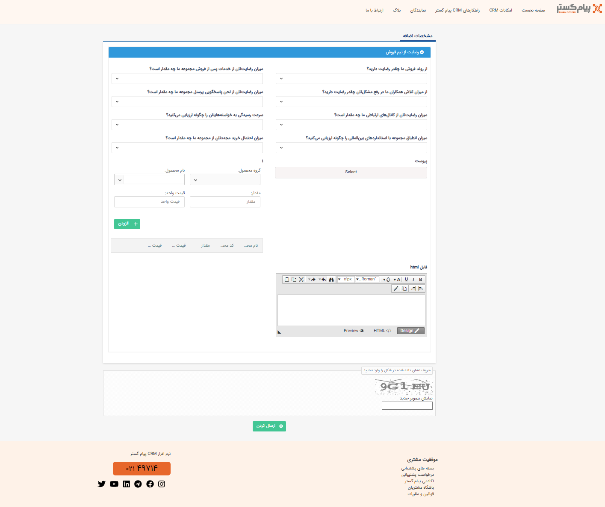
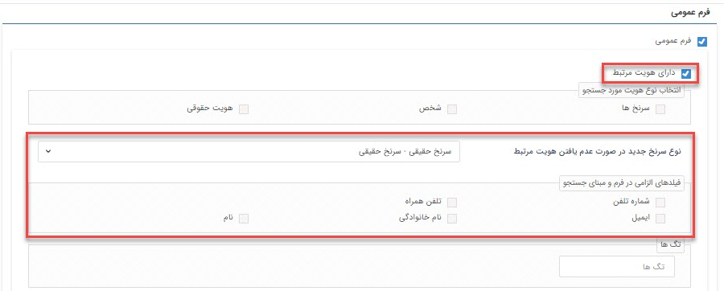
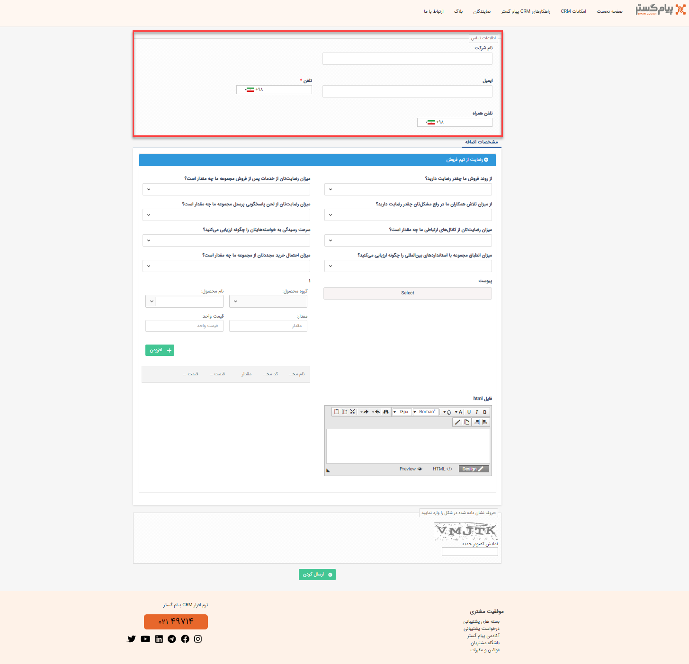
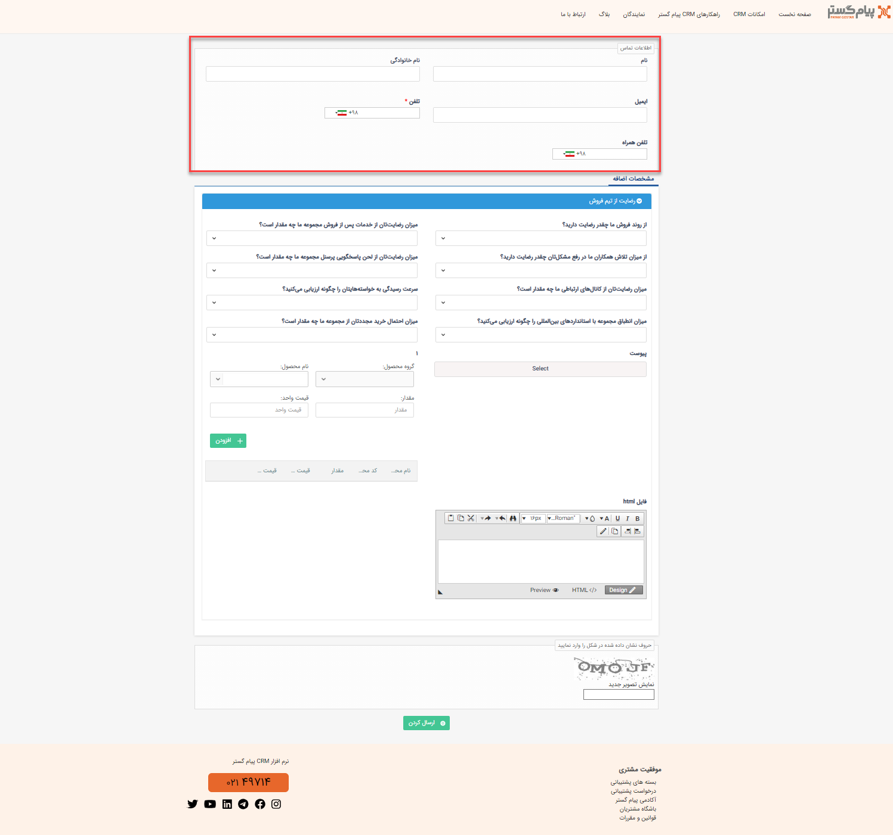
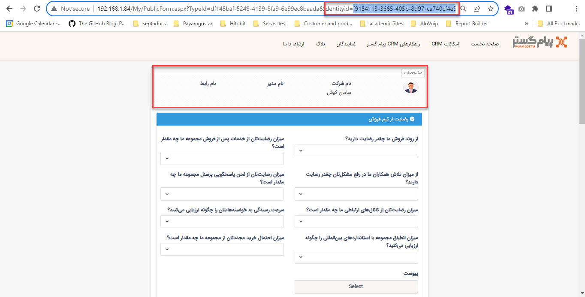
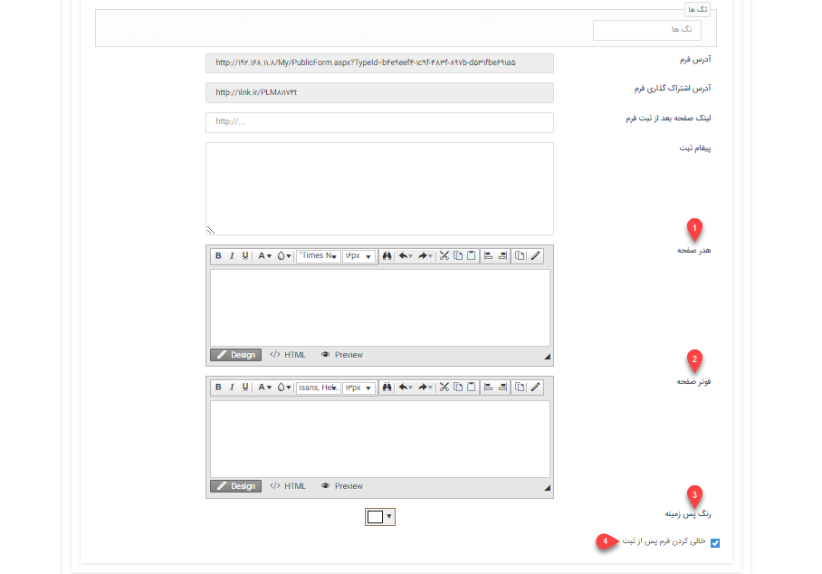
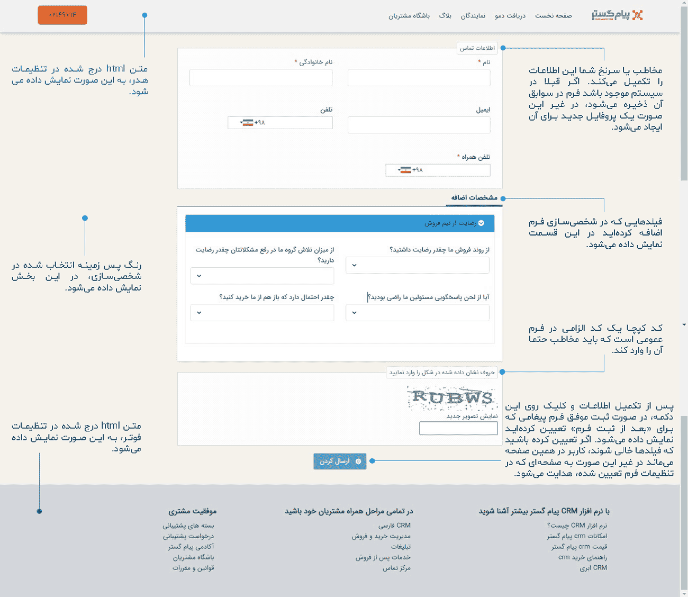

# تنظیمات فرم عمومی

در شخصی‌سازی فرم‌ها، این امکان وجود دارد فرمی تهیه کنید که سرنخ‌ها و مخاطبانتان خارج از نرم‌افزار و از طریق سایت، اطلاعاتی را ثبت کنند. مثلا برای فرم‌های نظرسنجی، استخدام، ثبت سفارش و یا ثبت‌نام قابلیت **فرم عمومی** بهترین ابزار است.

- [تنظیمات مشترک شخصی‌سازی فرم](#CommonFormCustomizationSettings)
- [تنظیمات اختصاصی فرم عمومی](#SpecificSettingsForGeneralForm)
- [ تنظیمات نمایشی فرم عمومی ](#UIFormSetting)

## تنظیمات مشترک شخصی‌سازی فرم {#CommonFormCustomizationSettings}
برای ایجاد یک فرم عمومی از مسیر **تنظیمات** > **شخصی‌سازی CRM** > **مدیریت فرم‌ها** اقدام کنید. ایجاد یک فرم عمومی در بخش اول تنظیمات مشترکی مثل سایر فرم‌ها دارد که جزئیات آن را در مقاله [شخصی‌سازی فرم](https://github.com/1stco/PayamGostarDocs/blob/master/Help/Settings/Personalization-crm/Form-management/2.6.0/Form-customize-setting.md) می‌توانید مطالعه کنید.

## تنظیمات اختصاصی فرم عمومی {#SpecificSettingsForGeneralForm}
با فعال کردن **چک باکس فرم عمومی**، به این نوع فرم آدرس (URL) اختصاص داده‌می‌شود که می‌توانید از این آدرس در سایت خود (یا ارسال آدرس برای مخاطبان) برای اهداف مختلف استفاده کنید. در اصل این فرم برای مواقعی که می‌خواهید مخاطبان یا سرنخ‌هایتان بدون ورود به نرم‌افزار اطلاعاتی را تکمیل کنند، کاربرد دارد.


### تنظیمات هویت مرتبط فرم عمومی 
برای استفاده از فرم عمومی می‌توانید تعیین کنید که هنگام ذخیره، فرم پروفایل مرتبط داشته باشد. این امکان وجود دارد که اگر هویت مرتبط از قبل در سیستم موجود باشد، فرم در سوابق آن ذخیره شود و در غیر این صورت سرنخ جدید به ازای فرم ثبت شده ایجاد می‌گردد.<br>

#### ذخیره فرم بدون پروفایل مرتبط
اگر چک باکس **دارای هویت مرتبط** را فعال نکنید فرم در هر صورت بدون هیچ هویتی و تنها با فیلدهای اضافه‌ای که در شخصی‌سازی برای این فرم تنظیم کرده‌اید، ذخیره می‌شود. بنابراین صفحه‌ای که مخاطب شما از فرم مشاهده می‌کند به شکل زیر خواهد‌بود (فیلدهای اطلاعات تماسی را ندارد).



فرم‌های عمومی‌ای که ذخیره می‌شوند را در قسمت **اتوماسیون و فرآیندهای سازمانی** > **فرم‌ها** > **زیرنوع مورد نظر** می‌توانید مشاهده کنید. لازم به ذکر است همانطور که در تصویر زیر مشاهده می‌کنید فرم عمومی بدون هویت مرتبط در لیست فرم‌ها نیز پروفایل مرتبط نخواهد‌داشت.


#### ذخیره فرم با پروفایل مرتبط به نام ثبت‌کننده فرم
برای اینکه فرم عمومی شما حتما با یک پرفایل مرتبط ذخیره شود، لازم است چک باکس **دارای هویت مرتبط** را فعال کنید. در این‌ صورت هنگام ذخیره فرم در سایت، فیلدهای اطلاعات هویتی و تماسی بر اساس نوع هویت تعیین شده (حقیقی یا حقوقی) در قسمت **نوع سرنخ جدید در صورت عدم یافتن هویت مرتبط** نمایش داده می‌شود. 



> **نکته**<br>
> هویتی که از طریق فرم عمومی ذخیره می‌شود تنها به صورت **سرنخ حقیقی یا حقوقی** بوده که باید از قبل زیرنوع سرنخ مورد نظر خود را در بخش شخصی‌سازی CRM ایجاد کرده باشید.


اگر نوع هویت را **سرنخ حقوقی** انتخاب کنید صفحه‌ای که مخاطب شما در سایت مشاهده می‌کند به شکل زیر خواهد بود.



و در صورت انتخاب نوع **سرنخ حقیقی**، اطلاعات تماسی هویت در فرم عمومی همراه با نام و نام خانوادگی خواهد بود.



### تنظیمات جستجوی پروفایل مرتبط
از طریق **انتخاب نوع هویت مورد جستجو** می‌توانید تعیین کنید اطلاعاتی که سرنخ شما هنگام ذخیره فرم عمومی تکمیل کرده است، در کدام یک از انواع هویت (سرنخ‌ها، شخص و هویت حقوقی) جستجو شود. در نتیجه‌ی جستجو، اگر هویت مرتبط اطلاعاتش قبلا در سیستم موجود بود فرم عمومی در سوابق آن ذخیره می‌شود در غیراینصورت یک سرنخ جدید با این اطلاعات ایجاد می‌کند. لازم به ذکر است می‌توانید از گزینه‌های **سرنخ‌ها**، **شخص** و **هویت حقوقی** یک یا هر سه گزینه را انتخاب نمایید.


> **نکته**<br>
> مسیر [ذخیره اطلاعات](https://github.com/1stco/PayamGostarDocs/blob/master/Help/Settings/General-settings/User-category/User-category.md) سرنخ‌هایی که از طریق فرم عمومی ایجاد می‌شوند، در قسمت **تنظیمات کلی** > **دسته‌بندی کاربران** > **گروه پیش فرض ذخیره مشتریان** > **سرنخ** تعیین می‌شود.<br>

#### ذخیره فرم با پروفایل مرتبط با «هویت مشخص» 

حالتی وجود دارد که می‌توانید تعیین کنید فرم عمومی پس از ذخیره، در پروفایل هویت مشخصی ذخیره شود. برای پیاده‌سازی این تنظیمات موارد زیر را اجرا نمایید:<br>
1. در تنظیمات شخصی‌سازی فرم چک‌باکس «**دارای هویت مرتبط**» را فعال کنید.
2. برای اینکه هنگام اتصال سابقه فرم به هویت مرتبطش، سیستم بر اساس یک مبنای واحد بتواند جستجو کند، تنظیمات «**تنظیمات نوع هویت مورد جستجو**» را فعال کنید. یعنی تعیین کنید که سیستم در لیست شرکت، سرنخ یا شخص جستجو را انجام دهد.
3. درصورت نیاز به الزامی بودن تکمیل اطلاعات تماسی تنظیمات بخش «**فیلدهای الزامی در فرم و مبنای جستجو**» را انجام دهید.
4. برای به اشتراک گذاری لینک فرم عمومی با مشتریان خود از طریق پیام کوتاه یا ایمیل، لازم است در انتهای آدرس URL فرم عمومی پارامتر هوشمند **شناسه** یا **Identity.Id** را طبق دستور زیر اضافه کنید.<br>


``` 
link&&identityid={prop{Identity.Id}} 
``` 
در این مثال می‌خواهیم در انتهای فرآیند فروش فعالیت ارسال پیام کوتاه قرار داده تا یک لینک برای شرکت در فرم نظرسنجی برای مشتری ارسال شود.
    
> **نکته**<br>
> پارامتر هوشمند **شناسه** را از لیست اطلاعات هویت مرتبط انتخاب کنید و به عبارت انگلیسی **Identity.Id** دقت نمایید.


### ذخیره فرم عمومی در سابقه‌ی یکی از سوابق هویت (تعیین سابقه‌ی پدر برای فرم عمومی)
برای اینکه فرم عمومی شما مرتبط با یکی از سوابق هویت  مورد نظر ثبت گردد، لازم است علاوه بر فعال کردن چک باکس **دارای هویت مرتبط**، Id آیتم مورد نظر را به هنگام ارسال و یا استفاده، به لینک ایجاد شده اضافه نمایید. برای درک بهتر این موضوع به مثال زیر توجه کنید:<br>
فرض کنید در انتهای فرآیند فروش، میخواهید یک لینک آدرس فرم نظرسنجی برای مشتری خود ارسال کرده تا از عملکرد کارشناس فروش مربوطه نظرسنجی نمایید. نکته‌ای که باید حتما رعایت شود این است که فرم به سابقه فرصت متصل باشد. بنابراین باید موارد زیر رعایت شود:<br>
**آیتم فرصت فروش** > **ارسال پیامک به مشتری جهت تکمیل فرم نظرسنجی** > **ذخیره فرم نظرسنجی از کارشناس در سابقه‌ی فرصت فروش**
در این صورت باید در لینک ارسالی به مشتری Id فرصت فروش (آیتم تحت چرخه) به همراه Id هویت مشخص، طبق دستور زیر ارسال شود.

``` 
link&&IdentityId={prop{Identity.Id}}&&ParentId={prop{Id}}
```

در دستور درج شده، Identity.Id قابل مشاهده در انتهای آدرس URL، در واقع ID هویت مورد نظر می باشد. ID درج شده در بخش ParentId هم شناسه انتهایی در URL سابقه‌ای است که باید فرم عمومی مرتبط با آن ذخیره شود.
برای دستابی به ID هویت مورد نظر، به صفحه هویتش رفته و عبارت درج شده در انتهای آدرس را کپی نمایید. (برای دستیابی به ID موجودیت پدر نیز به همین صورت اقدام کنید.)

## الزامی کردن اطلاعات تماسی
زمانی که یکی یا همه فیلدهای نام، نام خانوادگی، نام شرکت/سازمان، شماره تلفن، تلفن همراه و ایمیل را الزامی کنید هنگام ذخیره فرم عمومی، این فیلدها به صورت ستاره‌دار نمایش داده شده و بدون تکمیل این اطلاعات فرم ذخیره نخواهد شد.<br>
از طرفی هر کدام از این فیلدها که الزامی باشند، مبنای جستجوی هویت در سیستم خواهد بود در صورتی که هویت تکراری با یکی از این اطلاعات یافت شود، فرم در سابقه هویت موجود در سیستم ذخیره خواهد شد و دیگر سرنخ جدید ساخته نخواهد شد.<br>
- **تگ‌گذاری روی فرم‌های ذخیره شده**<br>
  از قسمت **تگ‌ها** می‌توانید برای هویت‌های مرتبط با فرم عمومی ذخیره شده،  از تگ‌ها می‌توانید در جستجوی پیشرفته یا گزارشات از آن استفاده کنید.<br>
- **آدرس فرم عمومی**<br> 
   این آدرس URL را باید در اختیار مخاطبان و سرنخ‌های خود قرار دهید تا با مراجعه و ذخیره فرم، اطلاعات آن‌ها را جمع‌آوری کنید.<br>
- **آدرس اشتراک‌گذاری فرم**<br> 
   لینک کوتاه‌سازی شده فرم می‌باشد که می‌توان به جای **آدرس فرم عمومی** در اختیاز اشخاص قرار گیرد.<br>
- **لینک صفحه بعد از ثبت فرم عمومی**<br>
  بهتر است صفحه‌ای را طراحی کنید و آدرس URL آن را در این قسمت وارد کنید که مخاطب شما پس از ذخیره فرم به آن صفحه ارجاع داده شود. به عنوان مثال صفحه‌ای با مضموم نتیجه ثبت فرم نظرسنجی.<br>
- **پیغام ثبت موفقیت آمیز فرم**<br>
   می توانید در این قسمت متنی را جهت نمایش به مخاطب پس از ثبت موفق فرم، تنظیم کنید.<br>

## نمایش لوگوی مشتری هنگام ثبت فرم عمومی{#LogoInGeneralForm}
اگر برای مشتریانتان تصویر پروفایل تنظیم کرده باشید، هنگام تکمیل فرم عمومی تصویر خود را در قسمت مشخصات فرم مشاهده خواهند کرد.<br>
برای تنظیم تصویر پروفایل دو حالت وجود دارد؛ یا مشتری شما از طریق باشگاه مشتریان برای حساب کاربری خود عکس/لوگو بارگذاری کرده باشد یا شما از مسیر **پروفایل هویت** > **سربرگ جزئیات** عکس/لوگو تنظیم کرده باشید.



## تنظیمات نمایشی فرم عمومی {#UISetting}
می‌توانید برای ظاهر فرم عمومی خود، تنظیمات نمایشی لحاظ  کنید که هدر و فوتر و رنگ پس زمینه آن را به دلخواه خود طراحی کنید.<br>



- **1. هدر صفحه**<br>
  می‌توانید با متن html هدر صفحه فرم عمومی خود را طراحی کنید.<br>
- **2. فوتر صفحه**<br>
   می‌توانید با متن html فوتر صفحه فرم عمومی خود را طراحی کنید.<br>
- **3. رنگ پس زمینه**<br>
   برای صفحه فرم عمومی خود می‌توانید یک رنگ پس زمینه انتخاب کنید.<br>
- **4. خالی کردن فرم پس از ثبت** <br>
   در صورت فعال بودن این گزینه، پس از ثبت موفق فرم، مقادیر وارد شده در فیلدهای آن خالی می‌شوند تا بتوانید فرم جدیدی ثبت کنید. توجه داشته‌باشید برای استفاده از این قابلیت، باید "لینک صفحه بعد از ثبت فرم"را خالی بگذارید. در غیر این صورت پس از ثبت فرم، به لینک تعیین شده هدایت می شوید و امکان ثبت فرم جدید وجود ندارد.<br>

> **نکته**<br>
> توجه داشته‌باشید در صورت فعال بودن چرخه کاری روی فرم، در هنگام ثبت، فیلدهایی که در وضعیت (کارتابل یا فعالیت) اولیه فرآیند، روی حالت نمایش تنظیم شده‌اند، به مخاطب نمایش داده خواهند‌شد.

در نهایت پس از اعمال تغییرات مورد نظر خود، آیتم فرم را ذخیره نمایید. فرمی که ایجاد کرده‌اید برای مخاطب/سرنخ شما به شکل زیر خواهد‌بود.


