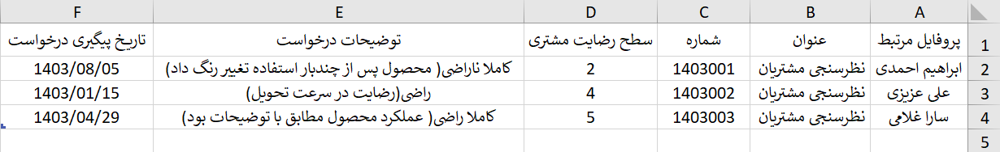
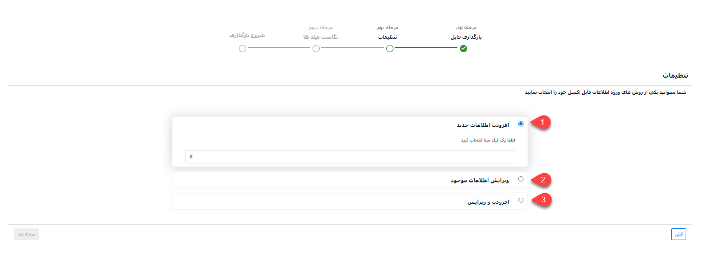
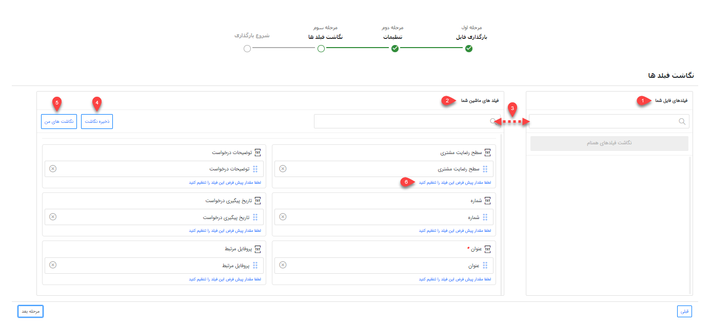

# ثبت فرم از طریق اکسل

در صورت نیاز به ایجاد تعداد زیادی اطلاعات مرتبط با نوع خاصی از فرم به صورت یکجا می‌توانید از روش ورود اکسلی استفاده نمایید. بدین ترتیب می‌توانید اطلاعات فرم‌های مورد نظر را در اکسل درج نمایید (یا از سایر نرم‌افزارهای خود خروجی بگیرید) و سپس بارگذاری کنید. در این حالت فرم‌های مورد نظر ایجاد شده و اطلاعات آن در فیلدهای مربوطه وارد می‌شود. از این روش می‌توانید برای ویرایش اطلاعات فرم‌های موجود نیز استفاده نمایید. 
برای اینکه بارگذاری فرم‌ها بدون مواجهه با خطا و با موفقیت به اتمام برسد، لازم است که قوانین تهیه و بارگذاری اکسل را رعایت کنید. در این راهنما تمامی موارد لازم برای تنظیم صحیح فایل اکسل، به همراه شیوه بارگذاری آن مطرح شده‌است. بدین منظور در این مقاله به موارد زیر می‌پردازیم: 
- [شیوه‌ی تهیه و تنظیم فایل اکسل فرم‌ها](#FormExcelSetting)
- [روش بارگذاری فایل اکسل فرم‌ها](#FormExcelUploading)
- [مجوزهای لازم برای بارگذاری اکسل فرم‌ها](#FormExcelPermision)

## تنظیمات فایل اکسل{#FormExcelSetting}
برای ورود اطلاعات فرم‌ها از طریق اکسل، ابتدا باید اکسل مورد نظر را بر اساس فرمت مورد پذیرش نرم‌افزار تنظیم کنید. بدین منظور می‌توانید اکسلی با ستون‌هایی که در تصویر می‌بینید (فیلدهای آیتم فرم نظرسنجی مشتریان) ایجاد کنید و یا از فایل نمونه استفاده نمایید. فایل نمونه در مرحله‌ی اول بارگذاری به شما ارائه می‌شود (جلوتر به آن می‌رسیم). 

تصویر فوق،‌ ستون‌های مورد نیاز برای بارگذاری زیر نوع خاصی از فرم‌ با عنوان فرم «نظرسنجی مشتریان» را بر اساس فیلدهای پیش‌فرض آیتم فرم‌ که در شخصی سازی ایجاد کردید را نشان می‌دهد. در صورت افزودن فیلدهای اضافه (در شخصی‌سازی)، برای هر فیلد یک ستون با نام مشابه آن ایجاد نمایید. چنانچه از فایل نمونه‌ای که نرم‌افزار به شما می‌دهد استفاده می‌کنید، این فیلدها به صورت خودکار در فایل اکسل قرار داده‌می‌شود. 
برای تکمیل اطلاعات مربوط به فیلدهای پیش‌فرض به راهنمایی‌های زیر توجه داشته باشید:
- **شماره فرم**: شماره مرتبط با این فرم را درج کنید.
- **پروفایل مرتبط:** نام هویت و یا شماره مشتری را در این قسمت وارد نمایید.
- **عنوان**: عنوان فرم‌هایی که قصد ثبت آنها از طریق اکسل را دارید در این ستون درج کنید.
- **توضیحات:** در صورت نیاز، توضیحات مرتبط با فرم را در این قسمت درج نمایید.
- **سطح رضایت مشتری**: این ستون فیلد اضافه‌ای است که در شخصی‌سازی به کمک لیست کشویی طراحی شده‌است و برای نشان‌دادن رضایت‌مشتری باید یکی از اعداد ۱ تا ۵ را انتخاب کنید.
- **تاریخ پیگیری نارضایتی**: تاریخی که نارضایتی مشتری در این فرم پیگیری شده را در این قسمت وارد کنید.

> **نکته** 
>برای فرم نظرسنجی نارضایتی مشتریان به عنوان مبنای شناسایی در مرحله بعد می‌توانید هر یک از فیلدهای بالا را انتخاب کنید. اما به صورت پیش‌فرض مبنای شناسایی فرم‌ها «عنوان» در نظر گرفته می‌شود. چنانچه بخواهید فرم‌هایی با عناوین مشابه را بارگذاری کنید می‌بایست مبنای شناسایی را از فیلدهای های اضافه که در شخصی‌سازی ایجاد کردید انتخاب کنید.

چنانچه زیرنوع فرم‌ مورد نظر دارای فیلدهای اضافه (اضافه شده در شخصی‌سازی) باشد، ستونی هم نام با فیلد خود به ستون‌های موجود در اکسل اضافه و اطلاعات مورد نظر را در ستون مربوطه وارد نمایید. در این خصوص به نکات زیر توجه داشته باشید: 
- امکان ورود اطلاعات فیلدهایی از نوع فایل، تصویر، html، کمپین، برچسب، لیست مرتبط، فیلد آیتم‌های CRM (مثل فیلد پرداخت،‌فاکتور و... به جز فیلد شخص/شرکت)، فیلد اضافه از نوع رنگ، فیلد لیستی از نوع فایل و فیلد لیستی از نوع کاربر/گروه از طریق اکسل وجود ندارد.
- در صورت استفاده از فیلد چک باکس،‌ با استفاده از «بلی» چک باکس تیک خورده و در صورت ذکر «خیر» چک باکس بدون تیک لحاظ می‌شود. البته از عبارات yes/no و true/false و همچنین اعداد 1/0 نیز می‌توانید بدین منظور استفاده نمایید.
- در صورت استفاده از فیلد کاربر، از بین کاربران تعریف شده در نرم‌افزار نام کاربر و یا کد کاربر مورد نظر را در این قسمت درج نمایید.
- برای ورود اطلاعات به فیلدهایی از نوع لیست کشویی فقط از عبارات موجود در لیست می‌توانید استفاده نمایید. فیلدهای لیست کشویی پیش‌فرض نرم‌افزار در بخش مدیریت آیتم‌های سیستم و لیست‌های کشویی اضافه‌ شده توسط شما در بخش شخصی‌سازی آن آیتم قابل مشاهده و ویرایش می‌باشند. چنانچه برای یک فیلد لیست کشویی، دو گزینه با عنوان مشابه تعریف شده باشد، ورود اطلاعات (مقداردهی) آن از طریق اکسل با خطا مواجه می‌شود.

>**نکته** 
> توجه داشته‌باشید که امکان بارگذاری چند نوع فرم‌ (زیرنوع‌های مختلف) به صورت یکجا وجود ندارد. برای بارگذاری فرم‌، برای هر زیرنوع فرم‌ به یک اکسل جداگانه نیاز دارید. 

## مراحل بارگذاری فایل اکسل{#FormExcelUploading}
برای بارگذاری فایل اکسل فرم‌ها به این ترتیب اقدام نمایید:
### بارگذاری فایل
برای بارگذاری فایل اکسل از مسیر تب **اتوماسیون و فرآیندهای سازمانی** > **فرم‌ها** > **زیرنوع فرم** مورد نظر را انتخاب کنید و وارد صفحه لیست فرم‌ها شوید. بر روی کلید «ورود اطلاعات از اکسل» کلیک کنید تا صفحه بارگذاری به شما نمایش داده‌شود. 
در گام اول **نوع** و **زیرنوع** آیتم انتخاب شده نمایش داده‌می‌شود. توجه داشته‌باشید که زیرنوع فرمی که قصد بارگذاری آن را دارید در قسمت زیرنوع انتخاب شده‌باشد. در غیر این صورت، چنانچه زیرنوع فرم به درستی انتخاب نشده‌است، آن را به زیرنوع مورد نظر تعییر دهید. 

با کلیک بر روی کلید فایل نمونه (شماره ۱) می‌توانید قالب نمونه اکسل را فرم‌ نمایید. همان طور که پیش‌تر به آن اشاره شد، در این قالب ستون‌هایی برای درج اطلاعات فیلدهای پیش‌فرض فرم تعبیه شده‌است و در صورت اضافه شدن فیلدهای اضافه طی شخصی‌سازی، برای وارد کردن اطلاعات آن‌ها نیز ستون‌هایی به فایل افزوده می‌شود. 
پس از تنظیم فایل اکسل، با کلیک بر روی کلید بارگذاری فایل (شماره ۲)، فایل مورد نظر را انتخاب و بارگذاری کنید. پس از اتمام بارگذاری، کلید مرحله‌ی بعد (شماره ۳) در پایین صفحه برای شما فعال می‌شود. با کلیک بر روی این کلید، برای اعمال تنظیمات به مرحله‌ی بعدی می‌روید. 

### تنظیمات بارگذاری فایل
در این بخش باید تنظیمات لازم جهت تعیین روش ورود اطلاعات را مشخص کنید.

**1. افزودن اطلاعات جدید** 
با انتخاب این گزینه، تمامی فرم‌های جدید موجود در اکسل بر اساس مبنای انتخابی شما شناسایی و بارگذاری می‌شود. در این مرحله چنانچه فیلد «شماره» که یکی از فیلدهای اضافه‌شده در شخصی‌سازی است را مبنای شناسایی انتخاب کنید. براساس شماره‌ی فرم‌، جستجوی تکراری بودن انجام شده و در صورت تکراری نبودن فرم‌ (یعنی اگر فرمی با این شماره در سیستم وجود نداشته‌باشد)، آن فرم‌ به لیست فرم‌‌ها اضافه می‌شود. 

>**نکته**  
به صورت پیش‌فرض در تمامی فرم‌های ساخته شده مبنای شناسایی «عنوان» می‌باشد که می‌توانید براساس فیلدهای اضافه‌شده در شخصی‌سازی این مبنا را تغییر دهید. 

**2. ‌ویرایش اطلاعات موجود** 
در این حالت براساس فیلدی که به عنوان مبنا انتخاب شده‌است (شماره‌فرم)، جستجو انجام‌می‌شود. در صورت وجود فرم با شماره مشابه، فرم‌ مربوطه ویرایش شده و اطلاعات موجود در اکسل برای آن درج می‌شود. در صورت  یافت نشدن فرم با چنین شماره‌ای،‌ اطلاعات آن سطر از اکسل بارگذاری نخواهدشد.  
با انتخاب چک باکس " فقط فیلد‌های خالی پر شوند" تنها فیلدهای خالی هویت مقداردهی شده و فیلدهایی که دارای اطلاعات می‌باشند بدون تغییر باقی می‌مانند. 

>**نکته** 
> هنگام ویرایش، جستجو فقط در بین فرم‌های موجود از زیرنوع انتخابی انجام می‌شود. فلذا اگر فرمی با عنوان یکسان در زیرنوع‌های دیگر یافت شود، فرم‌ مذکور ویرایش نخواهدشد. 

**3. افزودن و ویرایش** 
در این حالت بر اساس فیلد مبنای انتخاب شده جستجو انجام می‌شود. در صورت وجود فرم‌ با اطلاعات فیلد مبنا، فرم مربوطه ویرایش می‌شود و در صورت یافت نشدن فرم‌ با عنوان یا شماره یکسان (فیلد مبنا)، آن رکورد به عنوان فرم‌ جدید به نرم‌افزار اضافه می‌شود. 
با انتخاب چک باکس "فقط فیلد‌های خالی پر شوند"،‌ در فرم‌‌هایی که بر اساس فیلد مبنا یافت شده (فرم‌‌های موجود) و نیازمند ویرایش می‌باشند، ‌تنها فیلدهای خالی مقداردهی شده و فیلدهایی که دارای اطلاعات می‌باشند بدون تغییر باقی می‌مانند. 

>**نکته** 
در حالت ویرایش (حالت ۲ و ۳)، چنانچه بر اساس مبنای جستجو، چند فرم‌ با اطلاعات مورد نظر یافت شود، (مثلا در حالتی که مبنا شماره فرم‌ است،‌ چند فرم دارای یک شماره فرم‌ یکسان باشند) ویرایش بر روی هیچ یک از فرم‌‌ها انجام نمی‌گیرد. 

به این موضوع توجه داشته‌باشید که در زمان ویرایش، مقادیر مندرج در اکسل جایگزین مقادیر قبلی می‌شوند. بنابراین در صورتی که نیاز است مقادیر جدید بدون حذف مقادیر قبلی به آن‌ها اضافه شوند، باید مقادیر قبلی موجود هر فیلد که قصد حفظ آن را دارید، در اکسل تکرار شوند. 
برای ادامه‌ی فرآیند بارگذاری، بر روی کلید مرحله بعدی کلیک کنید. 

### نگاشت فیلدها
در مرحله سوم، سرستون‌های فایل اکسل در بخش «فیلدهای فایل شما» (شماره ۱) و فیلدهای موجود در مشخصات فرم‌ در بخش «فیلدهای ماشین شما» (شماره ۲) نمایش داده‌می‌شود. در واقع در این بخش مشخص می‌شود که اطلاعات هر ستون اکسل باید در کدام فیلد فرم‌ وارد شود. 
در صورت یکسان بودن نام ستون با نام فیلد مربوطه،‌ نگاشت به صورت خودکار انجام می‌گیرد. در غیر این صورت باید با drag & drop نام هر ستون را از بخش فیلدهای فایل شما (سمت راست) به فیلد مربوطه در بخش فیلدهای ماشین شما (سمت چپ) متصل نمایید. در این شرایط برای یافتن عنوان مورد نظر در هر دو بخش می‌توانید از قابلیت جستجو (شماره ۳)‌ استفاده کنید. 

اگر نگاشت خود را به صورت دستی انجام داده‌اید، می‌توانید نگاشت خود را ذخیره نمایید (شماره ۴). در صورت استفاده مجدد از این اکسل یااکسل مشابه برای بارگذاری، با کلیک بر روی نگاشت‌های من (شماره ۵)، نگاشت به صورت خودکار انجام می‌شود. شما می‌توانید نگاشت‌های پرکاربرد خود را در سیستم ذخیره نموده و در وقت خود صرفه‌جویی کنید. در لیست نگاشت‌های من امکان ویرایش یا حذف نگاشت ذخیره شده نیز وجود دارد. 
شما این امکان را دارید که برای هر فیلد مقداری را به عنوان مقدار پیش‌فرض (شماره ۶) در نظر بگیرید تا در صورت خالی بودن مقدار فیلد در اکسل، فیلد با مقدار پیش‌فرض که در این قسمت تعریف کرده‌اید پر می‌شود. 
برای شروع بارگذاری، روی کلید مرحله بعدی کلیک کنید.  

### شروع بارگذاری
بارگذاری فایل ممکن است لحظاتی زمان ببرد. پس از اتمام فرآیند بارگذاری، در صورت بارگذاری موفق اکسل،‌ انجام موفقیت‌آمیز آن در این صفحه اعلام می‌شود. پیشنهاد می‌شود که پس از آن به صفحه‌ی لیست فرم‌‌ها بروید و نتیجه را بررسی کنید. افزوده شدن فرم‌‌های جدید را با مقایسه تعداد فرم‌ها با سطرهای اکسل و ویرایش فرم‌‌ها را با بررسی چند نمونه‌ی تصادفی می‌توانید به راحتی چک کنید. 
چنانچه بارگذاری فایل با خطا مواجه شده‌باشد، پیغامی مشابه تصویر زیر به شما نمایش داده‌می‌شود. 

در منوی گزارش‌ها، بخش وضعیت عملیات انبوه می‌توانید نتایج ورود اطلاعات را مشاهده کنید. در صورت بروز خطا در فرآیند بارگذاری، با دانلود فایل اکسل از این بخش می‌توانید خطا و علت خطا را مشاهده نمایید. برای دانلود فایل، بر روی جزئیات رکورد مربوطه کلیک کرده و خروجی اکسل فرم‌ کنید. در اکسل دریافتی، سطرهای دارای مشکل با رنگ قرمز مشخص شده و در ستون آخر دلیل بروز خطا درج شده‌است. 

## مجوزهای مورد نیاز برای بارگذاری فرم‌ از طریق اکسل{#FormExcelPermision}
برای ثبت فرم‌از طریق اکسل،‌ کاربر باید دارای مجوزهای زیر باشد:
- **برای افزودن اطلاعات جدید** 
برای افزودن اطلاعات جدید (مورد ۱ در تنظیمات بارگذاری فایل) باید مجوز **ذخیره اولیه** زیرنوع فرم‌ انتخابی را داشته‌باشید.
- **برای ویرایش اطلاعات موجود** 
برای ویرایش اطلاعات موجود (مورد ۲ در تنظیمات بارگذاری فایل) باید مجوز **ویرایش** زیرنوع فرم‌ انتخابی را داشته‌باشید.
- **برای افزودن و ویرایش** 
برای افزودن و ویرایش اطلاعات (مورد ۳ در تنظیمات بارگذاری فایل) باید مجوز **ذخیره اولیه** و همچنین مجوز **ویرایش** زیرنوع فرم‌ انتخابی را داشته‌باشید.

