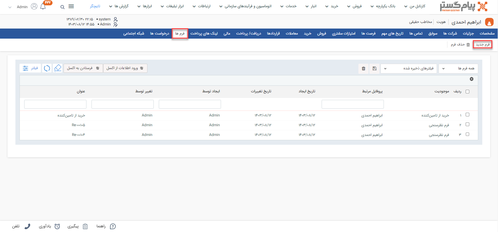

# فرم جدید

چنانچه قصد ثبت اطلاعات در سازمان را دارید می‌توانید از آیتم فرم استفاده نمایید و از این طریق می‌توانید فرآیند پاسخ به درخواست‌های داخل یا خارج سازمان را بهبود دهید.
## مسیر‌های ثبت فرم دستی
برای ثبت فرم در پیام‌گستر مسیرهای مختلفی وجود دارد که براساس نیاز خود می‌توانید از مسیرهای زیر اقدام به ثبت فرم جدید به صورت دستی برای هویت موردنظر نمایید. 

- **تب اتوماسیون و فرآیندهای سازمانی** > **فرم‌ها** > **فرم جدید**

- **ویجت دسترسی سریع** > **فرم** 

- **صفحه اصلی پروفایل مخاطب** > **آیتم جدید** > **فرم جدید** 

برای مشاهده لیست «آیتم‌های جدید» بر روی فلش کنار «تماس جدید» (قابل مشاهده در نوار سفید بالای صفحه) کلیک نمایید. 

- **صفحه اصلی پروفایل مخاطب** > **تب سوابق** > **فرم جدید** 

- **صفحه اصلی پروفایل مخاطب** > **تب فرم‌ها** > **فرم جدید** 

> **نکته** 
> توجه داشته باشید که چنانچه از صفحه هویت مورد نظر اقدام به ثبت فرم جدید نمایید، بخش «مرتبط با» به صورت خودکار با نام هویت پر می‌شود. به عبارت دیگر فرم به نام هویت ثبت می‌شود. اما اگر از مسیرهای صفحه اصلی (مسیر اول) اقدام به ثبت فرم نمایید، باید نام هویت را در قسمت «مرتبط با» جستجو و انتخاب کنید. 

## شیوه‌ی ثبت فرم دستی
در صورت داشتن چند زیرنوع فرم، به انتخاب صحیح آن توجه داشته‌باشید. زیرنوع آیتم در قسمت بالای صفحه قابل مشاهده و قابل تغییر می‌باشد. در تصویر زیر، «فرم درخواست جذب نیرو» برای ثبت نمونه انتخاب شده‌است. 
برای ثبت فرم لازم است فیلدهای مورد نیاز آیتم را با اطلاعات موجود تکمیل و سپس ذخیره نمایید. فرم درخواست جذب نیرو در شخصی‌سازی CRM تعریف شده‌است و شامل فیلدهای اضافه به شرح زیر می‌باشد: 

### ۱. مرتبط با  
نام هویتی که می‌خواهید فرم در سوابق او ثبت شود در این قسمت درج کنید. بدین منظور کافیست بخشی از نام هویت مورد نظر را تایپ نمایید تا لیست هویت‌های مشابه آن برای انتخاب به شما نمایش داده‌شود. چنانچه پیش‌تر به آن اشاره شد، اگر از صفحه هویت اقدام به ثبت فرم کرده‌باشید، نام هویت به صورت خودکار در این بخش ثبت شده‌است. 

> **نکته**  
> اگر طی روند شخصی‌سازی، فیلدی برای ثبت اطلاعات در فرم در نظر گرفته‌شده باشد، آن را در قسمت «مشخصات اضافه» مشاهده می‌کنید. 

برای فرم جذب نیرو در شخصی‌سازی CRM گروه فیلد و فیلدهایی را درنظر گرفته‌ایم که در قسمت مشخصات اضافه درج شده‌اند . در این مثال دو گروه‌ فیلد "اطلاعات درخواست" و "منابع انسانی" را درنظر گرفته‌ایم که هر کدام فیلد‌های مشخص خود را دارند. 
### ۲. مشخصات اضافه  
فیلدهایی که به صورت دستی در شخصي‌سازی ایجاد کرده‌اید در این قسمت نمایش داده می‌شود.
#### اطلاعات درخواست
اطلاعات درخواست شامل فیلدهایی  مرتبط با اطلاعات اولیه درخواست است که به شرح زیر می‌باشد:
- **درخواست‌دهنده**: این فرم یک فرم درون سازمانی است و فیلد موردنظر برای شخص "درخواست‌کننده نیرو" کاربر درنظر گرفته‌ شده‌است. بدین منظور کاربران سیستم درصورت نیاز می‌توانند با انتخاب نام خوداز بین کاربران سیستم فرمی با این عنوان را ثبت کنند.
- **سمت شغلی موردنظر**: فرم‌درخواست نیرو برای جذب نیرو در سمت مشخصی صورت می‌گیرد که بدین منظور از فیلد سمت استفاده می‌شود.
- **دپارتمان مربوطه**:  با انتخاب فیلد دپارتمان مشخص می‌کنید که این درخواست مربوط به کدام دپارتمان ثبت شده‌است.
- **نوع نیرو**: برای انتخاب نوع نیرو چک‌باکسی ایجاد شده‌است که شامل دو گزینه‌ "نیروی‌جدید" و "نیروی‌جایگزین" می‌باشد.
- **سطح نیرو**: برای ثبت اطلاعات سطح نیرو فیلد چک‌‌باکس انتخاب شده است که افراد را در چهار سطح Intern، 	Junior ، 	Mid level و Senior دسته‌بندی می‌کند.
- **تعداد نیرو**: برای تعیین تعداد نیرو لیست کشویی انتخاب شده‌است و فرد تکمیل کننده فرم محدود به انتخاب ۱، ۲ یا ۳ نیرو بواسطه یک فرم است.
- **الویت درخواست**: برای الویت درخواست می‌بایست لیست کشویی تعیین کنید تا درخواست‌دهنده به راحتی الویت درخواست را بررسی کند.
- **جنست**: فیلد جنسیت به کمک یک لیست‌کشویی ایجاد شده‌است که می‌توانید آن را از بین گزینه‌های "زن"، "مرد" و "مهم نیست" گزینه موردنظر خود را انتخاب کنید.
- **توضیحات درخواست**: در رابطه با درخواست می‌توانید توضیحات مرتبط را در این قسمت درج کنید. در این بخش یک فیلد متنی براساس شرح وظایف ثبت کنید.
- **شرایط احراز شغل (دوره های آموزشی و تجارب کاری)**: در این قسمت شرایط لازم برای احراز این شغل را به کمک فیلد متنی درج کنید.
- **تجهیزات مورد نیاز**: تجهزات موردنیاز برای این شغل را به کمک فیلد متنی درج کنید.
- **حقوق پرداختی**: مبلغی که قصد دارید در ازای این شغل درخواستی پرداخت شود را تحت عنوان فیلد عددی وارد کنید.

#### منابع انسانی
گروه فیلد منابع انسانی شامل فیلدهایی مرتبط با واحد منابع انسانی می‌باشد که طی فرآیند درخواست جذب نیرو جدید هنگامی که طی چرخه کاری فرم در مرحله اول تکمیل شد در این مرحله می‌بایست اطلاعات مربوط به واحد منابع انسانی تکمیل شود.
- **مصاحبه‌کننده منابع انسانی**: برای انتخاب فرد مصاحبه‌کننده از فیلد کاربر استفاده شده است که در صورت تکمیل این فرم شخص تکمیل‌کننده فرم می‌تواند نام کاربری فرد مصاحبه کننده را از دپارتمان منابع انسانی انتخاب کند.
- **مسئول جذب**: برای مسئول جذب فیلد کاربر انتخاب شده‌است.
- **آگهی شده در پنل استخدامی**: قصد داریم در فرم موردنظر مشخص کنیم که آیا این درخواست در پنل استخدامی آگهی شده‌است یا خیر. برای این کار باید مشخصه چک‌باکس را انتخاب کنید.
- **آگهی‌ها**: چنانچه چک باکس آگهی شده در پنل استخدامی فعال باشد می‌توانید در این قسمت آگهی را اضافه کنید.
- **فرم**: با انتخاب فرم از موجودیت‌های CRM مشخص می‌کنید چه فرم‌هایی باید به این فرم پیوست شود. بدین منظور در شخصی‌سازی CRM  فیلد فرم را از فیلدهای آیتم‌های سی آر ام انتخاب می‌کنید. 

## مسیر‌های ثبت فرم خودکار

برای ثبت فرم در پیام‌گستر مسیرهای دیگری نیز وجود دارد که براساس آن 
  یکی از قابلیت‌های پیام‌گستر ثبت فرم به صورت خودکار می‌باشد که از طریق مسیر‌های زیر می‌توانید به صورت خودکار فرم ثبت کنید. به عنوان مثال، چنانچه مشتری تماس گرفت می‌توانید به صورت خودکار برای مشتری فرم نظرسنجی تنظیم کنید. می‌توانید به صورت خودکار برای هویت موردنظر  فرم ثبت کنید. 
با انجام تنظیمات در شخصی‌سازی  CRM برای زیرنوع هر فرمی  می‌توانید تنظیماتی اعمال کنید تا به صورت خودکار برای هویت‌ها فرم ثبت کنید. این تنظیمات برای ایجاد فرم خودکار از طریق ایمیل، فکس ، پیامک قابل اجرا است. برای اطلاعات بیشتر می‌توانید به [تنظیمات ایجاد فرم از طریق ابزارهای ارتباطی](https://github.com/1stco/PayamGostarDocs/blob/master/Help/Form/CreateFormThroughCommunicationTools_2.8.4.md) مراجعه کنید. 
 علاوه بر روش‌های بالا دو روش  دیگر نیز وجود دارد که از ایجاد «فرم خودکار به کمک نقطه سفارش» و «ایجاد فرم خودکار به کمک یادآوری تماس» استفاده کنید که برای اطلاعات بیش‌تر به [تنظیمات ایجاد فرم‌های سیستمی](https://github.com/1stco/PayamGostarDocs/blob/master/Help/Form/FormCreationSettingsFromOtherMethods_2.8.4.md) مراجعه کنید.

## ثبت فرم از روی سایرآیتم‌ها
در پیام‌گستر می‌توانید متصل به هر آیتمی که برای هویت ثبت کرده‌اید به صورت مستقیم فرم ثبت کنید. در این حالت این فرم متصل با آیتم انتخابی در سابقه هویت ثبت می‌شود. به عنوان مثال از روی پیش‌فاکتور فروش ثبت‌شده برای مشتری می‌توانید فرم درخواست تامین کالا ثبت کنید که مسیرهای ثبت فرم از روی پیش‌فکتور به شرح زیر می‌باشد:

- **صفحه‌اصلی پروفایل مخاطب** > **تب سوابق** > **فرم جدید**

 - **مشخصات** > **آیتم جدید** > **فرم جدید**

