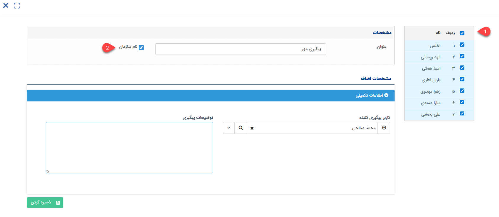

# ثبت فرم گروهی
در صورت نیاز می‌توانید برای تعدادی از هویت‌ها به صورت یک‌جا، فرم ثبت کنید. در هر بخش از نرم‌افزار شامل بانک اطلاعاتی، گروه‌های هدف و یا لیست حاصل از جستجوی پیشرفته که به در آن به لیستی از هویت‌ها دسترسی دارید، با انتخاب هویت‌های مورد نظر و کلیک راست بر روی آن‌ها می‌توانید برای هویت‌های انتخاب شده فرم جدید ایجاد کنید. در ادامه به بررسی نحوه‌ی ثبت فرم به صورت گروهی و نکات مرتبط با آن می‌پردازیم. 

## نحوه‌ی ثبت فرم گروهی
برای ثبت فرم گروهی کافیست مراحل زیر را طی کنید: 
### ۱. انتخاب لیست هویت‌های مورد نظر
ابتدا لیست هویت‌هایی که می‌خواهید برای آن‌ها فرم ایجاد کنید را پیدا کنید. شما ممکن است بخواهید برای تعدادی از هویت‌های یکی از دسته‌بندی‌های بانک اطلاعاتی، اعضای یکی از گروه‌های هدف و یا لیستی که از فیلترهای جستجوی پیشرفته حاصل شده، فرم ثبت کنید. پس از انتخاب همه یا تعدادی از هویت‌های لیست، روی آن راست کلیک کرده و گزینه‌ی «فرم جدید» را انتخاب و زیرنوع فرم مورد نظر را مشخص کنید. 

### ۲. ثبت فرم
برای ثبت فرم برای هویت‌های انتخابی، کافیست فیلدهای فرم مذکور را پر کنید. بدیهی است که فیلدهای نمایش داده شده در این قسمت بر اساس فیلدهای تعبیه شده برای آن فرم متفاوت می‌باشد. با این وجود، برخی موارد در ثبت تمامی فرم‌ها به صورت گروهی مشابه می‌باشد که در قسمت زیر در مورد آن‌ها توضیح داده شده‌است. 
فرض کنید برای گروهی از هویت‌ها، قصد ایجاد فرم پیگیری تماس دارید. در صورت انتخاب هویت‌ها و اقدام به ثبت فرم جدید برای آن‌ها، صفحه‌ای مشابه تصویر زیر به شما نمایش داده می‌شود. 

1. لیست تمامی هویت‌های انتخابی (که قصد ایجاد فرم برای آن‌ها را داشتید) در این قسمت به شما نمایش داده‌می‌شود. جهت ایجاد فرم برای همه‌ی آن‌ها، تمامی موارد را در این قسمت علامت‌گذاری کنید. توجه داشته‌باشید که چنانچه هویتی در این قسمت علامت‌گذاری نشده‌باشد، برای آن هویت فرم ایجاد نمی‌شود. 
2. عنوان فرم را مشخص کنید. با فعال کردن گزینه‌ی «نام سازمان»، نام هویت مرتبط در کنار عنوان درج شده برای فرم ثبت می‌شود. به عنوان مثال، بر اساس تنظیمات قابل مشاهده در تصویر فوق، فرم برای هویت «اطلس» به صورت «پیگیری مهر - اطلس» و برای هویت الهه روحانی با عنوان «پیگیری مهر - الهه روحانی» در نرم‌افزار ثبت می‌شود. 

پس از تکمیل فیلدهای اطلاعاتی، کافیست که بر روی کلید ذخیره، کلیک کنید. بدیهی است که در صورت فعال بودن چرخه بر روی آیتم، با ذخیره‌ی آیتم، فرم بر اساس فرآیند استقراریافته، به کارتابل کاربر مورد نظر انتقال می‌یابد.

