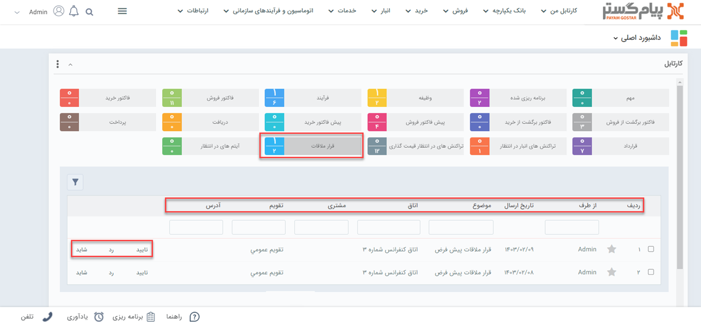

# تایید قرارملاقات
هنگام ثبت قرارملاقات چنانچه چک‌باکس‌های **"لیست دعوت شدگان به این شرکت کننده ارسال شود"** و  **"وضعیت حضور شرکت کننده به هماهنگ کننده اطلاع داده شود"** انتخاب شود، الزاماتی در خصوص برگزاری جلسات ایجاد خواهد شد. این الزامات براساس شرکت‌کنندگان در سه قالب متفاوت برای **کاربر**، **مشتری** و **فردی خارج از شرکت** نمایش داده می‌شود.
 
 - **کاربر**: اگر فرد شرکت کننده از کاربرهای سیستم باشد این الزام برای حضور در جلسه را می‌تواند از طریق  **تقویم کاری** یا **صفحه اصلی قرارملاقات** مشاهده کند.
>**نکته** 
شخصی که مجوز لغو قرارملاقات را از طریق شخصی‌سازی داشته باشد می‌تواند قرارملاقات ثبت شده را از صفحه اصلی قرارملاقات لغو کند.

 قرارملاقات‌ها برای کاربر از طریق روش‌های تفاوتی نمایش داده می‌شود. مشاهده قرارملاقات‌ها از طریق کارتابل یکی از ساده‌ترین روش‌ها برای تایید یا رد حضور در جلسه می‌باشد. بدین صورت که شما از طریق نوار نمایش داده شده می‌توانید یکی از کلیدهای **تایید**، **رد** یا **شاید** را انتخاب کنید.
>**نکته** 
با ورود به صفحه قرارملاقات‌ها تنها شخصی که مجوز لغو قرار ملاقات را داشته باشد می‌تواند جلسه را لغو کند.

- **مشتری**: چنانچه این قرار ملاقات برای مشتری ثبت شده باشد، مشتری لینکی در خصوص تایید یا رد جلسه دریافت خواهد کرد. این پیامک از طریق ایمیل یا پیامک به مشتری ارسال می‌شود.

- **اطلاعات تماس**: در صورتیکه فرد خارج از شرکت باشد می‌توانید از طریق راه‌های ارتباطی که برای او ثبت کرده‌اید پیامی در خصوص شرکت یا عدم شرکت در جلسه ارسال نمایید.