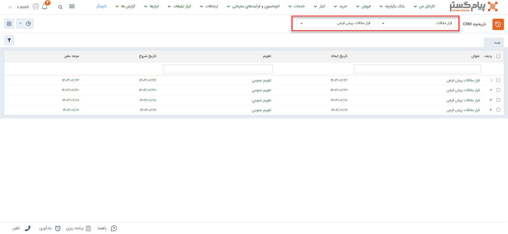
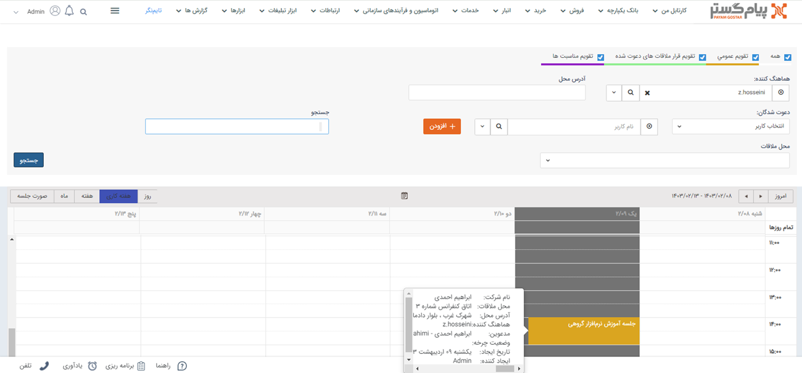
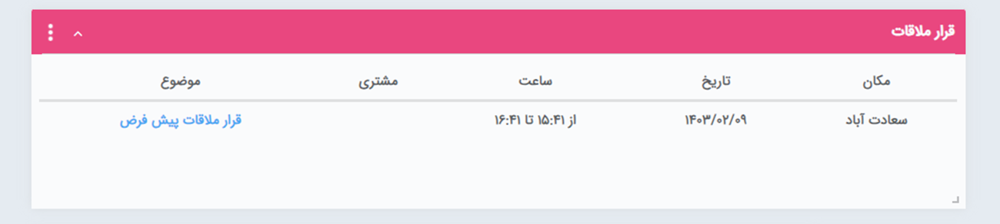
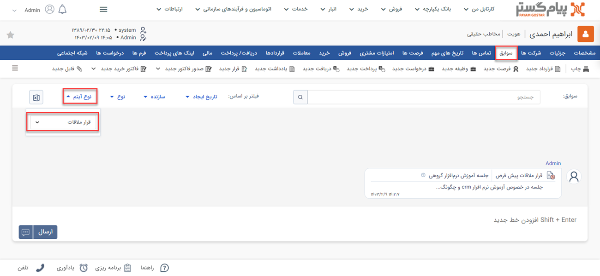

# مشاهده لیست قرارملاقات ثبت شده
دراین مقاله روش‌های مشاهده‌ی لیست قرارملاقات‌ها در دو حالت بررسی می‌شود: 
- [مشاهده لیست تمامی قرارملاقات‌های ثبت شده](#AllMeetings)
- [مشاهده قرارملاقات‌های ثبت شده برای یک هویت](#CustomerMeetings)

## مشاهده لیست همه قرارملاقات‌های ثبت شده{#AllMeetings}
برای مشاهده لیست همه یادداشت‌های ثبت شده تنها یک روش وجود دارد:

- از طریق **تب بانک یکپارچه** > **تاریخچه CRM**  می‌توانید با اعمال فیلتر "نوع" بر روی قرارملاقات و انتخاب زیرنوع مورد نظر/همه در فیلتر کناری، تمامی قرارملاقات‌های ثبت شده را مشاهده نمایید.

## مشاهده لیست قرارملاقات‌های ثبت‌شده یک هویت{#CustomerMeetings}
برای مشاهده لیست قرارملاقات‌های ثبت شده برای یک مخاطب می‌توانید از روش‌های زیر اقدام نمایید: 

-  می‌توانید از آن برای مشاهده قرارملاقات و جلسات استفاده کنید مشاهده **تقویم** است. جلسات تنظیم شما همراه با روز و ساعت در تقویم مورد نظر قابل مشاهده است.

 > **نکته** وضعیت تایید حضور کاربر می‌تواند به هماهنگ کننده قرار ملاقات اطلاع داده شود، برای تنظیم متن پیام مرتبط با این اطلاع رسانی به مدیریت پیام های سیستم مراجعه کنید.
>> **نکته** در صورتی که کاربری درخواست حضور را تایید نکند، می توان آن کاربر را در قرار ملاقات دیگری در همان زمان دعوت کرد.

- روش بعدی استفاده از **ویجت قرارملاقات** است.
با استفاده از این ویجت می‌توانید لیست قرارملاقات‌هایی که در آن روز در آن دعوت شده‌اید و یا هماهنگ‌کننده آن جلسه هستید را مشاهده نمایید. توجه داشته باشید که در این ویجت تنها جلسات همان روز (مطابق با تاریخ برگزاری) قابل مشاهده می‌باشد.

> **نکته**  
جلسات هر روز تا قبل از ساعت پایان در این ویجت نمایش داده می‌شود. پس از گذشت ساعت پایان جلسه، از ویجت قرارملاقات خارج می‌شود.

در نظر داشته باشید، ترتیب نمایش قرارملاقات‌ها در ویجت، به صورت صعودی براساس ساعت شروع آن‌ها است. به عبارت دیگر نزدیک‌ترین جلسه در بالاترین سطر و آخرین جلسه‌ی روز در سطر انتهایی نمایش داده می‌شود.

> **نکته** 
با کلیک بر روی موضوع جلسه، وارد آیتم قرارملاقات ثبت‌شده که در آن دعوت شده‌اید و یا هماهنگ‌کننده آن هستید می‌شوید. در صورتی که بر روی نام درج شده در ستون مشتری کلیک نمایید، وارد صفحه پروفایل هویتی می‌شود که قرارملاقات مرتبط با ایشان و در سوابق او ثبت شده است.

- از طریق صفحه **پروفایل مخاطب** > **تب سوابق** می‌توانید به قرارملاقات‌های ثبت شده برای مخاطب دسترسی داشته باشید. بدین منظور با استفاده از ویجت جستجوی سریع، صفحه پروفایل هویت مورد نظر را باز کنید. در صفحه اصلی پروفایل هویت از قسمت سوابق  با اعمال فیلتر روی "نوع آیتم" و انتخاب «قرارملاقات» می‌توانید قرارملاقات‌های ثبت شده در فرآیند فروش را برای هویت مورد نظر خود را مشاهده نمایید. 

> **نکته** 
> برای مشاهده قرارملاقات‌های ثبت شده در سابقه یک هویت باید مجوز مشاهده سوابق را بر روی آن زیرنوع هویت و همچنین مشاهده آیتم را در زیرنوع‌های قرارملاقات‌ها داشته باشید.  