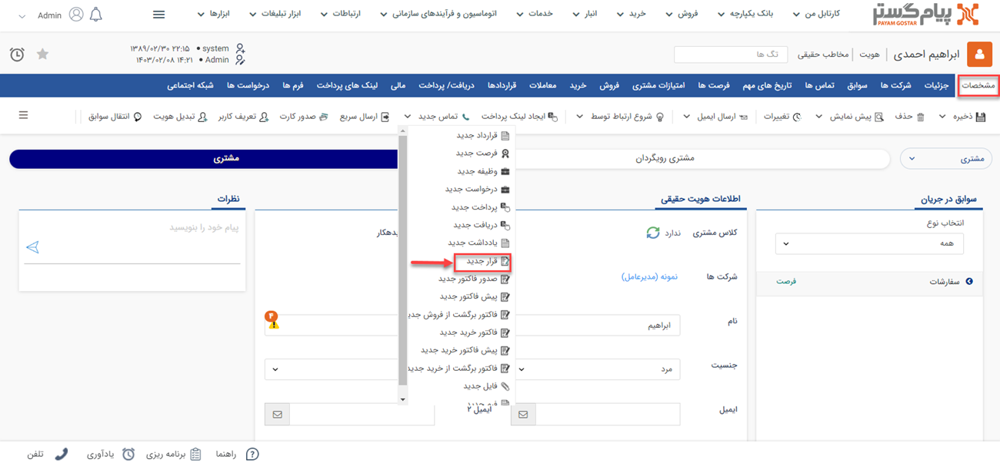

# قرارملاقات جدید 
می توانید با استفاده از این فعالیت یک قرار ملاقات در سوابق هویت مرتبط با آیتم تحت چرخه، یا یک هویت دیگر ایجاد کنید، به طور مثال فرض کنید در فرآیند فرصت فروش، برای بعضی از مشتریان نیاز به جلسه پرزنت محصول احساس می‌شود، در این صورت می‌توانید با استفاده از این فعالیت، قرار ملاقات مرتبط با جلسه پرزنت فروش را به صورت خودکار توسط سیستم ایجاد کنید. توجه داشته باشید در صورتی که این نوع قرار ملاقات چرخه کاری فعال داشته باشد، با ایجاد قرار ملاقات چرخه کاری مربوط به آن نیز فعال خواهد شد.

## مسیر‌های ثبت قرارملاقات جدید
شما از طریق مسیرهای زیر می‌توانید برای مشتری خود یک قرارملاقات جدید ثبت کنید. 
- **ویجت دسترسی سریع** > **قرارملاقات**

- **صفحه اصلی پروفایل مخاطب** > **آیتم جدید** > **قرارملاقات جدید** 
برای مشاهده لیست «آیتم‌های جدید» بر روی فلش کنار «تماس جدید» (قابل مشاهده در نوار سفید بالای صفحه) مراجعه نمایید.

- **صفحه اصلی پروفایل مخاطب** > **تب سوابق** > **قرارملاقات جدید**

## شیوه‌ی ثبت قرارملاقات
مشخصات قرارملاقات در پیام‌گستر به شرح زیر می‌باشد: 

هنگام ثبت قرارملاقات می‌توانید از زیرنوع‌های متفاوتی که برای قرار ملاقات در نظر گرفته‌اید، یکی را انتخاب کنید. 
**مرتبط با** 
نام هویتی که این قرارملاقات برای او ثبت شده را در این قسمت درج کنید. بدین منظور کافیست بخشی از نام هویت مورد نظر را تایپ نمایید تا لیست هویت‌های مشابه آن برای انتخاب به شما نمایش داده شود.

>**نکته** 
ثبت **مرتبط با** در قرارملاقات اختیاری است. گاهی می‌خواهید در سازمان قرارملاقاتی ثبت کنید که نیاز نباشد در پرونده پرسنل ثبت شود بدین منظور قرارملاقات را بدون لحاظ کردن مرتبط با 
  برای ایجاد این فعالیت، پس از تعیین نام و نوع فعالیت، سایر تنظیمات را مطابق با توضیحات زیر انجام دهید. 
  
**1. تخصیص** 
- **هماهنگ کننده**: هماهنگ کننده قرار ملاقات را مشخص کنید، هماهنگ کننده جلسه می‌تواند یک کاربر مشخص و یا کاربر وارد شده در یکی از فیلدهای از نوع لیست کاربر آیتم تحت چرخه باشد .
- **تقویم**: از تقویم‌هایی که در تنظیمات تعریف شده است می‌توانید تقویم مورد نظر خود را انتخاب کنید. 

**2. مشخصات قرارملاقات** 
- **موضوع**: موضوع قرارملاقات را تعیین کنید. این عنوان می‌تواند یک مقدار مشخص یا مقدار وارد شده در یکی از فیلدهای از نوع متن آیتم تحت چرخه باشد. همانطور که مشاهده می‌کنید قابلیت اضافه شدن نام مشتری (هویت مرتبط با آیتم تحت چرخه) به عنوان قرار ملاقات نیز وجود دارد.
- **زمان**: زمان شروع و پایان قرار ملاقات را مشخص کنید. 
این زمان ها می توانند یک مقدار مشخص و یا مقدار وارد شده در فیلدهای از نوع تاریخ و از نوع ساعت آیتم تحت چرخه باشند .
- **محل ملاقات**: محل قرار ملاقات را مشخص کنید. برای تعیین محل قرار  روش‌های متفاوتی وجود دارد:

**اتاق:** می‌توانید یکی از اتاق‌های تعریف شده در قسمت[ مدیریت اتاق ها ](https://github.com/1stco/PayamGostarDocs/blob/master/Help/Basic-Information/Room-management/Room-management.md)را انتخاب کنید. 
**آدرس محل**: یک آدرس مشخص (ثابت برای تمامی قرارهای ایجاد شده از طریق این فعالیت) وارد کنید.
- **تکرار**: در صورتی که می خواهید قرار ملاقات ثبت شده یک الگوی تکرار داشته باشد این گزینه را فعال کرده و پس از آن نحوه تکرار را مشخص کنید .
- **توضیحات جلسه**: می‌توانید توضیحات مرتبط با این قرارملاقات را تحت عنوان توضیحات جلسه در این قسمت اضافه کنید. 

**3. حاضران جلسه**  
- **اطلاعات تماس**: می‌توانبد مدعوین حاضر در جلسه را در صورتی که کاربر و مشتری شرکت شما نیستند اما نیاز است به صورت مهمان در جلسه مورد نظر حضور پیدا کنند اضافه کنید. اطلاعات تماس شامل مواردی نظیر: نام، شماره تماس، ایمیل و فکس می‌باشد.
- **انتخاب کاربر**: می‌توانید مدعوین را از کاربران حاضر در سازمان خود انتخاب کنید.
- **انتخاب مشتری**: در این قسمتمی توانید یک هویت دلخواه (ثابت برای تمامی قرارهای ایجاد شده از طریق این فعالیت) را از بانک اطلاعاتی انتخاب کنید.
- **چک‌باکس‌های مرتبط با حضور**: در این قسمت می‌توانید براساس جلسات برای مدعوین الزاماتی را ایجاد کنید.
  - **حضور شرکت کننده الزامی است**: با انتخاب این چک‌‌باکس شما حضور شرکت‌کنندگان را در جلسه در نظرگرفته شده الزامی می‌کنید.
  - **درخواست تایید حضور به شرکت کننده ارسال شود**:  با انتخاب این گزینه، قرارملاقات پس از ثبت یا در کارتابل کاربر قرار می‌گیرد یا از طریق لینک به مشتری و سایر مدعوین اطلاع‌رسانی می‌شود.
  - **لیست دعوت شدگان به این شرکت کننده ارسال شود**:در این بخش می‌بایست لیست تمامی افرادی که قرار است در این جلسه شرکت کنند برای فرد دعوت شده ارسال شود.
  - **وضعیت حضور شرکت کننده به هماهنگ کننده اطلاع داده شود**: این چک باکس مهمی است و می‌بایست وضعیت حضور شرکت‌کنندگان به هماهنگ‌کننده جلسه اطلاع‌رسانی شود.
  این اطلاع رسانی می‌تواند از بخش تایید در کارتابل یا تایید از طریق لینک‌های ارسال شده صورت گیرد.