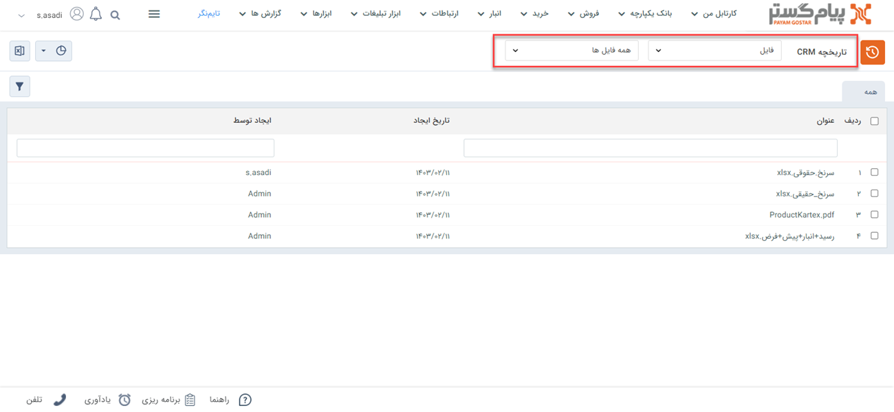
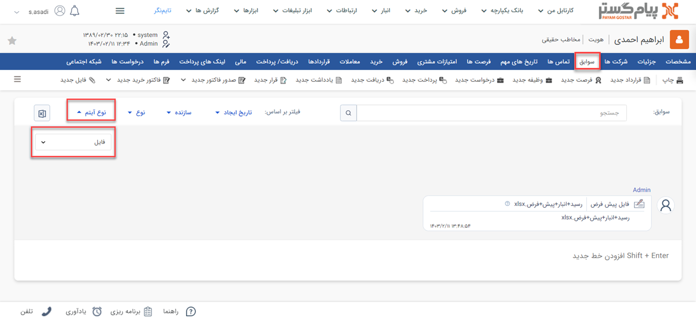

# مشاهده لیست فایل‌های ثبت شده
دراین مقاله روش‌های مشاهده‌ی لیست فایل‌ها در دو حالت بررسی می‌شود: 
- [مشاهده لیست تمامی فایل‌های ثبت شده](#AllFiles)
- [مشاهده فایل‌های ثبت شده برای یک هویت](#CustomerFiles)

## مشاهده لیست همه فایل‌های ثبت شده{#AllFiles}
برای مشاهده لیست همه فایل‌های ثبت شده تنها یک روش وجود دارد:

- از طریق **تب بانک یکپارچه** > **تاریخچه CRM**  می‌توانید با اعمال فیلتر "نوع" بر روی فایل‌ها، و انتخاب زیرنوع مورد نظر/همه در فیلتر کناری، تمامی فایل‌های ثبت شده را مشاهده نمایید.

> **نکته** 
> در صورت داشتن مجوز مشاهده لیست و مشاهده آیتم زیرنوع‌های فایل‌، شما می‌توانید تمامی فایل‌های ثبت شده را در این قسمت‌ مشاهده نمایید. در این صورت تنها مجاز به مشاهده فایل‌هایی که خودتان ثبت کرده‌اید خواهید بود. 

## مشاهده لیست فایل‌های ثبت‌شده یک هویت{#CustomerFiles}
برای مشاهده لیست فایل‌های ثبت شده برای یک مخاطب می‌توانید از روش زیر اقدام نمایید: 

- از طریق صفحه **پروفایل مخاطب** > **تب سوابق** می‌توانید به فایل‌های ثبت شده برای مخاطب دسترسی داشته باشید. بدین منظور با استفاده از ویجت جستجوی سریع، صفحه پروفایل هویت مورد نظر را باز کنید. در صفحه اصلی پروفایل هویت از قسمت سوابق  با اعمال فیلتر روی "نوع آیتم" و انتخاب «فایل» می‌توانید فایل‌های ثبت شده را برای هویت مورد نظر خود  مشاهده نمایید. 

> **نکته** 
> برای مشاهده فایل‌های ثبت شده در سابقه یک هویت باید مجوز مشاهده سوابق را بر روی آن زیرنوع هویت و همچنین مشاهده آیتم را در زیرنوع‌های فایل‌ها داشته باشید.  