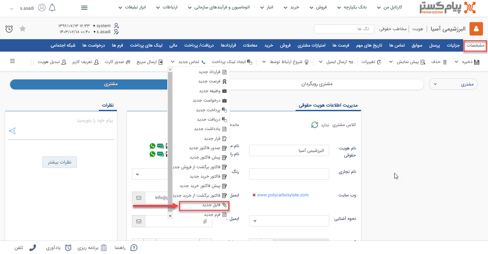
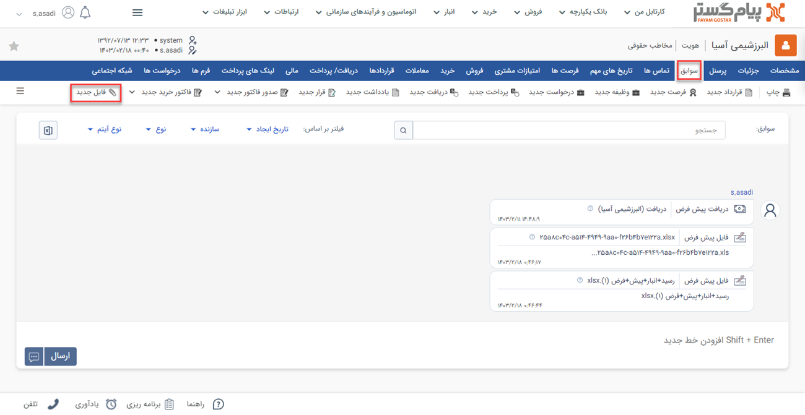

# فایل جدید 
چنانچه مذاکراتی با مشتری صورت بگیرد و نیاز به ثبت فایل در پرونده مشتری باشد می‌توانید از آیتم فایل استفاده کنید. فایل در پیام‌گستر شامل اطلاعاتی نظیر موضوع و محتوای موردنظر می‌باشد.

## مسیر‌های ثبت  فایل
شما از طریق مسیرهای زیر می‌توانید برای مشتری خود یک فایل جدید ثبت کنید. 

- **صفحه اصلی پروفایل مخاطب** > **آیتم جدید** > **فایل جدید** 
برای مشاهده لیست «آیتم‌های جدید» بر روی فلش کنار «تماس جدید» (قابل مشاهده در نوار سفید بالای صفحه) مراجعه نمایید.

- **صفحه اصلی پروفایل مخاطب** > **تب سوابق** > **فایل جدید**

## شیوه‌ی ثبت فایل
مشخصات فایل در پیام‌گستر به شرح زیر می‌باشد: 

