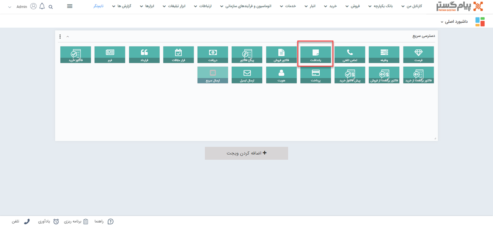
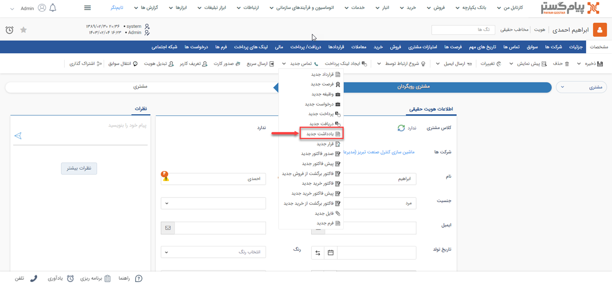
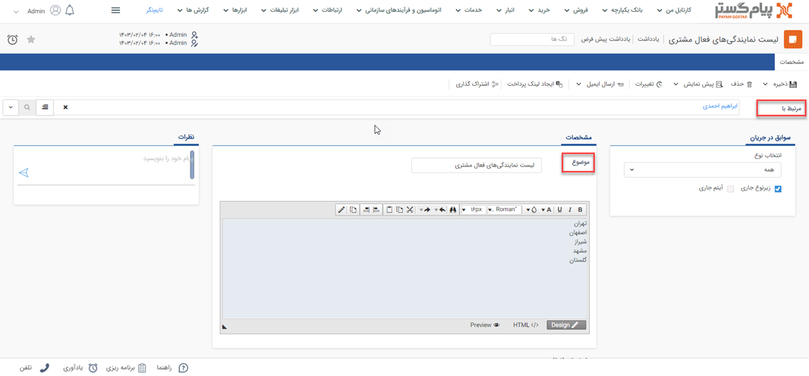

# یادداشت جدید 
چنانچه مذاکراتی با مشتری صورت بگیرد ونیاز به ثبت آن در پرونده مشتری باشد می‌توانید از آیتم یادداشت استفاده کنید. یادداشت در پیام‌گستر شامل اطلاعاتی نظیر موضوع و محتوای موردنظر می‌باشد.

## مسیر‌های ثبت  یادداشت
شما از طریق مسیرهای زیر می‌توانید برای مشتری خود یک یادداشت جدید ثبت کنید. 
- **ویجت دسترسی سریع** > **یادداشت**

- **صفحه اصلی پروفایل مخاطب** > **آیتم جدید** > **یادداشت جدید** 
برای مشاهده لیست «آیتم‌های جدید» بر روی فلش کنار «تماس جدید» (قابل مشاهده در نوار سفید بالای صفحه) مراجعه نمایید.

- **صفحه اصلی پروفایل مخاطب** > **تب سوابق** > **یادداشت جدید**

## شیوه‌ی ثبت یادداشت
مشخصات یادداشت در پیام‌گستر به شرح زیر می‌باشد: 

**1. مرتبط با** 
نام هویتی که این یادداشت برای او ثبت شده را در این قسمت درج کنید. بدین منظور کافیست بخشی از نام هویت مورد نظر را تایپ نمایید تا لیست هویت‌های مشابه آن برای انتخاب به شما نمایش داده شود.

**2. مشخصات** 
در این قسمت می‌بایست مشخصات مرتبط با یادداشت را در این قسمت ثبت نماید.

- **عنوان**: برای یادداشتی که می‌خواهید ثبت کنید باید عنوانی را انتخاب کنید. ثبت کردن عنوان برای یادداشت‌ها به شما کمک می‌کند در گزارش‌‌ها بتوانید یادداشت‌ها را براساس عنوانشان فیلتر کنید.
- **متن یادداشت**: متنی که قصد دارید به عنوان یادداشت برای مشتری خود ثبت کنید را در این قسمت درج نمایید.
>**نکته** 
چنانچه نیاز به ثبت مشخصات دیگری برای یادداشت دارید می‌توانید از طریق .مشخصات اضافه" این اطلاعات را اضافه کنید."
