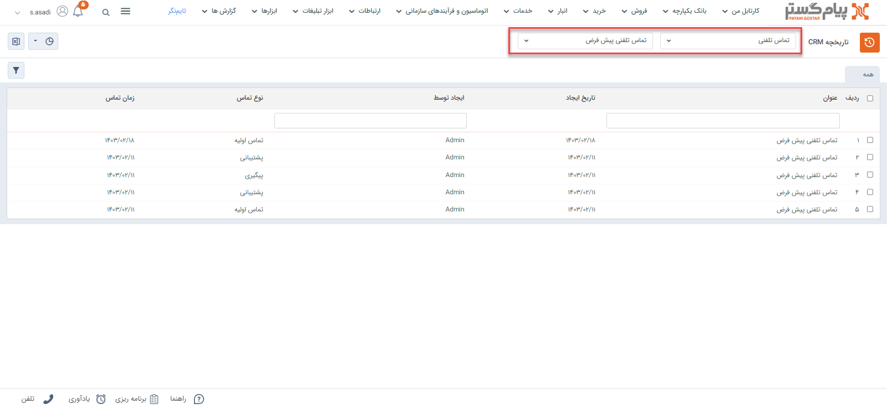
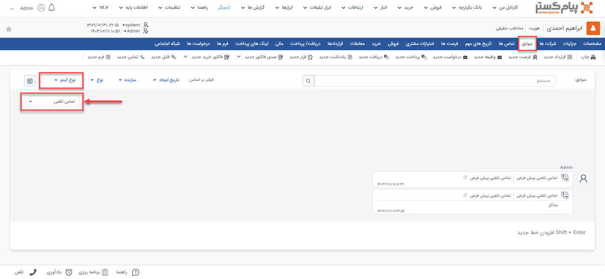

# مشاهده لیست تماس‌ ثبت شده
دراین مقاله روش‌های مشاهده‌ی لیست تما در دو حالت بررسی می‌شود: 
- [مشاهده لیست تمامی تماس‌های تلفنی ثبت شده](#AllPhoneCall)
- [مشاهده تماس‌های تلفنی ثبت شده برای یک هویت](#CustomerPhoneCalls)

## مشاهده لیست همه تماس‌های تلفنی ثبت شده{#AllPhoneCall}
برای مشاهده لیست همه تماس‌های تلفنی ثبت شده تنها یک روش وجود دارد:

- از طریق **تب بانک یکپارچه** > **تاریخچه CRM**  می‌توانید با اعمال فیلتر "نوع" بر روی قرارداد، و انتخاب زیرنوع مورد نظر/همه در فیلتر کناری، تمامی یادداشت‌های ثبت شده را مشاهده نمایید.

> **نکته** 
> در صورت داشتن مجوز مشاهده لیست و مشاهده آیتم زیرنوع‌های قرارداد، شما می‌توانید تمامی تماس‌های تلفنی ثبت شده را در این قسمت‌ها مشاهده نمایید. در این صورت تنها مجاز به مشاهده تماس‌هایی که خودتان ثبت کرده‌اید خواهید بود. 

## مشاهده لیست تماس‌های تلفنی ثبت‌شده یک هویت{#CustomerPhoneCalls}
برای مشاهده لیست تماس‌های تلفنی ثبت شده برای یک مخاطب می‌توانید از روش زیر اقدام نمایید: 

- از طریق فیلتر روی تماس تلفنی **پروفایل مخاطب** > **تب سوابق** می‌توانید به تمامی تماس‌تلفنی‌های ثبت شده برای مخاطب دسترسی داشته باشید. بدین منظور با استفاده از ویجت جستجوی سریع، صفحه پروفایل هویت مورد نظر را باز کنید. در صفحه اصلی پروفایل هویت از قسمت سوابق  با اعمال فیلتر روی "نوع آیتم" و انتخاب «تماس تلفنی» می‌توانید قرارداد‌های ثبت شده در فرآیند فروش را برای هویت مورد نظر خود را مشاهده نمایید. 

> **نکته** 
> برای مشاهده تماس‌های تلفنی ثبت شده در سابقه یک هویت باید مجوز مشاهده سوابق را بر روی آن زیرنوع هویت و همچنین مشاهده آیتم را در زیرنوع‌های یادداشت‌ها داشته باشید.  