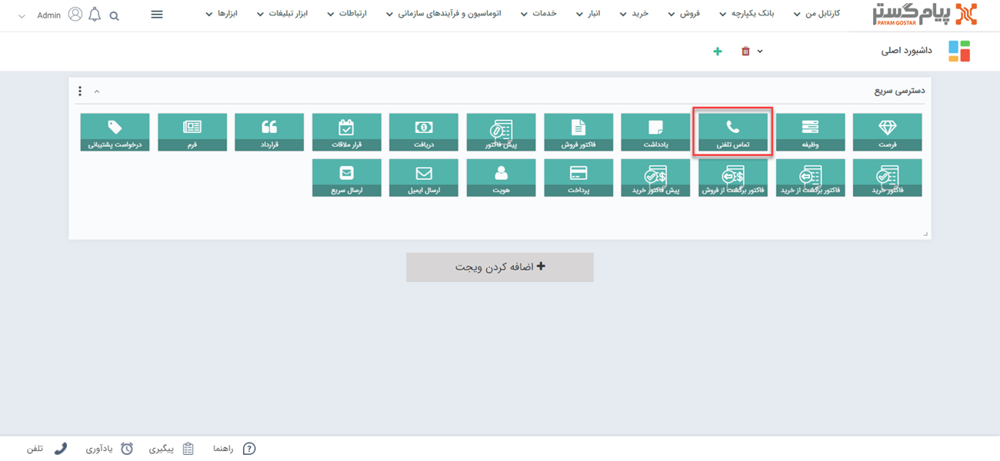
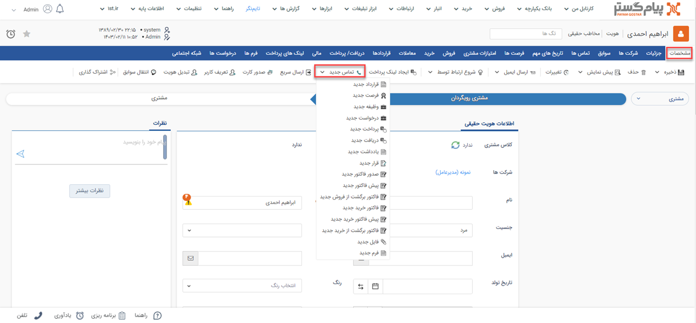
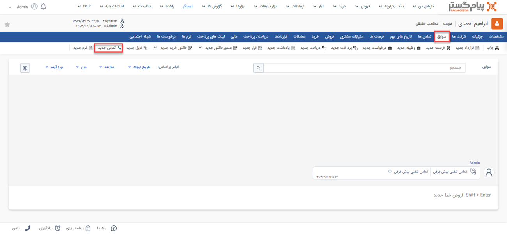
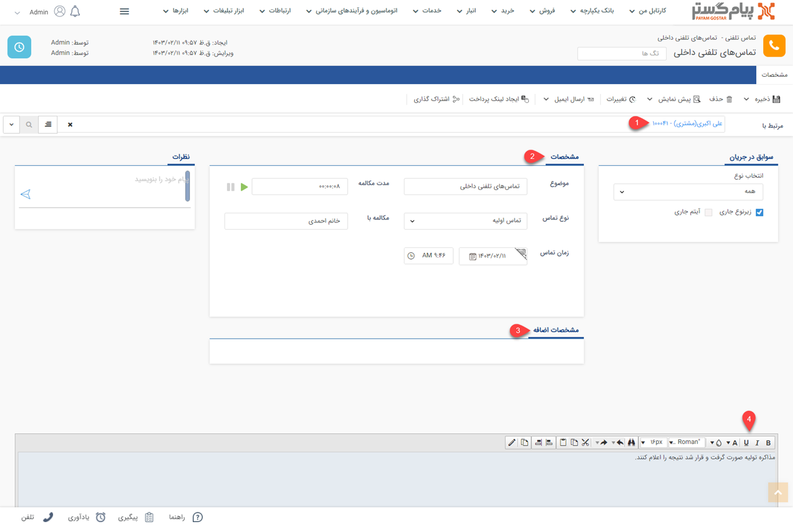

# ثبت سابقه تماس تلفنی
زمانی که با یک مشتری تماس می‌گبرید یا مشتری با شما تماس می‌گیرد می‌توانید برای آن یک سابقه از نوع تماس تلفنی ثبت نمایید تا تاریخچه‌ای از زمان‌های تماس مشتری و مکالمات صورت‌گرفته، ایجاد شود. در مدیریت سوابق هویت، این آیتم از جایگاه ویژه‌ای برخوردار است.

## مسیر‌های ثبت  تماس تلفنی
شما از طریق مسیرهای زیر می‌توانید برای مشتری خود یک یادداشت جدید ثبت کنید. 
- **ویجت دسترسی سریع** > **تماس‌ تلفنی**

- **صفحه اصلی پروفایل مخاطب** > **تماس تلفنی جدید** 

- **صفحه اصلی پروفایل مخاطب** > **تب سوابق** > **تماس تلفنی جدید**

## شیوه‌ی ثبت تماس تلفنی
مشخصات تماس تلفنی در پیام‌گستر به شرح زیر می‌باشد: 

برای ثبت سابقه تماس تلفنی مراحل زیر را انجام دهید: 
### 1. مرتبط با  
نام هویتی که این تماس تلفنی برای او ثبت شده را در این قسمت درج کنید. بدین منظور کافیست بخشی از نام هویت مورد نظر را تایپ نمایید تا لیست هویت‌های مشابه آن برای انتخاب به شما نمایش داده شود. 
### 2. مشخصات  
در این قسمت مشخصات مرتبط با تماس صورت گرفته را وارد کنید. 
- **موضوع**: ابتدا موضوع تماس مشتری را در موضوع ثبت کنید. 
- **مدت مکالمه**: در قسمت مدت مکالمه، با زدن دکمه سبز رنگ Play در ابتدای تماس و زدن دکمه توقف در پایان تماس، مدت مکالمه را ثبت کنید.
- **نوع تماس**: نوع تماس را با توجه به هدف آن در نوع تماس مشخص کنید. ردیف لیست‌های نمایش داده شده در مدیریت آیتم‌ها قابل تغییر است.
- **مکالمه با**: نام شخصی را که مکالمه با آن صورت گرفته در مکالمه با وارد کنید.
- **زمان تماس**: تاریخ تماس به‌صورت خودکار تاریخ روز جاری را نشان می‌دهد، اما اگر تماس در تاریخ یا ساعت دیگری صورت گرفته است می‌توان آن را در زمان تماس تغییر داد. 

>**نکته** 
در صورتی که از پنجره تماس در نرم افزار استفاده می کنید. نیازی به پر کردن این فیلد نیست. 

### 3. مشخصات اضافه 
 در این قسمت می‌توانید مشخصات اضافه مرتبط با این تماس تلفنی را ثبت کنید. 
### 4. توضیحات 
 خلاصه ای از مکالمات صورت‌گرفته با مخاطب را در این قسمت یادداشت کنید. 
