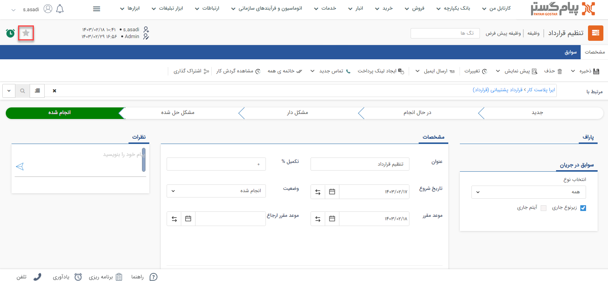

# آیتم مهم
برای ثبت هر یک از آیتم‌ها در ‌‌CRM پیام‌گستر از طریق نوار دسترسی بالا می‌توانید آیتم مورد نظر را **مهم** کنید. 
چنانچه نیاز باشد آیتم‌های سیستم براساس کاربرد یا استفاده آن **مهم** شوند می‌توانید از این آیتم استفاده کنید.

> **نکته** 
اگر آیتمی را از نوار بالا مهم شده باشد، آیتم‌ها در کارتابل مربوطه براساس مهم بودن .دسته‌بندی می‌شوند