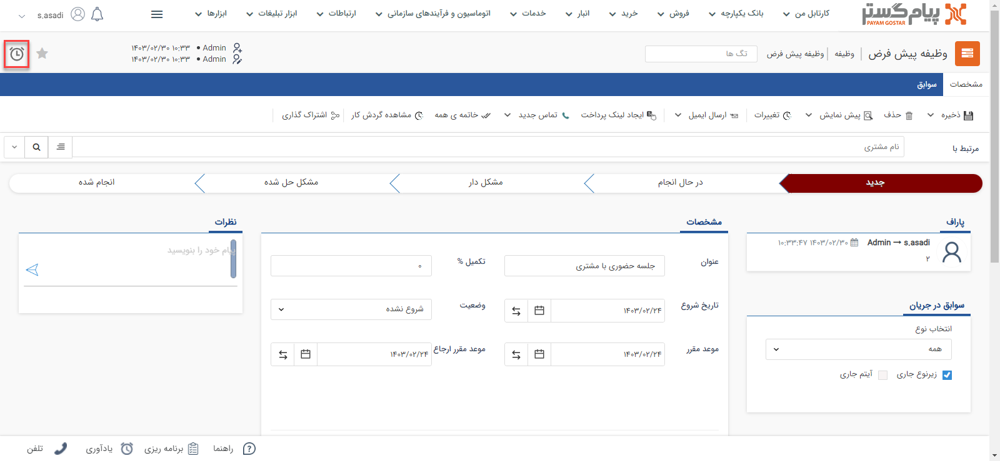
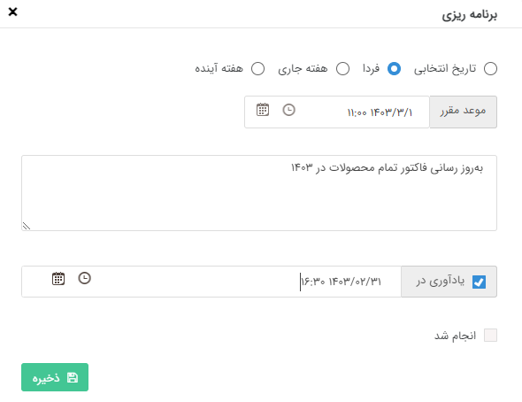
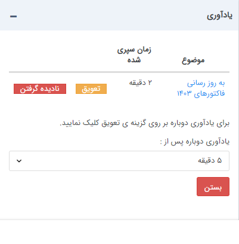

#  ثبت برنامه‌ریزی و یادآوری 

در صورتی که می‌خواهید در ارتباط با یکی از آیتم‌های سیستم یک پیگیری برای کاربری خودتان ایجاد کنید (به طور مثال پیگیری برای برقراری تماس) می‌توانید از قابلیت ایجاد پیگیری استفاده کنید. این قابلیت برای تمامی آیتم‌های crm اعم از پروفایل هویت‌ها و تمامی انواع سوابق وجود دارد. لیست یادآوری‌های خود را می‌توانید در ویجت برنامه‌ریزی شده مشاهده نمایید.

برای دسترسی به این قسمت کافیست بر روی آیکون برنامه‌ریزی در زیر نوار ابزار مشخصات کلیک کنید.در صورتی که برنامه‌ریزی روی این آیتم تنظیم شده باشد، آیکون ساعت سبزرنگ خواهد شد

همانطور که در عکس ملاحظه می کنید، می توانید در این قسمت تنظیمات مرتبط با یادآوری و برنامه‌ریزی مورد نظر خود را تعیین نمائید.

- **نوع انتخاب تاریخ:** تاریخ پیگیری را مشخص کنید.

- **تاریخ پیگیری:** بازه زمانی پیگیری را تعیین کنید. توجه کنید که نحوه نمایش پیگیری های ثبت شده در لیست پیگیری ها و وظایف بر اساس تاریخ موعد می‌باشد.

- **توضیحات پیگیری:** عنوان و یا هر توضیح مرتبط با پیگیری مورد نظر را تعیین کنید.

- **یادآوری در:** در صورتی که تمایل دارید این پیگیری در تاریخ و ساعت خاصی به شما یادآوری شود، این گزینه را فعال کرده و زمان مورد نظر خود برای نمایش یادآوری را وارد کنید.

- **انجام شد:** با فعال کردن این گزینه پیگیری ثبت شده روی این آیتم غیر فعال می شود.

## پنجره یادآوری

پیگیری‌هایی که برای آن‌ها یادآوری تنظیم کرده باشید به صورت زیر در تاریخ و ساعت وارد شده هرکدام نمایش داده خواهند شد. پنجره یادآوری تا زمانی که به تمامی آیتم های درون آن رسیدگی نشده باشد، به صورت مکرر ظاهر خواهد شد .

**موضوع:**  عنوان یادآوری را که تعیین کرده‌اید نمایش می‌دهد در صورتی که عنوانی تعیین نشده باشد، عنوان آیتمی (مانند مخاطب، فاکتور، یادداشت و .... )  که در سیستم بر آن یادآور گذاشته شده نشان داده می‌شود و با کلیک بر روی آن می‌توانید آن را مشاهده کنید.

- **زمان سپری شده:** زمانی که از یادآور تنظیم شده گذشته است.

- **تعویق:** می‌توانید یادآوری آیتم را به اندازه‌ای که در پایین پنجره یادآوری تعیین کرده اید به تعویق بیاندازید.

- **نادیده گرفتن:** یادآور را حذف کرده و دیگر در خصوص این آیتم یادآوری نمایش داده نخواهد شد.

- **یادآوری دوباره پس از:** زمان یادآوری بعدی را برای تعویق تعیین کنید.

