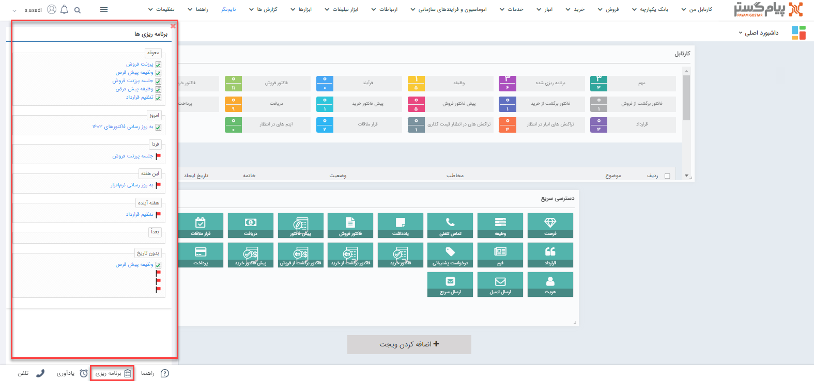
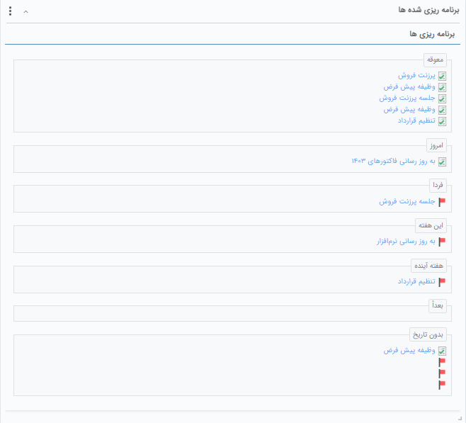
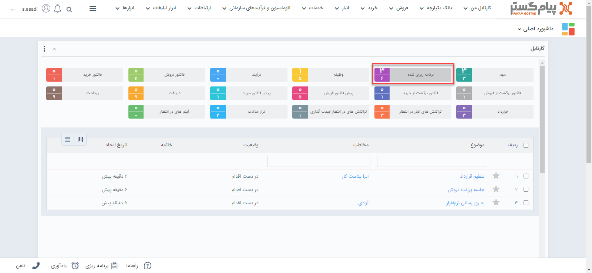

# مدیریت برنامه‌ریزی و یادآوری
در هر بخش/صفحه‌ای از نرم‌افزار با کلیک روی گزینه برنامه‌ریزی می‌توانید لیست برنامه‌ریزی و یادآوری‌ها و همچنین وظایف خود را به تفکیک زمان مقرر آن ببینید. این بخش در واقع امکان دسترسی به ویجت برنامه‌ریزی شده‌ها را در همه‌ی صفحه‌های نرم‌افزار فراهم می‌آورد. 
پیگیری‌های ثبت شده در نرم‌افزار، در **ویجت برنامه‌ریزی شده‌ها** می‌توانید

برای آگاهی از [**نحوه ثبت پیگیری**]() می‌توانید از مقاله موجود در بخش مربوطه استفاده نمایید. 

> **نکته** 
> پیگیری‌های ثبت‌شده در نرم‌افزار، در [**ویجت پیگیری‌ها**](https://github.com/1stco/PayamGostarDocs/blob/master/Help/home/widget/FollowUpWidget/FollowUpWidget.md) و همچنین [**کارتابل وظیفه، پیگیری**](https://github.com/1stco/PayamGostarDocs/blob/master/Help/home/widget/Cardboard/Task-tracking/2.6.0/Task-tracking.md) نیز قابل مشاهده می‌باشند. 

برای مشاهده لیست پیگیری‌های ثبت شده در نرم‌افزار دو روش اصلی وجود دارد:
## ویجت برنامه‌ریزی شده‌ها
در این ویجت لیست کلیه [برنامه‌ریزی‌هایی]() که برای خود ثبت کرده‌اید  تمامی و [وظایفی]() که مسئول انجام آن هستید (به شما ارجاع داده شده) را می‌توانید مشاهده نمایید. بدین ترتیب می‌توانید کارهایی که باید انجام آن را به خاطر داشته باشید در یک کادر ببینید. 
لازم به ذکر است که این ویجت نمایی دیگر از بخش [برنامه‌ریزی شده‌ها در نوار دسترسی]() است و در واقع لیستی از یادآوری‌ها و وظایفی را به شما نشان می‌دهد. شما می‌توانید از طریق کارتابل برنامه‌ریزی شده نیز به آن‌ها دسترسی داشته باشید. 

> **نکته** 
> در این ویجت، برنامه‌ریزی‌ شده‌ها با آیکون پرچم قرمز رنگ و وظایف با آیکون یادداشت سبزرنگ نمایش داده می‌شوند. 

نحوه قرارگیری برنامه‌ریزی شده‌ها در هر کدام از بازه‌های زمانی این ویجت (معوقه، امروز، فردا و ....) بر اساس تاریخ وارد شده در قسمت موعد پیگیری و مهلت وظیفه می‌باشد. یعنی: 
- برنامه‌ریزی شده‌ها بر اساس تاریخ «موعد» در گروه‌‌های مختلف زمان‌بندی قرار می‌گیرند.
- در مورد آیتم وظیفه چنانچه به هنگام ارجاع وظیفه به شما، برای آن تاریخ «مهلت» انتخاب شده باشد، جایگاه آن در لیست برنام‌ریزی شده‌ها بر اساس آن تعیین می‌شود. در غیر این صورت (یعنی ارجاع بدون تاریخ مهلت)‌ وظیفه در قسمت «بدون تاریخ» نمایش داده می‌شود.

## کارتابل برنامه‌ریزی شده‌ها
از این قسمت می‌توانید تمام [وظایف]() و [برنامه‌ریزی]()‌هایی که برای خود ثبت کرده اید، وظایفی که دیگران به شما ارجاع داده اند و وظایفی که شما به کاربران دیگر ارجاع داده اید را مشاهده نمایید .

