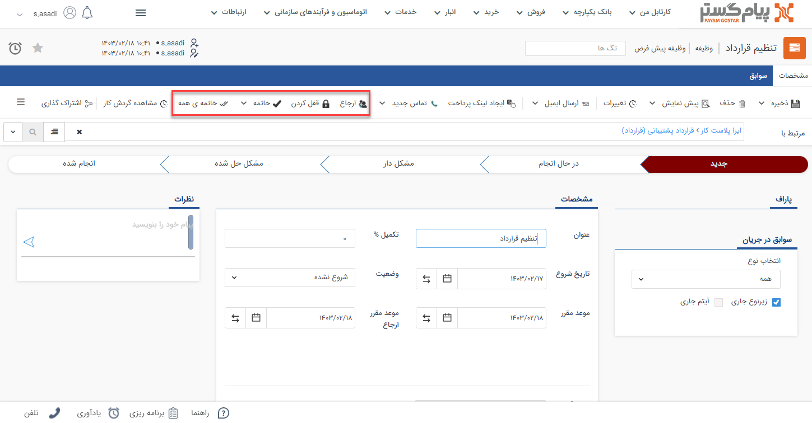

#  وظیفه من

با استفاده از این آیتم می‌توانید یک وظیفه (Task) برای خود در نرم افزار ایجاد کنید. این وظیفه ابزار بسیار توانمندی است که به شما اجازه می‌دهد در خصوص هر موضوع مانند پیگیری یک مورد خاص، یا یک درخواست از مدیر یا نیاز به یک راهنمایی در خصوص یک مورد، یک وظیفه را برای کاربر یا کاربران دیگر نرم افزار ارسال کند و پاسخ مناسب به صورت مکتوب و مستند دریافت نماید. وظیفه‌ها به مدیریت شدن کارها و شفاف سازی سیستم کاری کمک شایانی می‌کنند. 

با باز کردن صفحه وظیفه خود در نوار بالای صفحه شما با کلیدهای ارجاع، قفل کردن ، خاتمه و خاتمه همه مواجه خواهید شد.

 

- **ارجاع**:  در صورتی که می‌خواهید وظیفه را به کاربر یا گروهی از کاربران  دیگر نرم افزار تخصیص دهید این گزینه را انتخاب کنید. 
- **قفل کردن**:می‌توانید زمان‌هایی که نیاز به کار کردن بر روی وظیفه ندارید آن را به حالت قفل شده در بیاورید. وظیفه قفل شده قابلیت ارجاع به دیگران را ندارد، برای خارج کردن وظیفه از حالت قفل شده در صورت اینکه قفل کننده آن وظیفه خودتان باشید میتوان با کلیک بر روی آزاد کردن، وظیفه قفل شده را از این حالت خارج کنید.
- **خاتمه**: هر کاربر پس از انجام دادن کار مرتبط با خودش باید وظیفه را خاتمه دهد تا این وظیفه از کارتابلش خارج شود.

 وظیفه را به چند حالت می‌توان به حالت خاتمه در آورد: 
  **خاتمه:** این وظیفه را برای کاربری شما به حالت خاتمه یافته در می‌آورد و دیگر آن را در قسمت وظایف در دست اقدام در کارتابل مشاهده نخواهید کرد 
 **خاتمه و یادداشت:** وظیفه را به حالت خاتمه یافته در می‌آورد و اجازه می‌دهد که یک یادداشت در پاراف این وظیفه به عنوان توضیحات خاتمه وارد کنید. 
   **خاتمه زنجیره ای:** زنجیره ارجاعات کاربری شما را به حالت خاتمه یافته در می‌آورد. یعنی وظیفه از کارتابل شما و تمامی‌کاربرانی که از طریق ارجاعات شما این وظیفه را دریافت کرده اند خارج خواهد شد. 
- **خاتمه همه**: این وظیفه را برای تمامی‌کاربران به حالت خاتمه یافته در می‌آورد.

>**نکته** 
 توجه داشته باشید که "خاتمه زنجیره ای" و "خاتمه همه" نیاز به داشتن مجوز مربوطه دارد و برای هر کاربری قابل استفاده نیست.

مثال: فرض کنید کاربر A وظیفه را به کاربر B,C ارجاع دهد، کاربر B همان وظیفه را به کاربر D,E و کاربر C آن را به کاربر F ارجاع دهد، همچنین کاربر D نیز آن را به کاربر G ارجاع دهد. در صورتی که کاربر B خاتمه زنجیره ای را بزند، این وظیفه از کارتابل خودش و کاربران D,E,G خارج خواهد شد. اما اگر خاتمه همه را بزند این وظیفه از کارتابل همه کاربران خارج خواهد شد. فلوچارت مربوط به ارجاعات ذکر شده در این مثال را مشاهده کنید:

- **پاراف:** ارجاعات مرتبط با کاربری شما (ارجاعات قبل و بعد از شما) در قسمت پاراف مشاهده خواهد شد که هر کدام از قسمت‌های آن شامل موضوع ذکر شده در آن ارجاع (کاری که باید انجام شود)، زمان ارجاع و کاربر ارجاع دهنده و کاربر دریافت کننده می‌باشد. در مثال بالا کاربر B ارجاعات A → B ،  B → D،  B → E و D → G را می‌تواند در قسمت پاراف مشاهده کند، اما ارجاعات  A → C  و C → F را مشاهده نمی‌کند.

