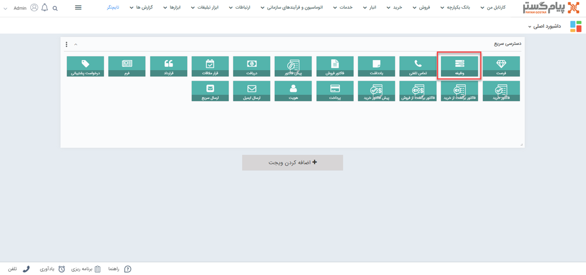
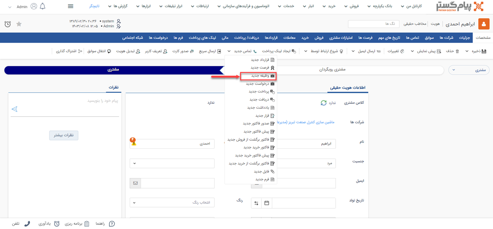
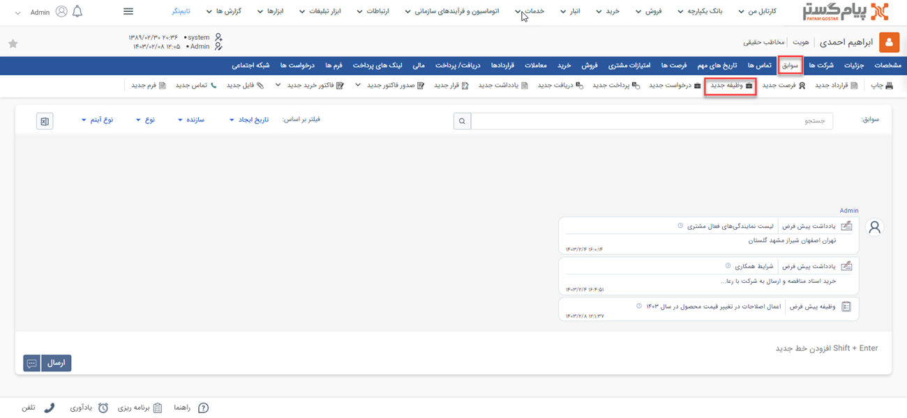
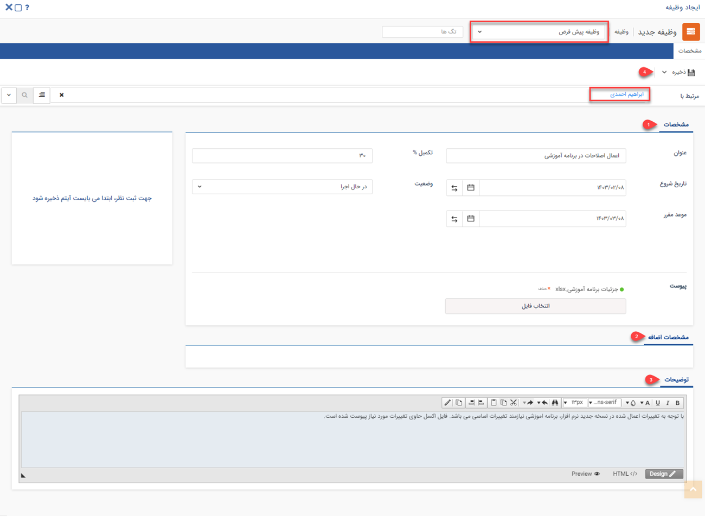
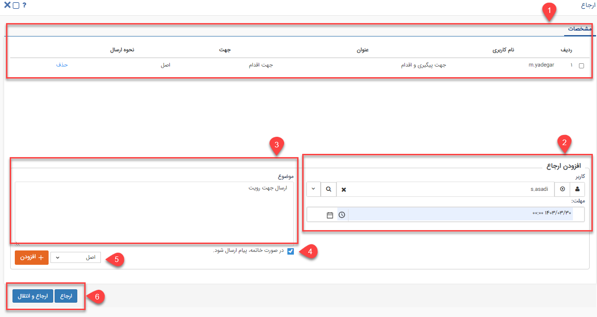

# وظیفه جدید 
مطابق با مذاکرات صورت گرفته با مشتری چنانچه نیاز باشد وظایف یا کارهایی به مخاطب ارجاع داده شود می‌توانید از آیتم وظیفه (Task) در پیام‌گستر استفاده کنید. وظیفه ابزار بسیار توانمندی است که به کاربر اجازه می‌دهد در خصوص هر موضوع مانند پیگیری یک مورد خاص، یا یک درخواست از مدیر یا نیاز به یک راهنمایی در خصوص یک مورد، یک وظیفه را برای کاربر یا کاربران دیگر نرم افزار ارسال کند و پاسخ مناسب به صورت مکتوب و مستند دریافت نماید. وظیفه‌ها به مدیریت شدن کارها و شفاف سازی سیستم کاری کمک شایانی می‌کنند. هر کاربری که وظیفه به او ارجاع داده شود می‌تواند آن را در لیست پیگیری‌ها و وظایف، ویجت پیگیری‌ها و همچنین قسمت وظیفه،پیگیری در کارتابل مشاهده کند.

>**نکته** 
 لطفا ابتدا قسمت اطلاعات مشترک سوابق را مطالعه کنید.

## مسیر‌های ثبت  وظیفه
شما از طریق مسیرهای زیر می‌توانید برای مشتری خود یک وظیفه جدید ثبت کنید. 
- **ویجت دسترسی سریع** > **وظیفه**

- **صفحه اصلی پروفایل مخاطب** > **آیتم جدید** > **وظیفه جدید** 
برای مشاهده لیست «آیتم‌های جدید» بر روی فلش کنار «تماس جدید» (قابل مشاهده در نوار سفید بالای صفحه) مراجعه نمایید.

- **صفحه اصلی پروفایل مخاطب** > **تب سوابق** > **وظیفه جدید**

## شیوه‌ی ثبت وظیفه
مشخصات وظیفه در پیام‌گستر به شرح زیر می‌باشد: 

ابتدا براساس زیرنوع‌‌های ثبت شده برای وظیفه زیرنوع مورد نظر خود را انتخاب کنید. 
**مرتبط با** 
نام هویتی که این وظیفه برای او ثبت شده را در این قسمت درج کنید، هویت‌ها می‌ةوانند نام مشتریان یا حتی پرسنل سازمان خودتان باشد. بدین منظور کافیست بخشی از نام هویت مورد نظر را تایپ نمایید تا لیست هویت‌های مشابه آن برای انتخاب به شما نمایش داده شود.

>**نکته** وظیفه جزء آیتم‌هایی است که نیاز ندارد حتما به یک هویت متصل شود. (یعنی وظیفه بدون اتصال به هویت قابل ذخیره کردن است.) اما در نظر داشته باشید که اگر وظیفه را به هیچ پروفایلی متصل نکنید، در صورتی که وظیفه را در کارتابل خود نداشته باشید نمی‌توانید آن را در سوابق هیچ کدام از هویت‌ها مشاهده کنید و تنها راه پیدا کردن وظیفه مورد نظر، قسمت تاریخچه CRM می‌باشد.

### 1. مشخصات  
در این قسمت می‌بایست مشخصات مرتبط با وظیفه را در این قسمت ثبت نماید.

- **عنوان**: اگر وظیفه را ایجاد می‌کنید عنوان مناسبی را برای وظیفه در نظر بگیرید تا بتوانید از طریق این عنوان موضوع وظیفه را به خوبی دریابید.
- **درصد تکمیل**:همانطور که از نام آن مشخص است می‌توان عددی از 0 تا 100 را انتخاب نمایید تا میزان پیشرفت وظیفه را مشخص کنید.
- **تاریخ شروع/ موعد مقرر**: در صورتی که این وظیفه باید در زمان مشخصی شروع شود این تاریخ را تنظیم نمایید. همچنین در صورتی که این وظیفه در تاریخ موعد مشخصی باید انجام شود این تاریخ را تنظیم نمایید.

- **وضعیت**: وضعیت انجام این وظیفه را مشخص کنید، این لیست در حالت پیشفرض می‌تواند گزینه‌های شروع نشده، درحال اجرا، انجام شده و ... را اختیار کند، لازم به ذکر است مانند تمامی‌ایتم‌های لیستی می‌توانید برای ویرایش و یا اضافه کردن وضعیت جدید به این گزینه‌ها به مدیریت آیتم‌های سیستم مراجعه کنید.
- **پیوست**: می‌توانید فایلی در ارتباط با وظیفه در این قسمت پیوست نمایید. 
### 2.مشخصات اضافه 
 چنانچه نیاز به ثبت مشخصات دیگری برای وظیفه دارید می‌توانید از طریق "مشخصات اضافه" این اطلاعات را اضافه کنید
### 3. توضیحات
توضیحات و هدف کلی مرتبط با این وظیفه را در این قسمت درج کنید.متنی که قصد دارید به عنوان وظیفه برای مشتری خود ثبت کنید را در این قسمت درج نمایید.
### 4.ذخیره
پس از تکمیل قسمت‌‌های مرتبط با ثبت وظیفه، می‌بایست وظیفه ثبت شده را ذخیره نمایید تا بتوان در مرحله ارجاع و بررسی آن را جستجو کرد.

##  ارجاع وظیفه

برای ارجاع وظیفه به کاربران دیگر از دکمه ارجاع در نوار ابزار وظیفه استفاده کنید، پس از کلیک بر روی این دکمه پنجره زیر نمایش داده خواهد شد. ابتدا بایستی نام کاربر، گروه، سمت، دپارتمان یا حکم مورد نظر برای ارجاع این وظیفه انتخاب کنید، مهلت،موضوع و نوع ارسال مرتبط با این ارجاع را وارد کنید و روی دکمه افزودن کلیک کنید. پس از تکمیل اطلاعات مرتبط با تمام ارجاعات از دکمه ارجاع یا ارجاع و انتقال استفاده کنید

>**نکته** 
توجه داشته باشید در صورتی که وظیفه به صورت رونوشت یا رونوشت مخفی برای شما ارسال شده باشد، قابلیت ارجاع به کاربران دیگر را ندارد.

**1. لیست ارجاعات:** هر کاربر یا گروهی که برای ارجاع انتخاب شده باشند در این قسمت نمایش داده می شوند.
توجه داشته باشید که ارجاع یک وظیفه می‌تواند به صورت ترکیبی از حالت های گروهی و تکی باشد.

**2.  کاربر/کاربران دریافت کننده وظیفه:** نام کاربر یا گروهی که می‌خواهید وظیفه برای آنها ارسال شود را انتخاب کنید.

- **مهلت:** زمانی که وظیفه باید به انتها برسد را مشخص کنید. (این زمان در لیست پیگیری های فرد دریافت کننده وظیفه نمایش داده می‌شود.)

**3.موضوع:** پارافی که برای گروه یا کاربری که انتخاب کرده‌اید را بنویسید. (به زبان ساده یعنی این کاربر یا گروهی که در مرحله دوم انتخاب کرده‌اید چه کاری در خصوص این وظیفه باید انجام دهد.)

**4.پیام خاتمه:** در صورت خاتمه پیدا کردن این وظیفه یک پیام به کاربری که این وظیفه را ارجاع داده است ارسال می‌کند. این پیام می‌تواند پیامک، ایمیل، پیام شبکه اجتماعی و یا یک پیام داخل سیستمی باشد.

> نکته: این پیام ها را در قسمت [مدیریت پیام های سیستم](https://github.com/1stco/PayamGostarDocs/blob/master/Help/Basic-Information/Manage-system-messages/Manage-system-messages.md) می توانید تنظیم کنید.

**5.نوع ارسال:** ارسال به سه صورت می‌تواند انجام شود:

- **اصل:** این وظیفه را با قابلیت ارجاع دوباره برای کاربر یا گروه انتخاب شده می‌فرستد.
- **رونوشت:** تنها یک کپی از این وظیفه را برای کاربر یا گروه انتخاب شده ارسال می‌کند و این رونوشت قابلیت ارسال دوباره ندارد.
- **رونوشت مخفی:** یک کپی از این وظیفه برای کاربر یا گروه انتخاب شده می فرستد و در این حالت اگر سایر کاربران قسمت گردش کار این وظیفه را باز کنند، ارسال این رونوشت را نخواهند دید. مگر مجوز مرتبط با مشاهده ارجاع‌های مخفی مرتبط با این نوع از وظیفه را داشته باشند

**6. ارجاع:** به لیستی که از کاربران تهیه کرده اید وظیفه را ارجاع می‌دهد و یک نسخه از این وظیفه در کارتابل شما نیز باقی می‌ماند.

- **ارجاع و انتقال:** به لیستی از کاربران که تهیه کرده‌اید وظیفه را ارجاع می دهد و این وظیفه را از کارتابل شما خارج می‌کند.

