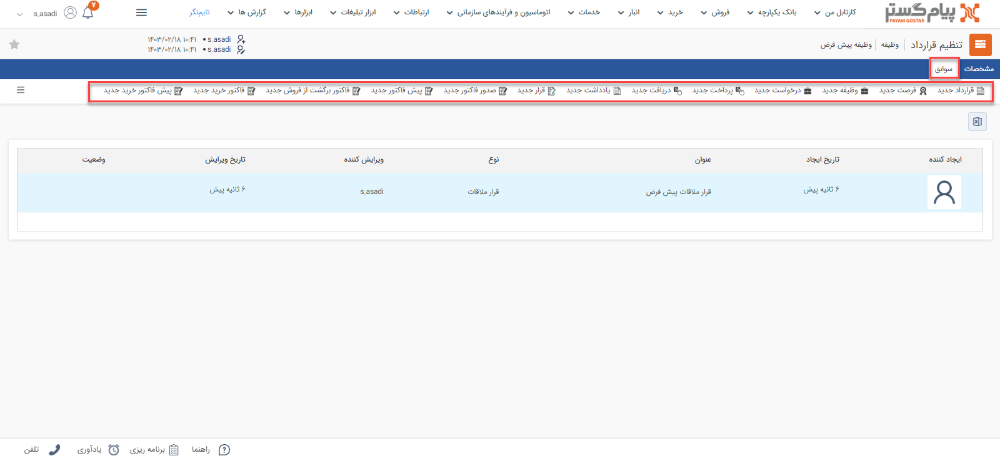

# سوابق مرتبط با وظیفه
در صفحه وظیفه، تب «سوابق» در کنار مشخصات آن مشاهده می‌شود. در این مقاله با کاربرد این دو تب آشنا می‌شوید: 

## سوابق وظیفه
 موجودیت‌های مختلفی (از جمله پیش‌فاکتور، فاکتور، قرارداد، دریافت، قرارملاقات و سایر موارد) می‌توانند به وظیفه، شما متصل باشند. این آیتم‌‌ها علاوه بر سوابق هویت، در سوابق وظیفه‌ای که به آن متصل شده‌اند نیز قابل دسترس هستند. برای دسترسی به آن‌ها کافیست وارد صفحه وظیفه، مورد نظر شوید و بر روی تب سوابق کلیک کنید. 

نوار بالایی تب سوابق وظیفه، امکان ثبت سوابق جدید را به شما می‌دهد. سوابقی که از این بخش ثبت شوند، به وظیفه مذکور متصل خواهند‌بود. 
