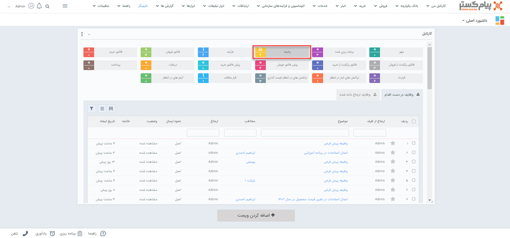
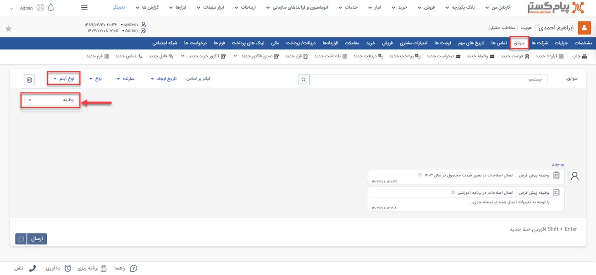
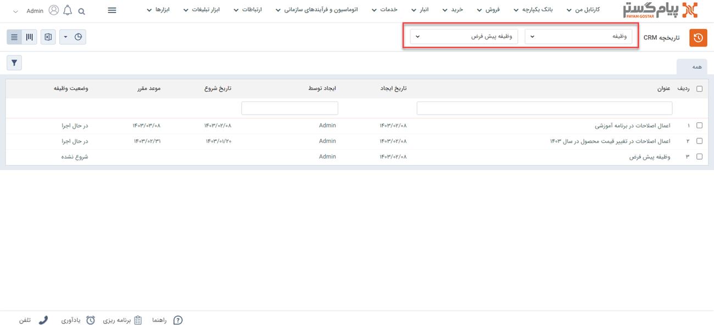

# مشاهده لیست وظیفه‌های ثبت شده
دراین مقاله روش‌های مشاهده‌ی لیست یادداشت‌ها در دو حالت بررسی می‌شود: 
- [مشاهده لیست وظیفه‌های ثبت شده برای خود](#MyTasks)
- [مشاهده وظیفه‌های ثبت شده برای یک هویت](#CustomerTask)
- [مشاهده وظیفه‌های ثبت شده برای یک برای همه](#AllTasks)

## مشاهده لیست وظیفه‌های ثبت شده برای خود{#MyTasks}
در پیام‌گستر می‌توانید پیگیری‌ها و وظایف را برای خودتان وظیفه کنید. در این حالت وظایف‌های ثبت شده برای خود را از طریق مسیر‌های زیر مشاهده می‌کنید.
مشاهده لیست وظایف ثبت شده برای به شرح زیر هستند

از طریق روش **ویجت دسترسی سریع** > **کارتابل** > **وظیفه**می‌توانید لیست‌ وظایف خود را مشاهده کنید.

**صفحه اصلی هویت** > **سوابق** > **نوع آیتم**>**وظیفه**

## مشاهده لیست وظیفه‌های ثبت شده برای خود{#MyTasks}
- از طریق **تب بانک یکپارچه** > **تاریخچه CRM**  می توانید با اعمال فیلتر نوع بر روی ,وظایف و انتخاب زیرنوع مورد نظر/همه، تمامی وظایف ثبت شده را مشاهده نمایید.

