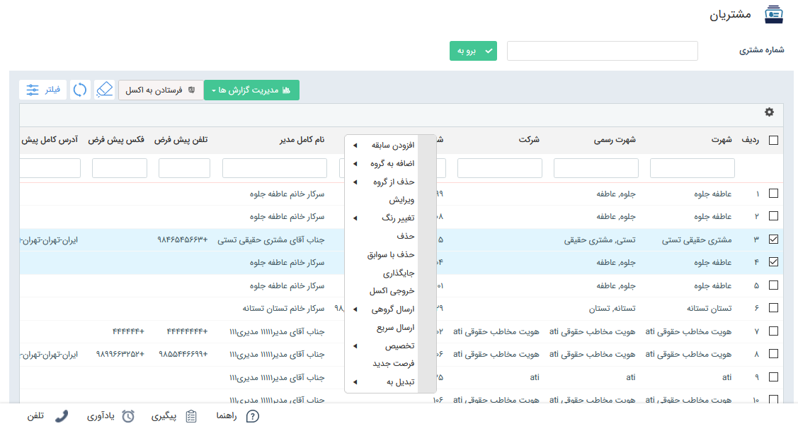

#  لیست مشتریان  

  به صورت معمول به تمامی اشخاص و شرکت هایی که یکبار اقدام به خرید و معامله با ما کرده اند، مشتری می گویند. در نرم افزار پیام گستر تمام مخاطب هایی که **شماره مشتری** دریافت نموده اند، در قسمت مشتریان نمایش داده می‌شوند. در واقع مشتری از نظر نرم افزار مخاطب یا پروفایلی است که شماره مشتری به آن اختصاص داده شده است.

یک مخاطب در مراحل مختلف ممکن است دارای شماره مشتری شود. برای مثال در برخی از کسب و کارها مانند پیرایشگاه یا خشکشویی، مخاطب بلافاصله پس از مراجعه، مشتری محسوب می شود. اما در برخی کسب و کارها مخاطب پس از طی مراحل طولانی (مانند ارسال نمونه، تایید آن، مذاکره و ...) تبدیل به یک مشتری می شود. 

به کمک تب مشتریان، می‌توانید جستجوی خود را بین مخاطبان دارای شماره مشتری محدود کنید.
برای جستجوی سریع یک مشتری، شماره مشتری آن را در فیلد **شماره مشتری** وارد کنید. با کلیک بر دکمه **برو به** یا **Enter** نتیجه جستجو در جدول پایین نمایش داده می‌شود.
برای جستجوی پیشرفته مشتریان، در قسمت **فیلتر**   بر اساس پارامترهای مشخص می‌توانید جستجو را انجام دهید. 

با **کلیک راست** بر روی لیست مشتریان می توانید برای آن ها سابقه ایجاد کنید، آن ها را در گروه های هدف دلخواه عضو کنید و یا از سایر گزینه های کلیک راست استفاده کنید.

>  **نکته:**   با دوبار کلیک بر روی هر کدام از سطرها ، پروفایل مربوط به آن مشتری باز می شود .

به کمک **مدیریت گزارشات** می‌توانید گزارش و داشبوردهای پیشرفته ایجاد نمایید. برای مطالعه بیشتر به بخش [  گزارش ها](https://github.com/1stco/PayamGostarDocs/blob/master/Help/Management-and-reports/Report-Builder/Report-Builder.md) مراجعه کنید.
