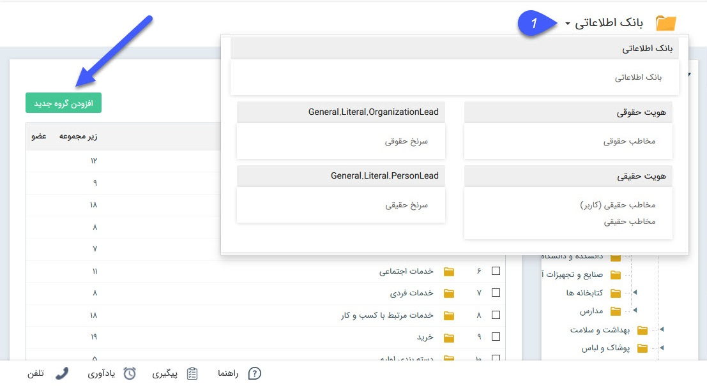
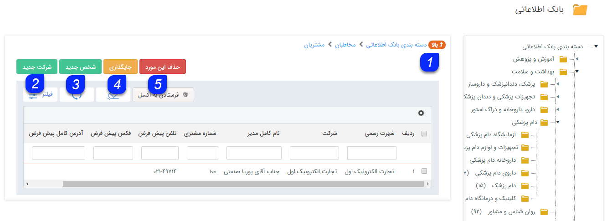
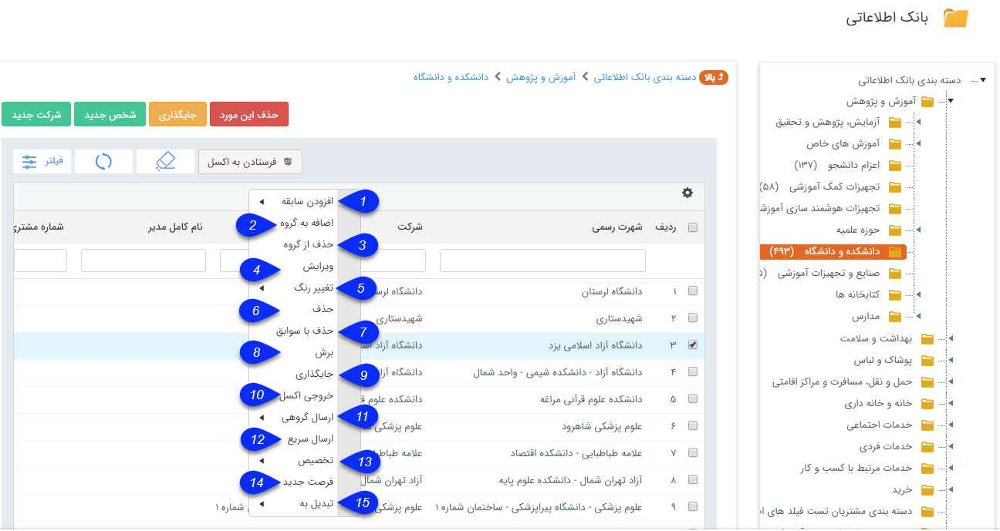

# بانک اطلاعاتی

 در این قسمت میتوانید برای انواع هویت‌ها ( مخاطبان و سرنخ‌های خود) دسته بندی‌های مختلفی را ایجاد کنید.

و لیست دسته بندی‌هایی که ایجاد کرده اید را همراه با تعداد اعضا و تعداد زیر شاخه‌های آن مشاهده کنید.

این دسته بندی‌ها می‌تواند بر اساس منطقه ( برای مثال تهران، کردستان و ...) یا بر اساس حوزه کاری (برای مثال تولید کننده،خدمات و ...) و یا سایر روش‌هایی که برای کسب و کار شما مناسب است، انجام شود.

در نظر داشته باشید که این دسته بندی‌ها در تمامی ‌قسمت‌های نرم افزار مورد استفاده قرار می‌گیرند (مانند ثبت مخاطب یا سر نخ جدید، جستجو، گزارش و ...).

بهتر است که دسته بندی‌هایی که ایجاد می‌کنید از لحاظ نام گذاری و تعداد زیر دسته بندی به گونه ای باشند که برای کاربران سردرگمی‌ایجاد نکنند.

### انواع هویت به شرح زیر می‌باشد:

· **مشتری:** به آن دسته از هویت‌ها گفته می‌شود که ماهیت مشتری دارند و با آن‌ها تعامل فروش برقرار می‌شود. (انواع هویت مشتری به دو نوع سرنخ و مخاطب تقسیم می‌شوند که در زیر توضیح داده شده است.)

·**نماینده:** به آن دسته از هویت‌ها گفته می‌شود که ماهیت نماینده شما را دارند و از نوع مخاطب وجود دارند.

·**تامین کننده:** به آن دسته از هویت‌ها گفته می‌شود که ماهیت تامین کننده دارند و با آن‌ها تعامل خرید برقرار می‌شود و از نوع مخاطب وجود دارند.

· **اپراتور:** به آن دسته از هویت‌ها گفته می‌شود که ماهیت اپراتور دارند و به عنوان کاربر سیستم تعریف می‌شوند و از نوع مخاطب وجود دارند.

·**رقیب:** به آن دسته از هویت‌ها گفته می‌شود که ماهیت رقیب برای شما را دارند و از نوع مخاطب وجود دارند.

### انواع هویت مشتری به شرح زیر است:

·**سرنخ:**  مرحله ای پیش از ثبت مخاطب می‌باشد، یک سرنخ فقط اطلاعات تماس یک شخص یا شرکت است که شما پیش تر هیچ ارتباطی با آن نداشتید ولی گمان میکنید که بتوانید در آینده با آن‌ها ارتباط تجاری برقرار کنید. (اگر صلاحیت سرنخ تایید شود، تبدیل به مخاطب خواهد شد) اطلاعات سرنخ‌ها ممکن است از روش‌های مختلفی مانند سمینارها و همایش‌ها یا بانک‌های اطلاعات مشاغل به دست آید

> **نکته:** امکان ایجاد آیتم مالی (فاکتورها، قرارداد، دریافت، پرداخت) برای هویت‌های از نوع سرنخ وجود ندارد.

 **مخاطب:** مخاطب حقیقی یا حقوقی شامل سرنخ‌هایی است که صلاحیت آنها تایید شده است و یا افراد و سازمان‌هایی است که به دلیل اینکه از قبل با آنها کار کرده ایم و یا از صلاحیت آن‌ها اطمینان داریم از ابتدا به عنوان مخاطب ذخیره کرده ایم.

> نکته: می‌توانید در قسمت [جستجوی پیشرفته](https://github.com/1stco/PayamGostarDocs/blob/master/Help/Integrated-bank/Advanced-search/Advanced-search.md) لیست سرنخ‌هایی را که صلاحیت آن‌ها تایید شده است (تبدیل به مخاطب شده اند) را در اختیار داشته باشید. برای انجام این کار باید پارامتر "وضعیت سرنخ"
 را بر اساس گزینه "واجد شرایط" فیلتر کنید. 
 
> نکته: در صورت نیاز می‌توانید ماژول بانک فهرست مشاغل اول را که در 15 دسته بندی اصلی، اطلاعات مشاغل ثبت شده در پرتال اول(1st.ir ) را برای شما نمایش می‌دهد و شامل بیش از 200 هزار هویت مختلف از مشاغل سراسر کشور است را به عنوان یک بانک کمکی تهیه کنید. این اطلاعات در قالب هویت‌هایی از نوع سرنخ در بانک اطلاعاتی شما نمایش داده خواهند شد.
 
 
 
 با کلیک بر روی "افزودن گروه جدید" می‌توانید یک دسته بندی جدید ایجاد کنید.

**1)**از طریق این بخش می‌توان  با فیلتر براساس نوع هویت، هویت‌ها با نوع مورد نظر را در بانک اطلاعاتی جستجو کرد.

 با دو بار کلیک بر روی هر کدام از دسته بندی‌ها می‌توانید محتوای آن دسته را مشاهده کنید و زیرشاخه‌های آن دسته بندی را مشاهده کنید. همچنین میتوانید دسته بندی جدیدی به زیر شاخه‌های این دسته بندی اضافه کنید.قابل ذکر است که در لایه اخر میتوانید لیست اعضای ان دسته بندی را مشاهده کنید.
 
 
 
 
 
**1. بالا:** بازگشت به لایه قبلی.

**2. شرکت جدید:** می‌توانید یک مخاطب یا سرنخ حقوقی ایجاد کنید.

**3. شخص  جدید:** با کلیک بر روی این دکمه می‌توانید یک سرنخ یا مخاطب حقیقی ایجاد کنید.

**4. جایگذاری:** می‌توایند مخاطبانی را که از یک دسته بندی دیگر برش داده اید در این قسمت جایگذاری(paste) کنید .

**5. حذف این مورد:** می‌توانید مخاطب یا شرکت‌های انتخاب شده را حذف کنی

> **نکته:** توجه داشته باشید که برای حذف مخاطبی که دارای سوابق است، باید ابتدا سوابق آن مخاطب را حذف کنید.

> **نکته:** توجه داشته باشید که ایجاد هویت جدید تنها در آخرین زیرسطح(لایه آخر) ممکن است .  

### کلیک راست بر روی دسته بندی‌ها:

**A. زیر مجموعه:** تعداد دسته بندی‌های زیر مجموعه بک دسته بندی را مشخص می‌کند.

**B. عضو:** تعداد هویت موجود در یک دسته بندی را نمایش می‌دهد.

**1. تغییر نام:** می‌توانید نام دسته بندی مورد نظر را تغییر دهید.

**2. حذف:**  میتوان دسته بندی مشروط بر آن که اطلاعاتی در داخل آن وجود نداشته باشد از این طریق حذف کرد

**3. تبدیل به اختصاصی:** می‌توانید دسته بندی را شخصی نمایید. توجه داشته باشید که برای اختصاصی کردن یک دسته بندی باید خودتان آن را ایجاد کرده باشید و یا مجوز مدیر سیستم یا مدیر بانک اطلاعاتی داشته باشید. دسته بندی اختصاصی شده به رنگ قرمز تغییر پیدا میکند.

> **نکته:** کاربری که دسته ای را تبدیل به اختصاصی می‌کند فقط خود قادر است، اطلاعات داخل آن را مشاهده نماید. (البته مدیر سیستم و یا مدیر بانک اطلاعاتی از این امر مستثنی هستند و کلیه دسته بندی‌ها را مشاهده می‌نمایند.

> **نکته:** در صورت اینکه دسته بندی را شخصی کرده اید میتوانید با راست کلیک کردن مجدد روی دسته بندی و انتخاب تبدیل به عمومی‌آن دسته بندی را از حالت اختصاصی خارج کنید، در حالت عمومی‌همه کاربران دارای مجوز ، میتوانند اطلاعات داخل ان دسته را مشاهده کنند.

> **نکته:** برای اختصاصی کردن و بالعکس عمومی‌کردن یک دسته بندی فقط کاربر سازنده دسته بندی و البته مدیر سیستم و یا مدیر بانک اطلاعاتی میتوانند این عملیات را انجام دهند.

**4. ورود اطلاعات از اکسل:** به قسمت[ ورودی اکسل ](https://github.com/1stco/PayamGostarDocs/blob/master/Help/Integrated-bank/Excel-input/Excel-input.md) مراجعه کنید .

###   کلیک راست بر روی لیست هویت‌ها:

کلیک راست بر روی هویت‌ها، همانطور که در تصویر مشاهده می‌نمایید امکاناتی برای شما فراهم می‌نماید.

**1. افزودن سابقه:** برای هویت یا هویت‌های انتخاب شده می‌توانید سابقه جدیدی ( از انواع فاکتور جدید، قرارداد و .. ) را ایجاد کنید .

**2. اضافه به گروه هدف:**  هویت‌های انتخاب شده را می‌توانید به یک گروه هدف (مانند دعوت به نمایشگاه) اضافه کنید.

**3.  حذف از گروه هدف:**  هویت‌های انتخاب شده را می‌توانید از یک گروه هدف (مانند دعوت به نمایشگاه) حذف کنید.

**4. ویرایش:** هویت انتخاب شده را می‌توانید ویرایش کنید.

**5. تغییر رنگ:** با استفاده از این منو می‌توانید برای هویت‌های انتخاب شده رنگ از لیست رنگ‌های موجود تعیین کنید.

> نکته: برای اضافه یا حذف کردن رنگ‌ها به قسمت[ مدیریت رنگ‌ها ](https://github.com/1stco/PayamGostarDocs/blob/master/Help/Basic-Information/Color-management/Color-management.md)مراجعه کنید.

**6. حذف:** هویت(های) مورد نظر را حذف می‌کند.

**7. حذف با سوابق:** میتوانید با استفاده از این گزینه هویت یا هویت‌های انتخاب شده را به همراه سوابق ثبت شده برای آن/آنها حذف نمایید.

> **نکته:** اگر یک هویت در فیلد یا فیلد‌هایی از نوع شخص/ شرکت استفاده شده باشد، امکان حذف با سوابق، برای آن هویت وجود ندارد.

**8. برش:** می‌توانید هویت یا هویت‌های انتخاب شده را برش زده (Cut) و در دسته بندی دیگری جایگذاری (Paste) کنید.

**9. جایگذاری:** هویت‌های برش زده شده را در این دسته بندی جایگذاری می‌کند.

**10. خروجی اکسل:** از اطلاعات هویت‌های انتخاب شده می‌توانید خروجی اکسل تهیه کنید.

**11. ارسال گروهی:** می‌توانید برای هویت‌های انتخاب شده، پیام گروهی (پیامک، ایمیل، فکس یا چاپ) تنظیم کنید.

**12. ارسال سریع:** می‌توانید یک پیام از طریق رسانه‌های مختلف، در لحظه برای مخاطبان انتخاب شده ارسال کنید.

**13. تخصیص:** میتوانید به هویت‌های انتخاب شده، مسئول ( کارشناس فروش، پشتیبانی و یا متفرقه ) تخصیص دهید.

**14. فرصت جدید:** برای هویت یا هویت‌های انتخاب شده می‌توانید یک [فرصت فروش جدید ](https://github.com/1stco/PayamGostarDocs/blob/master/Help/Opportunity/NewOpportunity.md)ایجاد نمایید.

**15. تبدیل به:** در این بخش دو قابلیت تبدیل نوع هویت و تبدیل سرنخ به مخاطب وجود دارد:

### در خصوص تبدیل هویت، نکات زیر وجود دارد:

**1.**  در این تبدیل تنها امکان تغییر نوع عملکرد هویت وجود دارد یعنی شما میتوانید هویت حقیقی را به حقوقی و حقوقی را به حقیقی تبدیل کنید.

**2.** لازم به ذکر است که بایستی نوع هویت انتخاب شده برای تغییر با نوع هویت‌های انتخاب شده یکسان باشند یعنی هر دو سرنخ یا هر دو مخاطب باشند.

### در خصوص تبدیل سرنخ به مخاطب نکات زیر وجود دارد:

هویت(‌های) انتخاب شده تماما بایستی از نوع سرنخ باشند.

سرنخ‌های حقیقی تنها میتوانند به مخاطبان حقیقی و سرنخ‌های حقوقی تنها میتوانند به مخاطبان حقوقی تبدیل گردند.

### شخصی سازی جدول هویت‌ها:

برای تعیین ستون‌هاي مجاز به نمايش در لیست هویت(Gridview)میتوان از طریق بخش شخصی سازی crm از طریق[ تنظیمات نمایشی ](https://github.com/1stco/PayamGostarDocs/blob/master/Help/Settings/Personalization-crm/CustomizationCommonSettings/ItemsCommonCustomizationSettings_2.7.5.3.md)روی موجودیت هویت فیلد‌های مورد نظر جهت نمایش در لیست هویت را تعیین کرد . اين ستون‌ها به عنوان پیش فرض در جدول مخاطبان نمايش داده مي شود و کاربران از ميان گزينه‌هاي فعال اين قسمت میتوانند براي خود ستون‌هاي مورد نياز را انتخاب کنند.

هر کاربر در قسمت  با کليک بر روي آيکون تنظيمات در لیست هویت‌ها مي تواند از بين ستون‌هاي مجاز تعيين شده در اين قسمت، برخي از آن‌ها را براي خود فعال/غيرفعال کند.

**1. فيلدهاي اصلي:** مي توانيد تعيين کنيد که کداميک از خصوصيات پيش فرض هویت‌ها در ليست هویت‌ها نمايش داده شود.

**2. خصوصيات اضافه شده:** علاوه بر فيلدهاي اصلي، فيلدهايي که از طريق [شخصی سازی-افزودن مشخصه](https://github.com/1stco/PayamGostarDocs/blob/master/Help/Settings/Personalization-crm/Overview/General-information/Add-features/Add-features.md) به  فیلد‌های انواع هویت اضافه شده اند را نيز مي توانيد به عنوان ستون‌هاي نمايش لیست هویت انتخاب کنيد.

