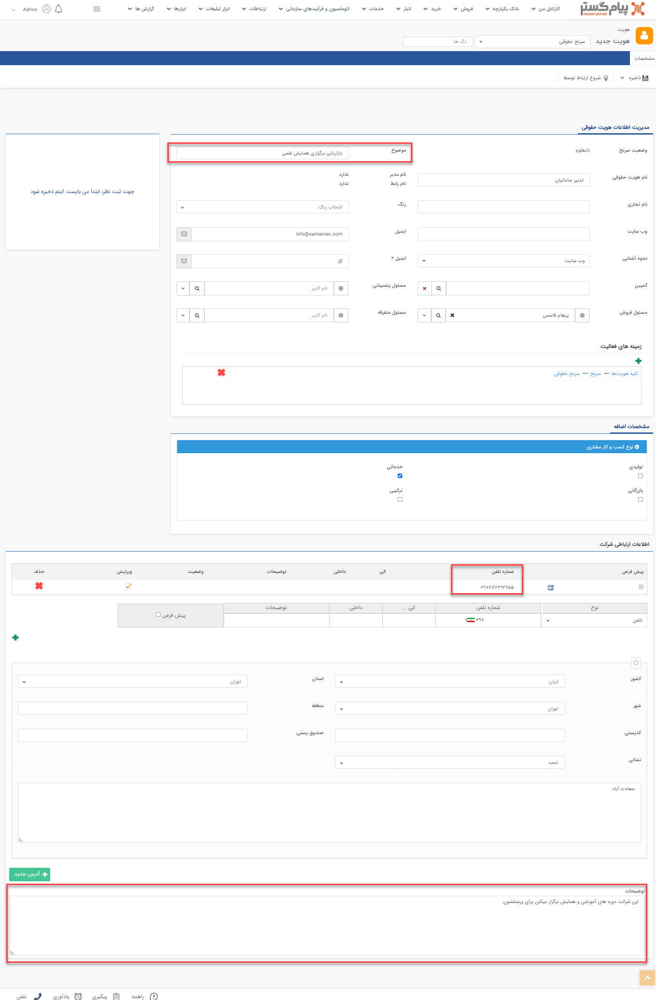

#  ایجاد سرنخ حقوقی جدید 

مطابق عکس زیر برای ورود اطلاعات هویت ها از طریق بانک اطلاعاتی وارد آخرین لایه دسته‌بندی‌ بانک اطلاعاتی شده و گزینه شرکت جدید را برای وارد کردن سرنخ حقوقی و گزینه شخص جدید را برای وارد کردن سرنخ حقیقی انتخاب کنید.

پس از انتخاب، صفحه زیر باز شده و می‌توانید در این صفحه زیرنوع هویت مورد نظرتان را انتخاب کنید.

پس از انتخاب زیرنوع مورد نظر، صفحه‌ای مطابق صفحه زیر باز شده و می‌توانید اطلاعات سرنخ مورد نظر را وارد کنید.

> **نکته** 
> اولویت نمایش اطلاعات ارتباطی (تلفن، فکس، ایمیل، موبایل، آدرس) هویت حقوقی در لیست و قالب چاپ، به صورت زیر می‌باشد: 
> 1- آدرس پیش‌فرض ثبت شده در مشخصات رابط 
> 2- آدرس غیرپیش‌فرض ثبت شده در مشخصات رابط 
> 3- آدرس پیش‌فرض ثبت شده در مشخصات هویت حقوقی 
> 4- آدرس غیرپیش‌فرض ثبت شده در مشخصات هویت حقوقی 
> 5- آدرس پیش‌فرض ثبت شده در مشخصات مدیر 
> 6- آدرس غیرپیش‌فرض ثبت شده در مشخصات مدیر 

لازم بذکر است با توجه به مفهوم و در دست نداشتن اطلاعات لازم و کافی در مورد سرنخ، اطلاعات اولیه درباره سرنخ می‌تواند تنها شامل راه ارتباطی مثل تلفن یا ایمیل باشد و در قسمت موضوع؛ زمینه همکاری با سرنخ یا موضوعی مرتبط را می‌توان مشخص کرد. بعنوان مثال این تصویر مربوط به سرنخی است که تنها موضوع، تلفن و توضیحات تکمیلی ثبت شده است.

پس از تکمیل اطلاعات، بر روی ذخیره کلیک کنید.

