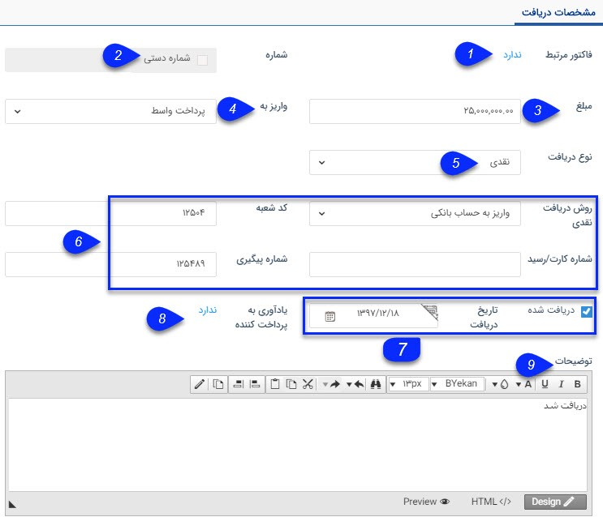

#  ایجاد دریافت - پرداخت جدید 

با استفاده از این آیتم می توانید دریافت های نقدی، چکی یا اعتباری مرتبط با مشتریان خود را ثبت نمایید.

> **نکته مهم:** ابتدا قسمت[ اطلاعات مشترک سوابق ](https://github.com/1stco/PayamGostarDocs/blob/master/help%202.5.4/Integrated-bank/Database/Records/Joint-record-information/Joint-record-information.md)را مطالعه کنید.

**1. فاکتور مرتبط:** در صورتی که این دریافت مرتبط با یک فاکتور فروش ثبت شده در پیام گستر باشد، از قسمت فاکتور مرتبط می توانید از لیست فاکتورهای صادر شده برای این مشتری، فاکتور مورد نظر را انتخاب کنیدو به این دریافت الصاق کنید.

**2. شماره دریافت:** در صورتی که مجوز شماره گذاری این نوع دریافت را داشته باشید، می توانید به صورت دستی این دریافت را شماره گذاری کنید. در غیر این صورت پس از ذخیره دریافت، کاربرانی که مجوز شماره گذاری داشته باشند آن را در کارتابل دریافت های خود مشاهده خواهند نمود و می توانند آن را شماره گذاری کنند. در صورت نیاز کاربر دارای مجوز شماره گذاری دریافت یا مدیر مالی میتواند این شماره را به دلخواه تغییر دهد.

> **نکته:** توجه داشته باشید در صورتی که در تنظیمات این نوع دریافت در شخصی سازی، قسمت "نیاز به شماره گذاری دارد" غیر فعال باشد، این دریافت پس از ثبت به صورت خودکار شماره گذاری خواهد شد.

(در صورت اتصال پیام گستر به نرم افزار مالی در نظر داشته باشید که تغییر این شماره ممکن است در هماهنگی با سیستم مالی مشکل ایجاد کن

**3. مبلغ:** مبلغ دریافت شده را تعیین کنید.

**4. واریز به:** حسابی که این واریز به آن انجام شده است را تعیین کنید.

لیست حساب های مالی نمایش داده شده در این قسمت را می توانید از قسمت [مدیریت حساب های مال](https://github.com/1stco/PayamGostarDocs/blob/master/help%202.5.4/Basic-Information/Financial-account-management/Financial-account-management.md)ی ویرایش کنید.

**5. نوع دریافت:** شما می توانید تمام دریافت های یک مشتری را ثبت نمایید. این دریافت می تواند به صورت نقدی، چکی یا اعتباری باشد. (تعدادی از شرکت ها وجود دارند که مقداری پول به عنوان شارژ و یا اعتبار نزد خود دارند، مشتریان می توانند از این اعتبار برای پرداخت ها استفاده نمایند.)

**6. روش دریافت نقدی:** در صورت اینکه نوع دریافت از مشتری نقدی باشد میتوانید روشی که وجه به دست شما رسیده است را از بین گزینه های( کارت به کارت،واریز به حساب بانکی، پرداخت آنلاین،پرداخت حضوری و لینک پیام گستر پرداخت) انتخاب کنید.

6.1 توجه کنید که فیلدهای این قسمت با توجه به نوع دریافتی که انتخاب کرده اید،تغییر می کند. (برای مثال برای دریافت کارت به کارت از نوع نقدی باید شماره پیگیری و شماره رسید را ذخیره کنید در صورتی که دریافت به صورت چک باشد می توانید شماره چک و تاریخ سررسید آن را نیز مشخص کنید.)

**7. اطلاعات زمان دریافت:** چک باکس "دریافت شده" برای دریافت های چکی و اعتباری معنی دارد و برای دریافت های نقدی نمی توان آن را غیرفعال نمود. در صورتی که گزینه دریافت شده را انتخاب کنید، باید تاریخ دریافت را وارد نمایید.

**8. یادآوری به پرداخت کننده:** با استفاده از این گزینه می توانید یک یادآوری در زمان مشخص برای پرداخت کننده با توجه به تاریخ سر رسید چک ایجاد نمایید.  با انتخاب این گزینه صفحه ارسال پیام برای شما باز خواهد شد و پیامی پیش فرض در آن نمایش داده می شود.

(برای اطلاع در خصوص شیوه تنظیم متن به[ اطلاعات مشترک ابزارها ](https://github.com/1stco/PayamGostarDocs/blob/master/help%202.5.4/Marketing/moshtarak-abzar/moshtarak-abzar.md)مراجعه کنید.)

**9. توضیحات:** توضیحات بیشتری که مرتبط با این دریافت وجود دارد را می توانید در این قسمت وارد کنید.
