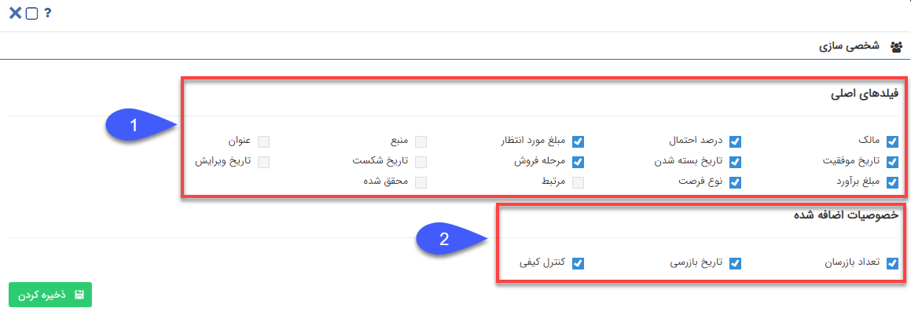
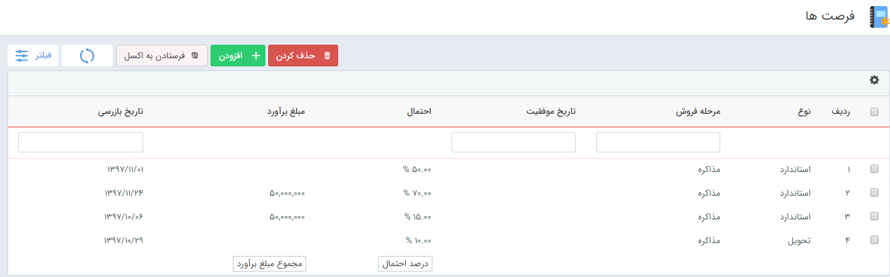

## تنظیمات مشاهده لیست سوابق

کاربر از این بخش انتخاب می‌کند که چه فیلدهایی در ستون جدول نمایش داده شود و از این طریق امکان شخصی سازی جداول لیست ایتم‌ها وجود دارد.

برای مثال در لیست فرصت‌ها که در زیر مشاهده می‌کنید فیلدهای مالک، نوع فرصت، مرحله فروش، تاریخ موفقیت، تاریخ بسته شدن، درصد احتمال، مبلغ برآورد و مبلغ مورد انتظار در جدول نمایش داده شده است.

برای تغییر این ستون‌ها، طبق شکل روی علامت تنظیمات کلیک کنید.

با باز شدن تنظیمات مربوط به شخصی سازی جدول لیستی از فیلدهای مرتبط با آیتم را مشاهده می‌کنید.

فیلدهایی که در این قسمت نمایش داده می‌شوند فقط شامل فیلدهای ثابت و فیلدهای اضافه شده روی نوع اصلی آیتم که در بخش شخصی سازی آیتم برای نمایش در لیست تعیین شده اند.

**1. فیلدهای اصلی:**  فیلدهای اصلی شامل فیلدهای ثابت آیتم می‌شوند. برای مثال فیلد مرحله فروش و تاریخ موفقیت و نوع فرصت جزو فیلدهای ثابت فرصت هستند.

**2. فیلدهای اضافه شده:** فیلدهای اضافه شده شامل فیلدهای اضافه شده توسط کاربر روی نوع آیتم اصلی می‌شوند. برای مثال فیلد تاریخ بازرسی و تعداد بازرسان توسط کاربر به آیتم فرصت اضافه شده است.

با فعال کردن هر گزینه، فیلد انتخاب شده به جدول اضافه می‌شود و مقدار آن نمایش داده می‌شود.

برای مثال با انتخاب فیلد "تاریخ بازرسی" و غیرفعال کردن فیلدهای "مبلغ مورد انتظار" و "تاریخ بسته شدن" و "مالک" ، جدول فرصت به شکل زیر درمی‌آید.

 
