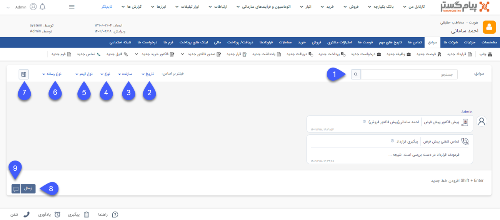

#    سوابق  
سربرگ سوابق با صفحه نمایش تمام کانال (Omni-channel) دسترسی به پرونده مشتری را فراهم می‌سازد. در این قسمت می‌توانید تمامی آیتم‌های ثبت شده برای هویت را مشاهده نمایید. این آیتم‌ها می‌توانند از انواع مختلف موجودیت‌های crm  اعم از فایل، یادداشت، تماس تلفنی، وظیفه، قرارملاقات، فرصت، پیش‌فاکتور و فاکتورها، دریافت، پرداخت، فرم، درخواست پشتیبانی و قرارداد باشند. علاوه بر آیتم‌های ثبت شده توسط کاربران، تمامی ارتباطات شما با هویت‌ها که از طریق تماس تلفنی، پیام کوتاه و ایمیل انجام شده است نیز به صورت خودکار ثبت شده و در این صفحه قابل نمایش می‌باشد. 
> **نکته:** برای مشاهده سوابقی که توسط سایر کاربران ثبت گردیده است، مجوز "مشاهده سوابق مشتری" مورد نیاز می‌باشد.

به منظور سهولت دستیابی به آیتم(های) مورد نظر، قابلیت‌های "نوار فیلتر جستجو" در بالای صفحه در اختیار می‌باشد. به منظور اعمال فیلتر مورد نظر، معیار(های) مورد نیاز را لحاظ کرده و بر روی آیکون ذره بین کلیک نمایید. قابلیت‌های نمایش داده شده در  این نوار به شرح زیر می‌باشند: 

**۱. تاریخ:** با استفاده از این فیلتر می‌توانید سوابق ثبت شده در بازه زمانی مورد نظر خود را بیابید. 
**۲. سازنده:** با استفاده از این فیلتر می‌توانید سوابق ثبت شده توسط کاربر مورد نظر خود را بیابید. در صورتی که تمایل به نمایش آیتم‌های ثبت شده توسط کاربری خود دارید، می‌توانید با استفاده از دایره سمت راست فیلد کاربر، کاربری خود را درج نمایید. 
**۳. نوع:** با استفاده از فیلترهای موجود در این قسمت می‌توانید لیست سوابق مورد نظر خود از انواع مختلف آیتم‌ها را جستجو کنید. 
- با کلیک بر روی گزینه "CRM" فیلتر زیرنوع نمایش داده شده و می‌توانید از لیست انواع موجودیت‌ها، یکی از انواع سوابق (به عنوان مثال فرم یا فرصت) را انتخاب نمایید. 
-  با کلیک بر روی گزینه "پیام" تمامی سوابق از نوع پیام کوتاه و ایمیل نمایش داده می‌شود. 
- با کلیک بر روی گزینه "تماس تلفنی" تمامی تماس‌های ثبت شده توسط سیستم (لاگ های ورودی و خروجی) نمایش داده می‌شود. 
**۴. جستجو:** با استفاده از این فیلد می‌توانید سوابق دارای یک عبارت خاص را جستجو و فیلتر نمایید. نتیجه حاصل شده مواردی را نشان می‌دهد که در عنوان و یا محتوا (توضیحات و سایر فیلدهای موجود در آیتم)  شامل عبارت مذکور می‌باشند. 
**۵.  آیکون ذره‌بین:** با کلیک بر روی این آیکون فیلتر(های) تنظیم شده اعمال می‌گردد. 
**۶.  آیکون حدف فیلتر:** با کلیک بر روی این آیکون فیلترهای اعمال شده حذف شده و تمامی سوابق نمایش داده می‌شود. 
**۷.  آیکون دریافت خروجی اکسل:** با کلیک بر روی این آیکون از سوابق نمایش داده شده در صفحه خروجی اکسل دریافت می‌شود. 
**۸.  ارسال پیام:** فضای پایین صفحه، امکان ارسال پیام (پیام کوتاه/ایمیل/ فکس) از صفحه سوابق را فراهم می‌آورد. 
>**نکته:** 
>در این بخش کلید Enter  فعالیت ارسال پیام را اجرا می‌نماید. برای ایجاد خط جدید (رفتن به خط بعد) از Shift+Enter استفاده نمایید. 

**۹. انتخاب رسانه روش ارسال:** با بر روی این گزینه می‌توانید روش ارسال پیام را از بین گزینه‌های فکس، ایمیل و پیام کوتاه انتخاب نمایید.
>**نکته:** 
>استفاده از هر یک از روش‌های ارسال پیام، نیازمند این است که خطوط ارتباطی آن در سیستم تعریف و تنظیمات مربوطه انجام شده باشد. به این منظور تنظیمات خطوط [پیامک](https://github.com/1stco/PayamGostarDocs/blob/master/Help/Settings/General-settings/payamak/safe-asli.md) ، [ایمیل](https://github.com/1stco/PayamGostarDocs/blob/master/Help/Settings/General-settings/email-s/email.safe-asli.md) و [فکس](https://github.com/1stco/PayamGostarDocs/blob/master/Help/Settings/General-settings/fax-s/Fax-List.md) را بررسی نمایید. 
>>تنها کاربرانی که مجوز ارسال پیام را داشته باشند می‌توانند از این قابلیت استفاده نمایند.