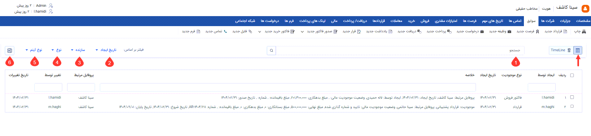
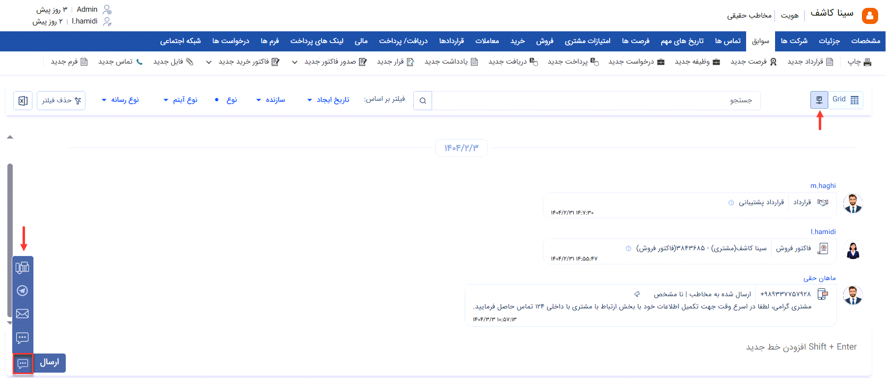

# صفحه سوابق هویت  
سربرگ سوابق دسترسی به پرونده مشتری را فراهم می‌سازد. در این قسمت می‌توانید تمامی آیتم‌های ثبت شده برای هویت را مشاهده نمایید. این آیتم‌ها می‌توانند از انواع مختلف موجودیت‌های crm  اعم از فایل، یادداشت، تماس تلفنی، وظیفه، قرارملاقات، فرصت، پیش‌فاکتور و فاکتورها، دریافت، پرداخت، فرم، درخواست پشتیبانی و قرارداد باشند. علاوه بر آیتم‌های ثبت شده توسط کاربران، تمامی ارتباطات شما با هویت‌ که از طریق تماس تلفنی، پیام کوتاه و ایمیل انجام شده‌است نیز به صورت خودکار ثبت شده و در این صفحه قابل نمایش می‌باشد. 

> **نکته** 
> برای دسترسی به تب سوابق، به مجوز «مشاهده سوابق مشتری» بر روی زیرنوع هویت و برای مشاهده هر نوع سابقه در این صفحه، به مجوز «مشاهده در لیست سوابق موجودیت‌ها» بر روی زیرنوع موجودیت نیاز دارید. برای اینکه کاربر بتواند هر یک از این رکوردها را باز و مشاهده نماید،‌ به مجوز «مشاهده آیتم» نیز نیاز دارد. 

سوابق هویت را می‌توانید در دو حالت نمایشی، مشاهده نمایید: 
- نمایش Grid که در آن سوابق (رکوردها) به صورت لیستی در یک جدول به شما نمایش داده‌می‌شود.
- نمایش TimeLine که در آن سوابق بر اساس توالی ایجاد، به شما نمایش داده‌می‌شود.

در ادامه به بررسی نحوه مشاهده سوابق و قابلیت‌های صفحه سوابق در هر حالت نمایشی می‌پردازیم. 

**1. جستجو:** با استفاده از این فیلد می‌توانید سوابق دارای یک عبارت خاص را جستجو و فیلتر نمایید. نتیجه حاصل شده مواردی را نشان می‌دهد که در عنوان و یا محتوا (توضیحات و سایر فیلدهای موجود در آیتم)  شامل عبارت مذکور می‌باشند. 
**2. تاریخ ایجاد:** با استفاده از این فیلتر می‌توانید سوابق ثبت شده در بازه زمانی مورد نظر خود را بیابید. 
**3. سازنده:** با استفاده از این فیلتر می‌توانید سوابق ثبت شده توسط کاربر مورد نظر خود را بیابید. در صورتی که تمایل به نمایش آیتم‌های ثبت شده توسط کاربری خود دارید، می‌توانید با استفاده از دایره سمت راست فیلد کاربر، کاربری خود را درج نمایید. 
**4. نوع:** با استفاده از گزینه‌های موجود در این قسمت می‌توانید لیست سوابق مورد نظر خود از انواع مختلف آیتم‌ها را جستجو کنید. 
- با انتخاب گزینه "آیتم سی‌آر‌ام" تمامی سوابق از جنس موجودیت‌های مختلف (فرصت، فاکتور و...) نمایش داده‌می‌شوند. 
-  با انتخاب گزینه "ارتباطات" تمامی سوابق از نوع پیام کوتاه و ایمیل نمایش داده‌می‌شود. 
- با انتخاب گزینه "تماس تلفنی" تمامی تماس‌های ثبت شده توسط سیستم (لاگ‌های ورودی و خروجی) نمایش داده‌می‌شود. 
- با انتخاب گزینه "تبلیغات" تمامی برنامه‌های تبلیغاتی اجرا شده (از هر رسانه‌ای) که هویت در لیست آن‌ها بوده به شما نمایش داده‌می‌شود. 
**5. نوع آیتم:** این بخش بر اساس نوع انتخابی می‌تواند متفاوت باشد. چنانچه نوع "آیتم سی‌آر‌ام" را برای نمایش انتخاب کرده‌باشید (به صورت پیش‌فرض این حالت انتخاب شده‌است)، فیلتر نوع آیتم به منظور انتخاب نوع موجودیت به شما نمایش داده‌می‌شود. به صورت پیش‌فرض تمامی سوابق از تمامی موجودیت‌ها در صفحه به شما نمایش داده می‌شود. اگر قصد نمایش سوابق از یک موجودیت خاص را دارید (مثلاً تمامی فاکتورهای فروش هویت)، موجودیت مورد نظر را از این بخش انتخاب و فیلتر را اعمال نمایید. 
در صورتی که سوابقی از نوع "ارتباطات" یا "تبلیغات" را انتخاب کرده‌باشید، فیلتری برای انتخاب **نوع رسانه** به شما نمایش داده‌می‌شود. علاوه بر آن می‌توانید مشخص نمایید که صرفاً پیام‌های ارسالی و یا دریافتی هویت در صفحه به شما نمایش داده‌شود. 
**6. دریافت خروجی اکسل:** با کلیک بر روی این آیکون از سوابق نمایش داده شده در صفحه خروجی اکسل دریافت می‌شود. 

با انتخاب حالت نمایشی TimeLine سوابق هویت با نمایشی متفاوت به شما ارائه می‌شود. با استفاده از این حالت نمایشی می‌توانید اطلاعاتی از جمله کاربر ثبت‌کننده آیتم و تاریخ ایجاد را در یک نگاه دریافت نمایید. 

> **نکته** 
> توجه داشته‌باشید که بر خلاف حالت نمایشی Grid که در آن صرفاً امکان انتخاب یک نوع سابقه (موجودیت‌های سی‌آرام/ارتباطات/تماس تلفنی/تبلیغات) فراهم می‌باشد، در حالت نمایشی TimeLine می‌توانید یک یا چند نوع را برای نمایش انتخاب نمایید. 

علاوه بر فیلترهایی که در حالت نمایش Grid نیز در اختیار شما بود، در حالت نمایشی TimeLine می‌توانید از قابلیت ارسال در صفحه سوابق نیز استفاده کنید. فضای پایین صفحه، امکان ارسال پیام (پیام کوتاه/ایمیل/ فکس) از صفحه سوابق را برای شما فراهم می‌سازد. 

>**نکته** 
>استفاده از هر یک از روش‌های ارسال پیام، نیازمند این است که خطوط ارتباطی آن در سیستم تعریف و تنظیمات مربوطه انجام شده‌باشد. به این منظور تنظیمات خطوط پیام کوتاه، ایمیل، شبکه‌های پیام‌رسان و فکس را در تنظیمات کلی بررسی نمایید. 
> توجه داشته‌باشید تنها کاربرانی که مجوز ارسال پیام را داشته باشند می‌توانند از این قابلیت استفاده نمایند. 

برای ارسال پیام کافیست با کلیک بر روی آیکون پیام در سمت چپ صفحه کلیک کرده و رسانه‌ی مورد نظر برای ارسال پیام را انتخاب نمایید. با کلیک بر روی این آیکون می‌توانید روش ارسال پیام را از بین گزینه‌های فکس، ایمیل، پیام کوتاه و پیام شبکه اجتماعی انتخاب نمایید. 

>**نکته** 
>در این بخش کلید Enter  فعالیت ارسال پیام را اجرا می‌نماید. برای ایجاد خط جدید (رفتن به خط بعد) از Shift+Enter استفاده نمایید. 