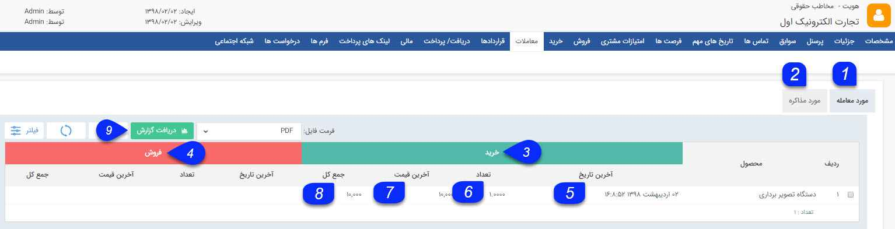

#  لیست معاملات و مذاکرات مشتری 
در این قسمت تمامی معاملات صورت گرفته با یک مخاطب را می توانید به تفکیک محصول مشاهده کنید و از آن گزارش تهیه نمایید.
در CRM پیام گستر محصولات براساس محصولات قابل معامله و مذاکره دسته بندی می شوند.
- [محصولات مورد مذاکره](#NegotiatedProducts)
- [محصولات مورد معامله](#TransactionedProducts)
- [مشاهده لیست معاملات مشتری](#customers'taradesList)

## محصولات مورد مذاکره {#NegotiatedProducts}
در این قسمت لیست تمامی کالاهایی که در پیش فاکتورها (خرید و فروش) هستند و احتمال فروش آنها هست را می توانید مشاهده کنید. 
اقلام مورد مذاکره برای هر مخاطب در قسمت[ معاملات ](https://github.com/1stco/PayamGostarDocs/blob/master/Help/Integrated-bank/Database/Trades/Trades.md)سوابق مرتبط با آن قابل مشاهده است. 

## محصولات مورد معامله{#TransactionedProducts}
 تمامی محصولات خریداری شده موجود در فاکتور خرید و فروخته شده(موجود در فاکتور فروش) به مشتری را نمایش می دهد. 
## مشاهده لیست معاملات مشتری{#customers'taradesList}
می توانید تمامی معاملات انجام شده برای یک مخاطب خاص را از طریق **صفحه اصلی هویت**> **معاملات** مشاهده نمایید.

1. **مورد معامله:** تمامی محصولات خریداری شده(موجود در فاکتور خرید) موجود در فاکتور خرید و فروخته شده (موجود در فاکتور فروش) به مشتری را نمایش می دهد.

2. **مورد مذاکره:** محصولاتی که در پیش فاکتورهای فروش و خرید این هویت گنجانده شده است را نمایش می دهد.

3. **خرید:** در این قسمت تمامی محصولات وارد شده در فاکتورهای خرید ثبت شده برای مخاطب نمایش داده می شود.

4. **فروش:** در این قسمت تمامی محصولات وارد شده در فاکتورهای فروش ثبت شده برای مخاطب نمایش داده می شود.

5. **آخرین تاریخ:** در این قسمت آخرین تاریخ فروش/ خرید محصول برای این مخاطب نمایش داده می شود.

6. **تعداد:** تعداد کل محصولات وارد شده در پیش فاکتور/فاکتورهای فروش/خرید ثبت شده برای مخاطب در این قسمت نمایش داده می شود.

7. **آخرین قیمت:** در این قسمت می توانید آخرین قیمت خرید/فروش معامله شده با این مخاطب را برای هر محصول مشاهده کنید.

8. **جمع کل:** جمع قیمت مرتبط با هر محصول که در پیش فاکتور/فاکتورهای خرید/ فروش ثبت شده وارد شده است را می توانید در این قسمت مشاهده کنید. توجه داشته باشید که ممکن است یک محصول در فاکتورهای مختلف با قیمت های متفاوتی وارد شده باشد. در واقع در این قسمت می توانید ارزش مالی معاملات انجام شده با مخاطب را برای هر محصول مشاهده کنید.

9. **دریافت گزارش:** می توانید از فیلترهای مختلف استفاده کنید و یک گزارش به فرمت دلخواه از سیستم دریافت کنید.