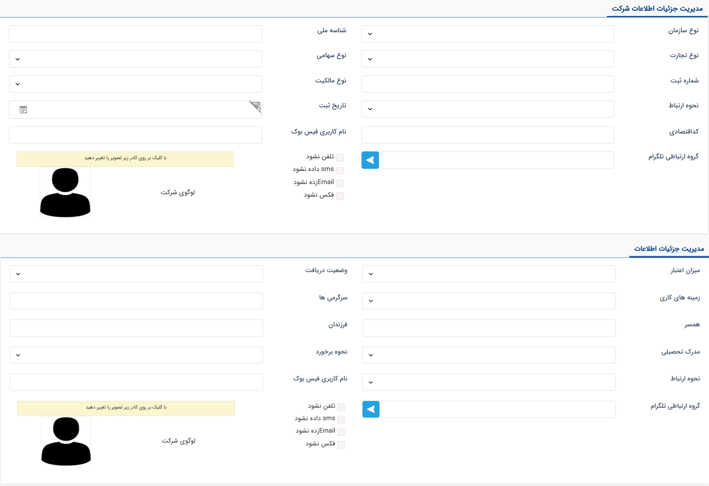

# جزئیات پروفایل هویت
اطلاعات اصلی هویت‌ها اعم از نام، نام‌خانوادگی، نام شرکت، اطلاعات ارتباطی و موارد مشابه در صفحه مشخصات پروفایل هویت قابل مشاهده است. در صورت نیاز به درج یا مشاهده اطلاعات بیشتر درباره‌ی هویت، لازم است که پس از ذخیره‌ی هویت به تب جزئیات مراجعه نمایید. 
با توجه به اینکه جزئیات مورد نیاز برای هویت‌های حقیقی و حقوقی در برخی موارد متفاوت هستند، تصاویر هر یک از آن‌ها به صورت جداگانه در ادامه ارائه شده‌است. 

عنوان فیلدهای تعبیه شده در صفحه جزئیات، گویای اطلاعاتی که می‌توانید برای هر یک از انواع هویت هویت ذخیره کنید، می‌باشد. در صورت نیاز می‌توانید گزینه‌های هر یک از فیلدهای اطلاعاتی را از بخش [مدیریت آیتم‌های سیستم](https://github.com/1stco/PayamGostarDocs/blob/master/Help/Basic-Information/Management-of-system-items/Management-of-system-items.md) ویرایش نمایید و یا گزینه‌های مورد نظر را به آن‌ها اضافه کنید. بخش‌هایی که ممکن است در مورد نحوه کاربرد آن‌ها ابهاماتی وجود داشته‌باشد، در ادامه توضیح داده شده‌است. 

**گروه ارتباطی تلگرام** 
اگر هویت شما در گروه تلگرامی‌ای عضو است که می‌خواهید پیام‌های ارسالی و دریافتی در آن، در سوابق هویت مورد نظر ثبت شود، نام گروه مذکور را در این قسمت درج و ذخیره نمایید. توجه داشته‌باشید به سبب جلوگیری از ثبت پیام‌های ارسالی و دریافتی در سوابق چند هویت، نام یک گروه تلگرامی تنها در پروفایل یک هویت در پیام‌گستر قابل ثبت است. به عبارت دیگر، تنها یک نفر از افراد حاضر در گروه را می‌توانید انتخاب نمایید که حضور وی در گروه را در نرم‌افزار ثبت کنید. سایر افراد می‌توانند در گروه حضو بوده و فعالیت داشته‌باشند لکن تمامی پیام‌های ارسالی و دریافتی در گروه در سوابق یک هویت (که نام گروه را در جزئیات پروفایل او ثبت کرده‌اید) ذخیره می‌شود.  
از کلید آبی رنگ کناری می‌توانید برای ارسال پیام در گروه مذکور استفاده کنید. در نتیجه برای ارسال پیام در گروهی که یک هویت در آن عضو است (مثلاً گروه پشتیبانی یک مشتری) کافیست که به پروفایل هویت مذکور رفته و از این بخش اقدام به ارسال پیام در آن گروه نمایید. 

**تعیین الزامات ارتباطی** 
در این صفحه گزینه‌های «تلفن نشود»، «SMS داده نشود» و و موارد مشابه نیز قابل مشاهده است. لازم به ذکر است که این گزینه‌ها تاثیری در عملکرد نرم‌افزار در برقراری تماس یا ارسال پیام به صورت تکی و گروهی ندارد. فعال‌سازی این گزینه‌ها در اطلاعات هویت صرفاً می‌تواند کاربران را در صورت مراجعه به این صفحه، درباره‌ی منع از استفاده از یک یا چند روش ارتباطی درباره‌ی یک هویت مطلع کند. 