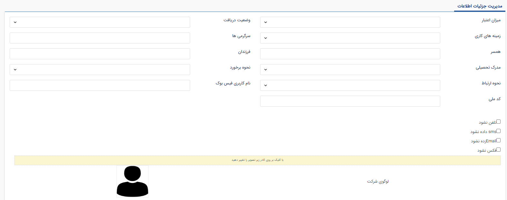
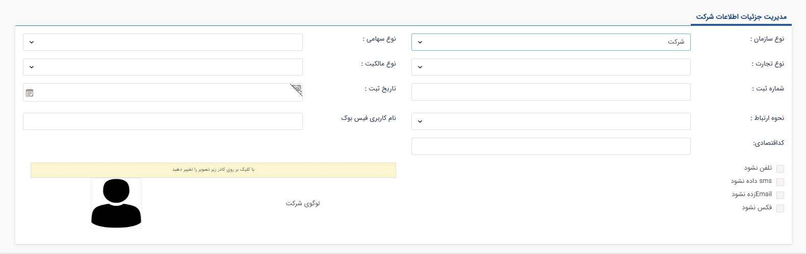

#  صفحه‌ی جزئیات 

این در این قسمت جزییات بیشتری از هویت مانند شماره ثبت، کد ملی، وضعیت دریافت، نحوه برخورد و ... می‌توانید ثبت کنید. لازم بذکر است جزئیات اطلاعاتی که برای هر یک هویت‌های حقیقی و حقوقی وجود دارد با هم متفاوت است.  

- **صفحه جزئیات مخاطب حقیقی:**

- **صفحه جزئیات مخاطب حقوقی:** {#NId}

در صورتی که چک باکس‌های sms فرستاده نشود، ایمیل فرستاده نشود و فکس نشود تیک خورده باشد، در ارسال های گروهی پیام به این هویت ارسال نمی‌شود.
