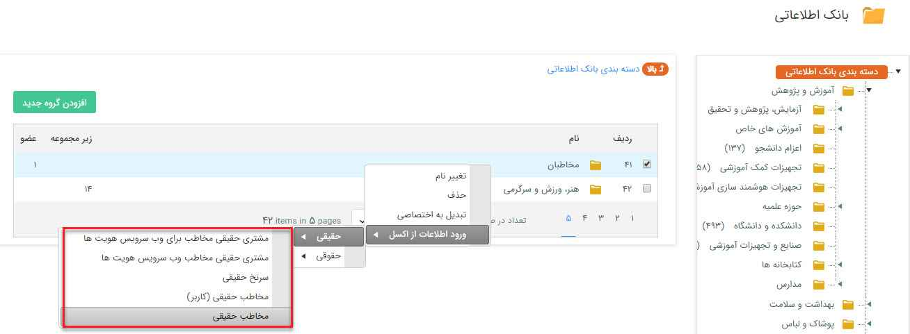
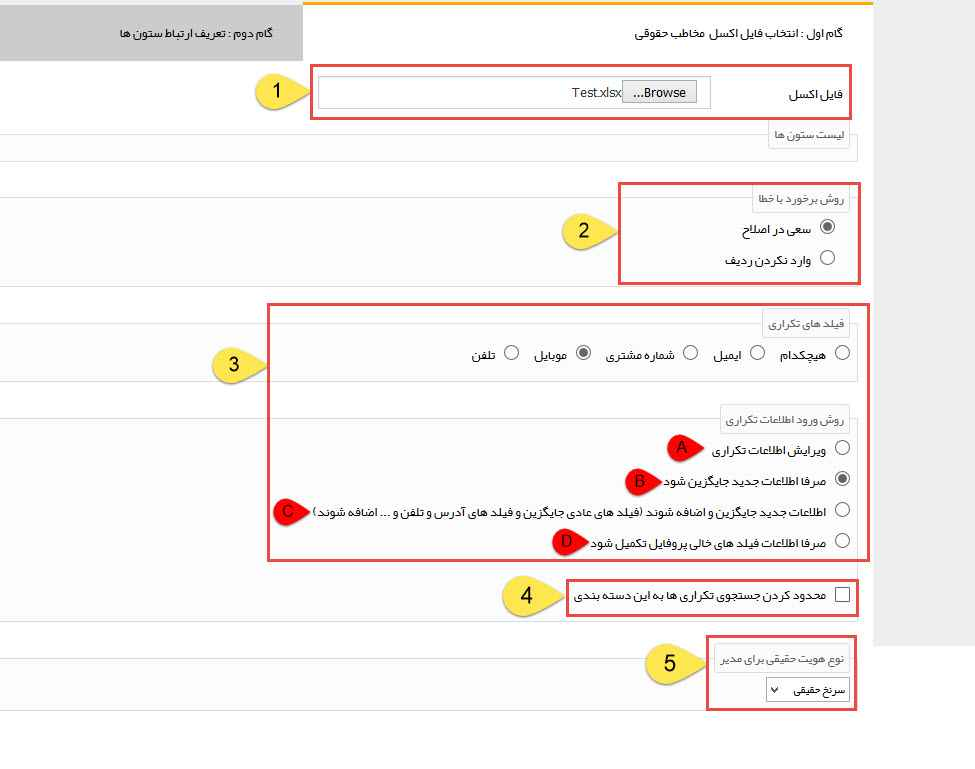
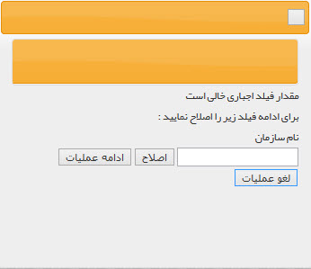
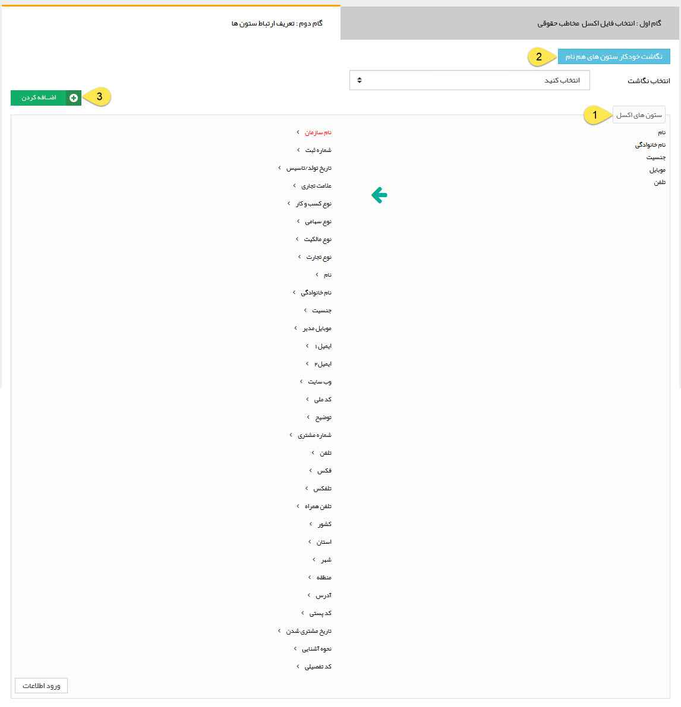
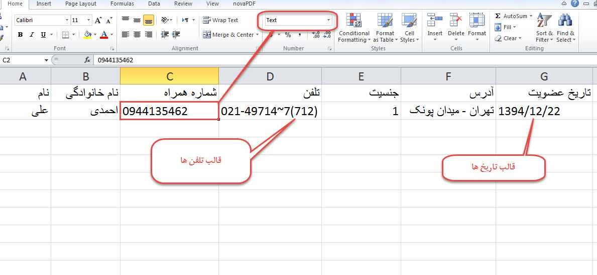

# ورود اطلاعات از اکسل (Excel)

با استفاده از این ابزار می‌توانید اطلاعات هویت‌هایی که در قالب فایل اکسل (Excel) درآورده اید را به راحتی به یکی از دسته بندی‌های  بانک اطلاعاتی اضافه کنید. و یا اطلاعات هویت‌هایی که قبلا وارد نرم افزار کرده اید را به صورت گروهی به روز رسانی کنید

برای ورود اطلاعات در داخل یک دسته بندی، بر روی آخرین سطح دسته بندی کلیک راست نموده و بسته به نوع هویت، یکی از دو نوع حقیقی و یا حقوقی را برگزینید، سپس تعیین کنید که می‌خواهید سرنخ یا مخاطب وارد کنید.

 جهت جلوگیری از ورود اطلاعات تکراری، از قسمت[  تنظیمات کلی بخش سیستم  ](https://github.com/1stco/PayamGostarDocs/blob/master/Help/Settings/General-settings/system/system.md)تنظیمات مورد نظرتان را اعمال کنید.
 
 برای وارد کردن اطلاعات حتما فیلد‌های الزامی‌(نام خانوادگی در مخاطبان و سرنخ‌های حقیقی و نام شرکت در مخاطبان و سرنخ‌های حقوقی) در تمامی‌سطرهای فایل اکسل دارای مقدار باشند.
 
امکان واردکردن اطلاعات از طریق اکسل برای فیلدهای اضافه شده از طریق شخصی سازی  نیز در این بخش وجود دارد.

 در هنگام ورود اطلاعات مخاطبان حقوقی از طریق فایلاکسل، تنها مدیر شرکت را می‌توان وارد کرد و امکان وارد کردن پرسنل دیگر وجود ندارد.
 

با انتخاب مسیر دسته بندی بانک اطلاعاتی، پنجره زیر نمایش داده می‌شود.

> **نکته:** در صورت باز نشدن خودکار پنجره از تنظیمات مرورگر خود Pop-Up Blocking را غیر فعال کنید.

## گام اول:

در این گام باید مسیر فایل اکسل آماده شده و شیوه ورود اطلاعات از اکسل را تعیین کنید و  پس از انجام تنظیمات مد نظر روی بخش بعدی کلیک کنید .

**1. انتخاب فایل اکسل:** فایل اکسل مورد نظر را انتخاب (بارگذاری) کنید.

**2. روش برخورد با خطا:** میتوانید تعیین کنید که در صورت بروز خطا (تکراری بودن اطلاعات، خالی بودن فیلد اجباری و ...) نرم افزار چگونه عمل کند.

**الف)** اگر روی حالت سعی در اصلاح باشد، خطای پیش آمده را در حین ورود اطلاعات نمایش می‌دهد و می‌توانید یکی از گزینه‌های اصلاح(ویرایش خطا)، ادامه عملیات(در نظر نگرفتن این ردیف از اکسل و وارد کردن سایر ردیف‌ها) یا لغو عملیات (لغو ورود اطلاعات) را انتخاب کنید

**ب)** اگر روی وارد نکردن ردیف قرار بگیرد، ردیف‌های دارای خطا را نادیده می‌گیرد و پس از اتمام فرآیند ورود اطلاعات، یک اکسل دارای نام ردیف‌هایی که وارد نشده اند با دلیل وارد نشدن آنها در اختیار شما قرار می‌دهد.

**3. فیلدهای تکراری:** در صورت نیاز نرم افزار می‌تواند بر اساس یک فیلد مرجع (ایمیل، شماره مشتری، موبایل یا تلفن) تکراری بودن مخاطب وارد شده را کنترل کند و در صورت مواجه با این تکرار یکی از چهار رفتار زیر را به انتخاب شما انجام می‌دهد.

**A.** یک پنجره هشدار نمایش می‌دهد و از کاربر می‌خواهد که اطلاعات تکراری را تغییر دهد.

**B.** اطلاعاتی که در اکسل موجود است را بر روی اطلاعاتی که برای همان مخاطب در نرم افزار موجود است بازنویسی (replace) می‌کند.

**C.** اطلاعاتی که در اکسل موجود است را بر روی اطلاعاتی که برای همان مخاطب در نرم افزار موجود است بازنویسی (replace ) می‌کند اما فیلدهای از نوع شماره تلفن، موبایل، فکس، تلفکس و آدرس را تغییر نمی‌دهد و اطلاعات از این نوع در اکسل را به همان مخاطب اضافه می‌کند.

**D.** صرفا فیلدهایی که در اکسل مقدار دارند اما برای آن مخاطب در نرم افزار خالی هستند را پر می‌کند. (برای مثال در اکسل برای آن مخاطب ایمیل وارد شده اما در مخاطبی که برای او ساخته بودیم فیلد ایمیل خالی است.)

**4. محدود کردن جستجوی تکراری به این دسته بندی:** در صورت فعال کردن فیلدهای تکراری، نرم افزار برای یافتن مخاطب مشابه با اطلاعات ورودی از اکسل ، تنها در این دسته بندی که برای ورود اطلاعات در بانک انتخاب کرده اید جستجو می‌کند.

**5. نوع هویت حقیقی برای مدیر:** در صورتی که نوع مخاطب حقوقی را برای ورود اطلاعات از اکسل انتخاب کرده باشید این تنظیمات را مشاهده میکنید و  می‌توانید از طریق آن مشخص کنید که مدیری که برای این مخاطب حقوقی از اکسل وارد می‌شود، به عنوان یک سرنخ یا مخاطب حقیقی ذخیره شود .

## گام دوم:

در گام دوم باید شیوه نگاشت ستون‌های اکسل خود با نرم افزار را تعیین کنید.

**1. ستون‌های اکسل:**   پارامتر‌های تعریف شده در فایل اکسل (Excel)  شما در ستون سمت راست نمایش داده می‌شود، می‌توانید تک تک پارامترها را با ماوس کشیده و در ستون سمت چپ (ستون فیلدهای پیام گستر ) قرار دهید و روی دکمه ورود اطلاعات کلیک کنید تا اطلاعات اکسل در پیام گستر وارد شود .

**2. نگاشت خودکار ستون‌های هم نام:** ستون‌هایی که نام آنها دقیقاً منطبق با فیلدهای نرم افزار باشد به صورت خودکار نگاشت می‌شوند و سر جای خود قرار می‌گیرند.

**3. اضافه و ذخیره کردن نگاشت:** اگر اکسلی که وارد می‌کنید تعداد ستون‌های زیادی دارد و نگاشت کردن آن در هر ورود زمان بر است، می‌توانید بعد از اینکه یکبار ستون‌ها را نگاشت کردید، در این قسمت نگاشت را ذخیره کرده و دفعات بعد تنها از لیست این قسمت، نام نگاشت ذخیره شده را انتخاب کنید.

### قالب (فرمت) فایل اکسل:

در هنگام ساختن فایل باید توجه نمود که نیازی نیست عنوان ستون‌ها حتما همنام با پارامترهای سیستم باشد (برای مثال می‌توان برای ستون نام از کلمه "اسم" استفاده کرد) یا ترتیب ستونها به همان شکلی که در هنگام ورود از شما خواسته می‌شود، باشد.

**فرمت پارامتر‌ها برای نگاشت بایستی به صورت زیر باشد**

**جنسیت:** مقدار جنسیت را با اعداد 1 و 2 می‌توان تعیین کرد(1=مرد؛ 2=زن ).

شماره تلفن همراه: باید فرمت سلولهای تلفن همراه به صورت TEXT باشند و هر شماره تلفن همراه با عدد صفر شروع شود. برای جدا کردن چند شماره تلفن همراه از علامت نقطه ویرگول ";" استفاده کنید.

**تلفن:** فرمت وارد کردن شماره تلفن به شکل "(داخلی)الی~شماره تلفن-پیش شماره " است. برای جدا کردن چند شماره تلفن همراه از علامت نقطه ویرگول ";" استفاده کنید.

**تاریخ:** فرمت وارد کردن تاریخ به شکل "روز/ماه/سال " باید باشد.

**کشور، استان، شهر:** با توجه به اینکه اطلاعات کشور، استان و شهر یک لیست مرتبط و بر اساس اطلاعات وارد شده در قسمت[ مدیریت کشورها، استان‌ها و شهرها ](https://github.com/1stco/PayamGostarDocs/blob/master/Help/Basic-Information/Management-of-countries%2C%20provinces-and-cities/Management-of-countries%2C%20provinces-and-cities.md)می‌باشد، در صورت تمایل به وارد کردن این اطلاعات از طریق فایل اکسل، باید هر سه به طور همزمان وارد شوند

**آدرس:** تنها امکان اضافه کردن یک آدرس از اکسل وجود دارد.

