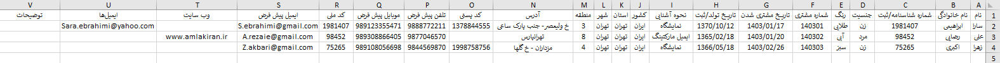
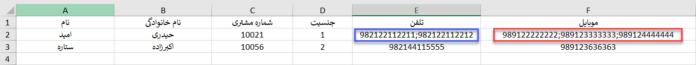
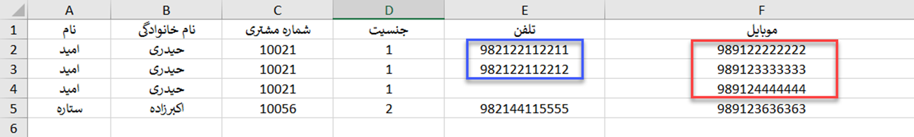
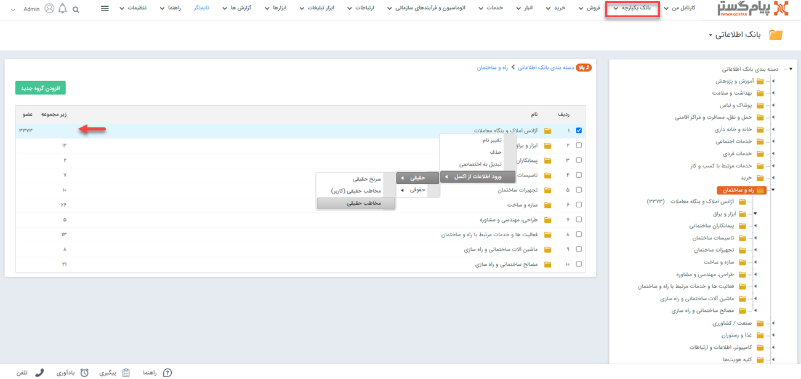
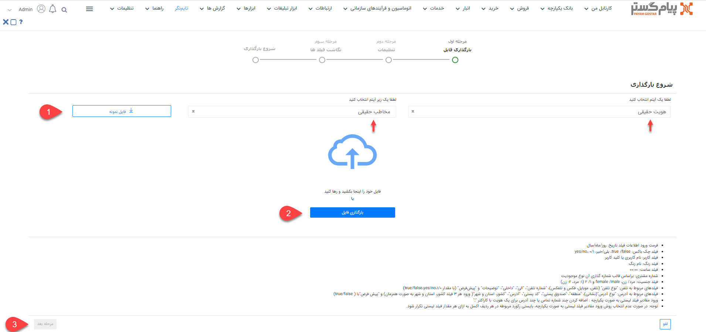
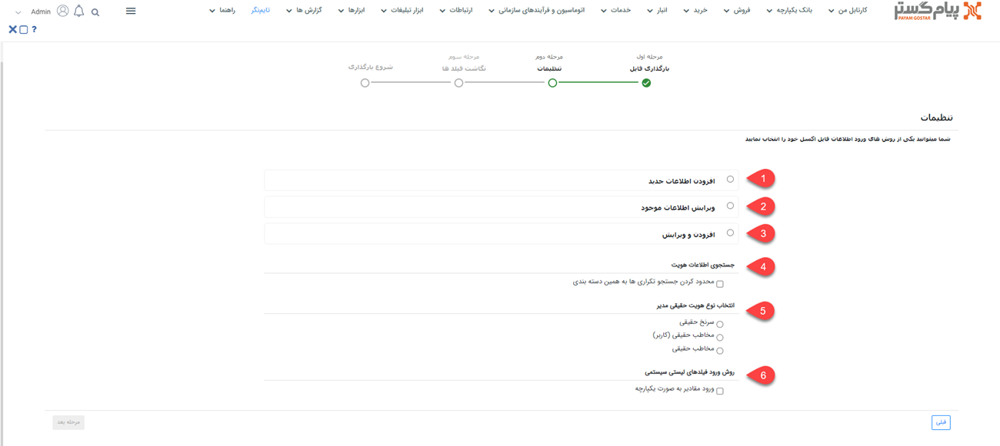
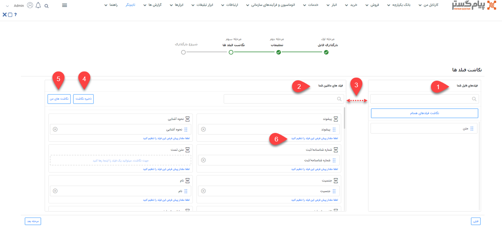

# ورود اطلاعات هویت از طریق اکسل

در صورت نیاز به ایجاد چندین هویت به صورت یکجا می‌توانید از روش ورود اکسلی استفاده نمایید. بدین ترتیب می‌توانید اطلاعات هویت‌های مورد نظر را در اکسل درج نمایید (یا از سایر نرم‌افزارهای خود خروجی بگیرید) و سپس در پیام‌گستر بارگذاری کنید. در این حالت هویت‌های مورد نظر ایجاد شده و اطلاعات آن در فیلدهای مربوطه وارد می‌شود. از این روش می‌توانید برای ویرایش اطلاعات هویت‌های موجود نیز استفاده نمایید. به عنوان مثال شماره موبایل‌های مشتریان را طبق آخرین تغییرات ویرایش کنید. 
برای اینکه بارگذاری هویت‌ها بدون مواجهه با خطا و با موفقیت به اتمام برسد، لازم است که قوانین تهیه و بارگذاری اکسل را رعایت کنید. در این راهنما تمامی موارد لازم برای تنظیم صحیح فایل اکسل، به همراه شیوه بارگذاری آن مطرح شده‌است. بدین منظور در این مقاله به موارد زیر می‌پردازیم: 
- [شیوه‌ی تهیه و تنظیم فایل اکسل هویت‌ها](#IdentityExcelFormat)
- [روش بارگذاری فایل اکسل هویت‌ها](#IdentityExcelUpload)
- [مجوزهای لازم برای بارگذاری اکسل هویت‌ها](#IdentityExcelUplodingPermission)

برای ورود انواع سرنخ حقیقی،‌ سرنخ حقوقی، مخاطب حقیقی و مخاطب حقوقی می‌توانید از این همین روش اقدام نمایید. 

## تنظیمات فایل اکسل {#IdentityExcelFormat}
برای ورود اطلاعات هویت‌ها از طریق اکسل، ابتدا باید اکسل مورد نظر را بر اساس فرمت مورد پذیرش نرم‌افزار تنظیم کنید. بدین منظور می‌توانید از فایل نمونه استفاده نمایید. فایل نمونه را می‌توانید از سایت [پیام‌گستر](https://www.payamgostar.com/fa/services/adoption-services/requirements) دانلود کنید و یا از نسخه‌ی نمونه‌ای در مسیر بارگذاری در اختیار شما قرار داده‌می‌شود استفاده کنید (جلوتر به آن می‌رسیم). 

هنگام تهیه‌ی فایل اکسل، به موارد زیر توجه داشته‌باشید: 
- تمامی اطلاعات هویت‌ها باید در یک Sheet ذخیره شده‌باشد. در غیر این صورت بارگذاری اکسل با موفقیت انجام نخواهد‌شد.
- امکان بارگذاری انواع مختلف هویت (سرنخ حقیقی/سرنخ حقوقی/مخاطب حقیقی/مخاطب حقوقی) به صورت یکجا (با استفاده از یک اکسل) وجود ندارد. برای هر زیرنوع هویت باید اکسل جداگانه‌ای تهیه شود.
- در صورت نیاز به بارگذاری و ذخیره هویت‌‌ها در دسته‌بندی‌های مختلف باید از اکسل‌های جداگانه استفاده نمایید.
- در صورت استفاده از اکسل نمونه‌ی موجود در سایت،‌ فرمت و کامنت‌های آن را حذف نمایید. بدین منظور جدول را نتخاب کرده و از Clear Comment  و Clear Format استفاده نمایید.
 
 
 
 تصویر فوق،‌ ستون‌های مورد نیاز برای بارگذاری مخاطب حقیقی را بر اساس فیلدهای پیش‌فرض نشان می‌دهد. ستون‌های زیرنوع‌های دیگر هویت ممکن است با توجه به فیلدهای موجود در آن، تفاوت‌های جزئی داشته‌باشد. در ادامه نکاتی که باید برای تهیه هر نوع در نظر داشته‌باشید را مرور می‌کنیم. برای تکمیل اطلاعات مربوط به فیلدهای پیش‌فرض به راهنمایی‌های زیر توجه داشته‌باشید: 

- **فیلد جنسیت:** این فیلد فقط برای هویت‌های حقیقی قابل استفاده می‌باشد. جنسیت را یا با عبارات «زن» و «مرد» و یا درج عدد ۱ برای مرد و عدد ۲ برای زن مشخص نمایید. استفاده از عبارات female /male نیز بلامانع است.
- **فیلد رنگ:**  نام رنگ را باید از بین رنگ‌های موجود در لیست رنگ صفحه هویت انتخاب نمایید. در صورت نیاز به رنگ جدید ابتدا آن را از قسمت [مدیریت رنگ‌ها](https://github.com/1stco/PayamGostarDocs/blob/master/Help/Basic-Information/Color-management/Color-management.md) به لیست اضافه کنید. برای پیدا کردن نام رنگ‌ها نیز می‌توانید از همین لیست استفاده کنید.
- **شماره مشتری:** به هنگام درج شماره‌ی مشتری به تطابق آن با الگوی شماره‌گذاری هویت توجه کنید. چنانچه شماره‌ی مندرج با الگوی شماره‌گذاری تطابق نداشته‌باشد و یا پیش‌تر برای هویت دیگری استفاده شده‌باشد، بارگذاری با خطا مواجه می‌شود.
- **فیلد تاریخ:** فیلدهای تاریخی مثل تاریخ تولد/ثبت و همچنین تمامی فیلدهای تاریخی که توسط شما در شخصی‌سازی اضافه می‌شود باید با فرمت روز/ماه/سال وارد شده‌باشد.
- **نحوه آشنایی:** نحوه‌ی آشنایی باید از بین عناوین موجود در لیست آن انتخاب شود. در صورت نیاز به عناوین بیشتر از بخش [مدیریت آیتم‌های سیستم](https://github.com/1stco/PayamGostarDocs/blob/master/Help/Basic-Information/Management-of-system-items/Management-of-system-items.md)، آیتم «منبع فرصت» را پیدا کرده و لیست آن را ویرایش نمایید.
- **کشور، استان و شهر:** با توجه به این که اطلاعات کشور، استان و شهر یک لیست مرتبط و بر اساس اطلاعات وارد شده در قسمت مدیریت کشورها، استان‌ها و شهرها می‌باشند، برای ورود اطلاعات باید به ترتیب کشور، استان و شهر پر شوند. این بدین معناست که بدون درج  کشور و استان (فیلدهای قبلی)، امکان درج شهر وجود نخواهد‌داشت؛ اما می‌توانید نام کشور را وارد کرده و نام فیلدهای بعدی (یعنی استان و شهر) را خالی بگذارید. اسامی انتخابی برای کشور، استان و شهر باید از بین اسامی موجود در لیست باشد. در صورت تمایل به درج سایر موارد ابتدا از بخش [مدیریت کشورها، استان‌ها و شهرها](https://github.com/1stco/PayamGostarDocs/blob/master/Help/Basic-Information/Management-of-countries-provinces-and-cities/Management-of-countries-provinces-and-cities.md) آن را تعریف نمایید.
- **شماره تلفن و موبایل:** به جای صفر ابتدایی شماره موبایل و یا کد شهرها در شماره‌های ثابت، کد ایران یعنی ۹۸ را درج نمایید. به عنوان مثال شماره تماس ۰۹۱۲۱۲۳۴۵۶۷ به صورت  ۹۸۹۱۲۱۲۳۴۵۶۷ باید در اکسل وارد شود.
- **اطلاعات چندگانه:** منظور از اطلاعات چندگانه فیلدهایی است که می‌توانند بیش از یک مقدار داشته‌باشد و شامل **تلفن**، **موبایل**، **فکس**، **تلفکس** و **آدرس‌ها** می‌شوند. شما می‌توانید به دو شیوه‌ی یکپارچه و جداگانه اطلاعات چندگانه یک هویت را در اکسل درج و وارد نمایید.  
در حالت ورود به صورت یکپارچه، برای اضافه کردن چند شماره تماس یا چند آدرس برای یک هویت، باید شماره تماس‌ها/آدرس‌ها را با ";" از یک دیگر جدا کنید. درنظر داشته‌باشید که در این روش اولین شماره و اولین آدرس به عنوان پیش‌فرض در نظر گرفته‌می‌شود. 

در حالت جداگانه، به ازای هر مقدار فیلد چندگانه، رکورد مربوطه در فایل اکسل تکرار می‌گردد. در این حالت برای درج «الی» می‌توانید از علامت ‍‍‍‍«~» و برای درج داخلی از «()»‍‍‍‍‍‍‍‍‍‍‍‍‍‍‍‍‍‍‍‍‍‍‍‍‍‍ در انتهای هر شماره استفاده نمایید.

چنانچه هویت شما دارای اطلاعاتی بیشتر از فیلدهای موجود در نرم‌افزار است،  باید فیلد مورد نیاز آن را از طریق شخصی‌سازی ایجاد نمایید. پس از آن می‌توانید اطلاعات این فیلدها را نیز با استفاده از اکسل وارد کنید. بدین منظور کافی است ستونی هم نام با فیلد خود به ستون‌های موجود در اکسل اضافه نمایید. در این خصوص به نکات زیر توجه داشته باشید: 
- امکان ورود اطلاعات فیلدهایی از نوع فایل، تصویر، html، کمپین، برچسب، لیست مرتبط، فیلد آیتم‌های CRM (مثل فیلد دریافت،‌فاکتور و... به جز فیلد شخص/شرکت)، فیلد اضافه از نوع رنگ، فیلد لیستی از نوع فایل و فیلد لیستی از نوع کاربر/گروه از طریق اکسل وجود ندارد.
- در صورت استفاده از فیلد **چک‌باکس**،‌ برای فعال کردن (تیک زدن) آن از «بلی» و برای غیرفعال بودن آن (درج بدون تیک) از «خیر» در ستون مربوطه استفاده کنید. البته از عبارات yes/no و true/false و همچنین اعداد 1/0 نیز می‌توانید بدین منظور استفاده نمایید.
- در صورت استفاده از **فیلد کاربر**، از بین کاربران تعریف شده در نرم‌افزار نام کاربری و یا کد کاربر مورد نظر را در این قسمت درج نمایید.
- برای ورود اطلاعات به فیلدهایی از نوع **لیست کشویی** فقط از عبارات موجود در لیست می‌توانید استفاده نمایید. فیلدهای لیست کشویی پیش‌فرض نرم‌افزار در بخش [مدیریت آیتم‌های سیستم](https://github.com/1stco/PayamGostarDocs/blob/master/Help/Basic-Information/Management-of-system-items/Management-of-system-items.md) و لیست‌های کشویی اضافه‌ شده توسط شما در بخش شخصی‌سازی آن آیتم قابل مشاهده و ویرایش می‌باشند.
چنانچه برای یک فیلد لیست کشویی دو گزینه با عنوان مشابه تعریف شده‌باشد، ورود اطلاعات (مقداردهی) آن از طریق اکسل با خطا مواجه می‌شود. 

> **نکته** 
> برای بارگذاری فایل اکسل در هر نوع از هویت، درج نام ستون‌های زیر الزامی می‌باشد. 
> - سرنخ حقیقی: نام خانوادگی، موضوع
> - سرنخ حقوقی: نام هویت حقوقی (نام سازمان)، موضوع
> - مخاطب حقیقی: نام خانوادگی
> - مخاطب حقوقی: نام هویت حقوقی (نام سازمان) 

به هنگام تنظیم اکسل خود به تفاوت فیلدهای سرنخ و مخاطب و همچنین تفاوت بین حقیقی و حقوقی توجه داشته‌باشید. به عنوان مثال در اکسل سرنخ‌ها (سرنخ حقیقی/حقوقی) شماره مشتری و تاریخ مشتری شدن وجود ندارد. همچنین برای هویت‌های حقیقی کد ملی و برای هویت‌های حقوقی شناسه ملی در نظر گرفته شده‌است. 

## مراحل بارگذاری فایل اکسل {#IdentityExcelUpload}
برای بارگذاری فایل اکسل هویت‌ها به این ترتیب اقدام نمایید: 
### انتخاب دسته‌بندی
در ابتدا وارد بانک اطلاعاتی شده و دسته‌بندی‌ای که می‌خواهید هویت‌ها در آن ذخیره شوند را پیدا کنید. روی دسته‌بندی مورد نظر راست کلیک کرده و از طریق گزینه‌ی «ورود اطلاعات از اکسل»، نوع هویت مورد نظر را انتخاب نمایید. 

به عنوان مثال، در تصویر فوق دسته‌بندی «آژانس املاک و بنگاه معاملات» برای ذخیره هویت‌‌ها انتخاب شده‌است. 

> **نکته** 
> چنانچه دسته‌بندی انتخابی شما برای بارگذاری اکسل دارای زیرمجموعه باشد، امکان ورود اطلاعات در آن وجود نخواهد‌داشت. برای ایجاد هویت و بارگذاری فایل اکسل باید آخرین زیرلایه را انتخاب نمایید. 

### بارگذاری فایل
در قسمت بالا، نوع و زیر نوع هویت انتخاب شده (سرنخ/مخاطب حقیقی/حقوقی) نمایش داده‌می‌شود. در صورت نیاز می‌توانید زیرنوع انتخابی را از همین بخش ویرایش کنید. 

با کلیک بر روی «فایل نمونه» (شماره ۱) می‌توانید اکسل نمونه برای تهیه اکسل با فرمت صحیح را دریافت نمایید. اگر طی شخصی‌سازی فیلدی به زیرنوع هویت خود اضافه کرده‌باشید، ستون آن در فایل نمونه‌ای به شما می‌دهد درج شده‌است. با توجه به اینکه فایل نمونه، دقیقاً مطابق با زیرنوع انتخابی به شما داده‌می‌شود، پیشنهاد می‌شود که از فایل برای تهیه‌ی اکسل خود استفاده کنید. 
در این مرحله فایل اکسل خود را انتخاب (شماره ۲) یا از طریق drag & drop بارگذاری کنید. پس از بارگذاری فایل،‌ کلید «مرحله بعد» (شماره ۳) فعال می‌شود. 

### تنظیمات بارگذاری فایل
در این بخش باید تنظیمات لازم جهت تعیین روش ورود اطلاعات را مشخص کنید. 

‍‍‍‍‍‍‍‍
**1. افزودن اطلاعات جدید** 
با انتخاب این گزینه، تمامی هویت‌های جدید موجود در اکسل بر اساس مبنای انتخابی شما شناسایی و بارگذاری می‌شود. در این مرحله باید یکی از فیلدهای شماره مشتری، تلفن، موبایل، ایمیل و یا هیچ کدام را به عنوان مبنای شناسایی انتخاب کنید. براساس فیلد انتخابی جستجوی تکراری بودن انجام شده و در صورت تکراری نبودن مبنای انتخاب شده، آن آیتم به نر‍‌م‌‌افزار اضافه می‌شود. 
با انتخاب گزینه‌ی هیچکدام به عنوان مبنا، تمامی هویت‌های موجود در اکسل (اعم از تکراری و غیرتکراری) به بانک اطلاعاتی اضافه خواهدشد و بررسی تکراری بودن اطلاعات تنها از طریق تنظیمات اعمال شده در تنظیمات کلی انجام می‌گیرد. 
**2. ‌ویرایش اطلاعات موجود** 
در این حالت براساس فیلدی که به عنوان مبنا انتخاب شده‌است، جستجو انجام می‌شود. در صورت وجود هویت با اطلاعات فیلد مبنا، هویت مربوطه ویرایش شده و اطلاعات موجود در اکسل برای آن درج می‌شود. در صورت یافت نشدن هویت بر اساس فیلد مبنا،‌ اطلاعات آن سطر از اکسل بارگذاری نخواهد‌شد.  
با انتخاب چک باکس " فقط فیلد‌های خالی پر شوند" تنها فیلدهای خالی هویت مقداردهی شده و فیلدهایی که دارای اطلاعات می‌باشند بدون تغییر باقی می‌مانند. 

> **نکته** 
> هنگام ویرایش، جستجو فقط در بین هویت‌های موجود از زیرنوع انتخابی انجام می‌شود. فلذا اگر هویتی با فیلد مبنای یکسان (مثلاً شماره موبایل مشترک) در زیرنوع‌های دیگر یافت شود، هویت مذکور ویرایش نخواهدشد. 

**3. افزودن و ویرایش** 
در این حالت جستجو براساس فیلد مبنای انتخاب شده، انجام می‌شود. در صورت وجود هویت با اطلاعات فیلد مبنا، هویت مربوطه ویرایش می‌شود و در صورت یافت نشدن هویت با این اطلاعات، به عنوان هویت جدید به نرم‌افزار اضافه می‌شود.  
با انتخاب چک باکس " فقط فیلد‌های خالی پر شوند،‌ در هویت‌هایی که بر اساس فیلد مبنا یافت شده و نیازمند ویرایش می‌باشند، ‌تنها فیلدهای خالی مقداردهی شده و فیلدهایی که دارای اطلاعات می‌باشند بدون تغییر باقی می‌مانند. 

> **نکته** 
> در حالت ویرایش  (حالت ۲ و ۳)، چنانچه بر اساس مبنای جستجو، چند هویت با اطلاعات مورد نظر یافت شود، (مثلا در حالتی که مبنا شماره موبایل است،‌ چند هویت دارای یک شماره موبایل یکسان باشند) ویرایش بر روی هیچ یک از هویت‌ها انجام **نمی‌گیرد**. 

به این موضوع توجه داشته‌باشید که در زمان ویرایش، مقادیر مندرج در اکسل جایگزین مقادیر قبلی می‌شوند. بنابراین در صورتی که نیاز است مقادیر جدید بدون حذف مقادیر قبلی اضافه شوند، باید مقادیر قبلی موجود هر فیلد که قصد حفظ آن را دارید، در اکسل تکرار گردند.  

**4. محدود کردن جستجو تکراری‌ها به همین دسته‌بندی** 
در صورت فعال کردن این گزینه، جستجوی وجود/عدم وجود هویت بر اساس فیلد مبنا به دسته‌بندی‌ای که برای بارگذاری اکسل انتخاب نموده‌اید محدود می‌شود. به عبارت دیگر، در صورت وجود آن اطلاعات در هویت‌های ذخیره شده در سایر دسته‌بندی‌ها، هویت جدید در نظر گرفته‌می‌شود. 

**5. انتخاب نوع هویت حقیقی مدیر** 
این بخش فقط در صورت انتخاب **هویت حقوقی** به شما نمایش داده‌می‌شود. در صورت انتخاب هویت از نوع حقوقی، در این قسمت باید نوع هویت مدیر را انتخاب نمایید. بدین ترتیب، در صورت درج اطلاعات مدیر در اکسل، یک هویت حقیقی از زیر‌نوع انتخابی شما در این بخش در پیام‌گستر ایجاد شده، اطلاعات مدیر که در اکسل وارد کرده‌اید (نام، نام خانوادگی، جنسیت، موبایل و کد ملی) برای او درج می‌شود و به پروفایل شرکت (هویت حقوقی) متصل می‌شود. 

> **نکته** 
> در هنگام ویرایش، اگر هویت حقوقی دارای مدیر باشد تنها نام، نام خانوادگی و کد ملی مدیر قبلی با اطلاعات مدیر جدید جایگزین و ویرایش می‌شود.

**6. ورود مقادیر به صورت یکپارچه** 
با فعال کردن این گزینه می‌توانید اطلاعات فیلدهای **تلفن**، **موبایل**، **فکس**، **تلفکس** و **آدرس‌ها** که می‌توانند شامل اطلاعات چندگانه باشد (مثلا ۳ شماره‌ی موبایل) را به صورت یکپارچه در اکسل درج و آن را بارگذاری نمایید. توضیحات لازم در این خصوص در بخش تنظیمات فایل اکسل > اطلاعات چندگانه ارائه شده‌است. 
 
> **نکته** 
> در حالتی که می‌خواهید یک یا چند تلفن را با ذکر داخلی و الی وارد نمایید، باید از حالت جداگانه (و نه یکپارچه) استفاده کنید. در صورت غیرفعال بودن این گزینه، مقادیر به صورت جداگانه باید در اکسل درج شده‌باشند.  

در صورت انتخاب شیوه ورود مقادیر به صورت یکپارچه و انتخاب یکی از فیلدهای  چندگانه (موبایل یا تلفن) به عنوان مبنای جستجو در قسمت‌های ۱، ۲ یا ۳،‌ باید یک ستون تحت عنوان موبایل/تلفن پیش‌فرض اضافه کنید. اولین شماره‌ی درج شده در آن ردیف شماره پیش‌فرض بوده و باید در این ستون تکرار شود. در مورد انتخاب ایمیل به عنوان مبنا نیز، ایمیل پیش‌فرض، مبنای جستجو قرار می‌گیرد.   

> **نکته** 
> در صورت انتخاب گزینه‌ی «هیچکدام» در قسمت مبنا، گزینه «ورود مقادیر به صورت یکپارچه» به صورت خودکار فعال می‌گردد. چرا که با توجه به عدم وجود مبنای شناسایی، امکان افزودن اطلاعات چندگانه به صورت جداگانه وجود ندارد. 

برای فعال شدن کلید «مرحله بعد» لازم است یکی از حالت‌های ۱، ‌۲  یا ۳ را برای شیوه‌ی بارگذاری انتخاب کنید. 

### نگاشت فیلدها
در مرحله سوم، سرستون‌های فایل اکسل در بخش «فیلدهای فایل شما» (شماره ۱) و فیلدهای موجود در مشخصات هویت در بخش «فیلدهای ماشین شما» (شماره ۲) نمایش داده‌می‌شود. در واقع در این بخش مشخص می‌شود اطلاعات هر ستون اکسل باید در کدام فیلد وارد شود. 

در صورت یکسان بودن نام ستون با نام فیلدها،‌ نگاشت به صورت خودکار انجام می‌گیرد. در غیر این صورت با drag & drop باید نام هر ستون را از بخش فیلدهای فایل شما (سمت راست) به فیلد مربوطه در بخش فیلدهای ماشین شما (سمت چپ) متصل نمایید. در این شرایط برای یافتن عنوان مورد نظر در هر دو بخش می‌توانید از قابلیت جستجو (شماره ۳)‌ استفاده نمایید.  
پس از نگاشت (اتصال نام ستون به فیلدها) می‌توانید نگاشت خود را ذخیره نمایید (شماره ۴). در صورت استفاده مجدد از این اکسل/اکسل مشابه برای بارگذاری با کلیک بر روی نگاشت‌های من (شماره ۵)، نگاشت به صورت خودکار انجام می‌شود.شما می‌توانید نگاشت‌های پرکاربرد خود را در سیستم ذخیره نمایید. در لیست نگاشت‌های من امکان ویرایش یا حذف نگاشت ذخیره شده وجود دارد. 
برای هر فیلد می‌توانید مقدار پیش‌فرض تعیین نمایید (شماره ۶). در صورت خالی بودن مقدار فیلد در اکسل، فیلد با مقدار پیش‌فرض که در این قسمت تعریف کرده‌اید پر می‌شود. 

### شروع بارگذاری
در صورت بارگذاری موفق اکسل،‌ انجام موفقیت‌آمیز آن در این صفحه اعلام می‌شود. در صورت عدم موفقیت در بارگذاری اطلاعات، پیغام زیر نمایش داده‌می‌شود. 

در منوی گزارش‌ها، بخش وضعیت عملیات انبوه می‌توانید نتایج ورود اطلاعات را مشاهده کنید. همچنین در صورت بروز خطا با دانلود فایل اکسل از این بخش می‌توانید خطا و علت خطا را مشاهده نمایید. برای دانلود فایل، بر روی جزئیات رکورد مربوطه کلیک کرده و خروجی اکسل دریافت کنید. در اکسل دریافتی، سطرهای دارای مشکل با رنگ قرمز مشخص شده و در ستون آخر دلیل بروز خطا درج شده‌است. 

> **نکته** 
> اگر جلوگیری از ثبت اطلاعات تکراری در تنظیمات کلی انجام شده‌باشد (برای مثال جلوگیری از ثبت تلفن تکراری) در هنگام ورود اطلاعات از طریق اکسل علاوه بر فیلد مبنا، این اطلاعات هم بررسی می‌گردد و در صورت تکراری بودن، ورود اطلاعات انجام نمی‌شود. 

## مجوزهای مورد نیاز برای ورود اطلاعات از طریق اکسل {#IdentityExcelUplodingPermission}	
برای ورود اطلاعات از طریق اکسل،‌ کاربر باید دارای  مجوزهای زیر باشد: 
- **افزودن شماره مشتری** 
برای افزودن و ویرایش شماره مشتری، کاربر باید مجوز تغییر شماره مشتری را روی زیرنوع هویت مربوطه داشته باشد. در غیر این صورت، مقدار این فیلد افزوده یا ویرایش نمی‌شود. 
- **افزودن و ویرایش رنگ هویت** 
برای افزودن و ویرایش رنگ، کاربر باید مجوز ویرایش رنگ را روی زیر نوع هویت داشته‌باشد. 
- **افزودن و ویرایش شماره تماس‌ها** 
برای افزودن شماره جدید یا ویرایش شماره‌ها کاربر باید **مجوز اضافه کردن شماره تماس** را روی زیرنوع هویت مربوطه داشته‌باشد.
در ویرایش هویت به دلیل اینکه شماره‌های جدید جایگزین شماره‌های قبلی می‌شوند، کاربر علاوه بر این مجوز، باید **مجوز حذف شماره** تماس هم داشته‌باشد.
- **تغییر حالت پیش فرض تماس یا نشانی** 
کاربر با مجوز تغییر حالت پیش فرض تماس یا نشانی می‌تواند شماره تماس یا آدرس پیش فرض را از طریق اکسل تعیین کند.
- **افزودن و ویرایش نشانی** 
برای افزودن نشانی جدید یا ویرایش نشانی‌ها کاربر باید **مجوز اضافه کردن نشانی** داشته‌باشد.
در ویرایش هویت به دلیل اینکه نشانی‌های جدید جایگزین نشانی‌های قبلی می‌شوند، کاربر علاوه بر این مجوز، باید **مجوز حذف نشانی‌** هم داشته‌باشد. 
- **افزودن هویت جدید** 
 برای **افزودن** اطلاعات جدید (حالت ۱ و ۳ در تنظیمات بارگذاری) کاربر باید مجوز ذخیره اولیه آیتم را در زیرنوع هویت انتخاب شده داشته باشد. 
- **ویرایش اطلاعات موجود** 
 برای ویرایش اطلاعات موجود (حالت ۲ و ۳ در تنظیمات بارگذاری) کاربر باید مجوز ویرایش آیتم را در زیرنوع هویت انتخاب شده داشته‌باشد. 

> **نکته** 
> برای افزودن و ویرایش اطلاعات (حالت ۳ در تنظیمات بارگذاری) باید مجوز **ذخیره اولیه آیتم** و **ویرایش آیتم** را روی زیرنوع هویت انتخاب شده داشته‌باشد.

در صورت داشتن **مجوز مدیر سیستم** و یا **مجوز مدیر بانک اطلاعاتی** می‌توانید بارگذاری اکسل در تمامی حالت‌ها را به انجام برسانید.
