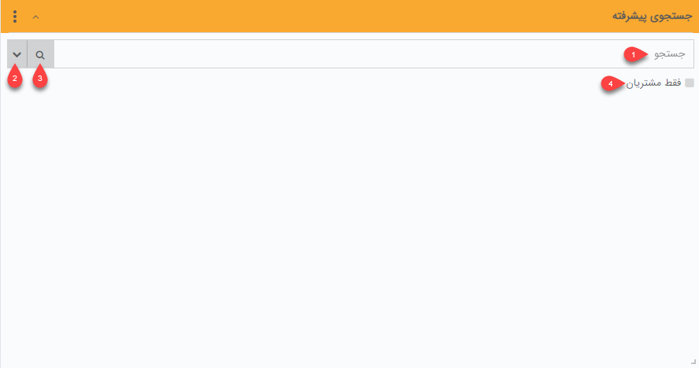
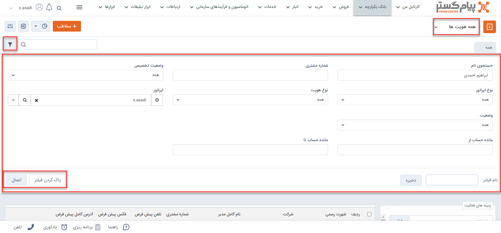

#  جست‌و جوی هویت‌
چنانچه بخواهید برای یک هویت سوابقی ثبت کنید می‌توانید با جستجوی سریع هویت مورد نظر را پیدا کنید و با ورود به صفحه مشخصات سوابق جدیدی برای اون ثبت کنید. در پیام‌گستر چندین روش برای جست‌وجوی هویت وجود دارد. دو مسیر ساده برای جست‌وجوی هویت وجود دارد:

## جستجوی هویت مورد نظر
 یکی از ساده‌ترین راه‌ها برای هویت مورد نظر شما استفاده از **ویجت جستجوی پیشرفته** است. ویجت جستجو به شما  کمک می‌کند تا در سریع‌ترین حالت ممکن هویت مورد نظر را پیدا کنید.

 

 
 **1**. عبارت مورد نظر خود را در این قسمت وارد کنید. توجه داشته باشید که از این قسمت فقط امکان جستجو بر اساس **نام خانوادگی** هویت حقیقی، **نام هویت حقوقی** و **شماره مشتری** امکان‌پذیر است.

**2**.  در صورت نیاز به جستجو بر اساس **تلفن همراه**، شماره **تلفن**، آدرس **ایمیل**، **نام** شخص و یا **نام مدیر** شرکت با کلیک بر روی فلش کناری اطلاعات مورد نظر را در بخش مربوطه وارد نمایید (مثلا زمانی که قصد پیدا کردن صاحب یک شماره تلفن را دارید). با کلیک بر روی گزینه جستجو وارد صفحه جستجو پیشرفته می‌شوید. برای دیدن نتایج یافت شده در پایین صفحه قسمت **نتایج جستجو** را باز و مشاهده نمایید.

**3**. چنانچه با استفاده از سایر اطلاعات (نظیر نام تجاری) قصد یافتن یک هویت را دارید عبارت مورد نظر را در بخش جستجو نوشته و با کلیک بر روی آیکون ذره‌بین وارد صفحه جستجوی پیشرفته شوید. عبارت مورد نظر به صورت خودکار وارد بخش [جستجوی سریع](https://github.com/1stco/PayamGostarDocs/blob/master/Help/Integrated-bank/Advanced-search/Advanced-search.md#QuickSearch) شده و بدین ترتیب هر هویتی که در هر فیلد اطلاعاتی او عبارت مورد نظر شما درج شده باشد در نتایج جستجو (قابل مشاهده درپایین صفحه) نمایش داده می‌شود.

**4**. در صورت فعال کردن این گزینه جستجو تنها از میان هویت‌هایی که دارای شماره مشتری هستند انجام خواهد شد.

> **نکته** 
>  در هر جستجو فقط تعداد 10 پروفایل در این ویجت نمایش داده می‌شود و اولویت نمایش با پروفایل‌هایی است که شماره مشتری دارند. در صورت نیاز به تعداد بیشتری از پروفایل‌ها با کلیک بر روی آیکون ذره‌بین وارد بخش [جستجوی پیشرفته](https://github.com/1stco/PayamGostarDocs/blob/master/Help/Integrated-bank/Advanced-search/Advanced-search.md) می‌شوید. 

## جستجوی هویت با یک ویژگی منحصر به فرد
برای جستجوی هویت با یک ویژگی خاص دو مسیر اصلی وجود دارد که عبارتند از:
### فیلتر جستجوی هویت
با ورود به  **بانک یکپارچه** > **بانک اطلاعاتی** و قسمت **فیلتر**، چنانچه به دنبال هویت‌هایی با یک ویژگی خاص باشید می‌توانبد از طریق جستجوی پیشرفته در بانک پکپارچه به راحتی هویت مورد نظر خود را با استفاده از نام خانوادگی/هویت حقوقی و یا شماره مشتری ایشان جستجو کنید. 

 

- **جستجوی نام**: نام هویت مورد نظر را در این قسمت وارد کنید.
- **شماره مشتری**: شماره‌ای که به مشتری اختصاص داده‌اید را در این قسمت وارد کنید.
- **وضعیت تخصیص**: وضعیت تخصیص در سه حالت همه، تخصیص یافته و تخصیص نیافته قابل انتخاب است.
- **نوع اپراتور**: نوع اپراتور را از بین گزینه‌های همه، پشتیبانی ، فروش و متفرقه انتخاب کنید.
- **نوع هویت**: هویت‌ها در قالب حقیقی و حقوقی قابل انتخاب هستند . شما می‌توانید با انتخاب گزینه همه تمامی هویت‌های ثبت شده اعم از حقیقی و حقوقی را مشاهده کنید.
- **اپراتور**: اپراتور را می‌بایست از کاربران سیستم و با نام کاربری انتخاب نمایید.
- **وضعیت**: وضعیت مالی هویت را از جهت بدهکار یا بستانکار بودن انتخاب کنید.
- **وضعیت مانده حساب**: وضعیت مانده حساب مشتری می‌توانید در یک بازه مشخص انتخاب کنید.

###  جستجوی پیشرفته هویت
در این قسمت می‌توانید بر حسب متغیرهای مختلف بین هویت‌های بانک اطلاعاتی، یک و یا چند مخاطب و سرنخ را جستجو کنید
برای دسترسی به این قسمت از طریق **تب بانک یکپارچه** > **جستجوی پیشرفته** اقدام نمایید.