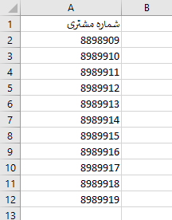
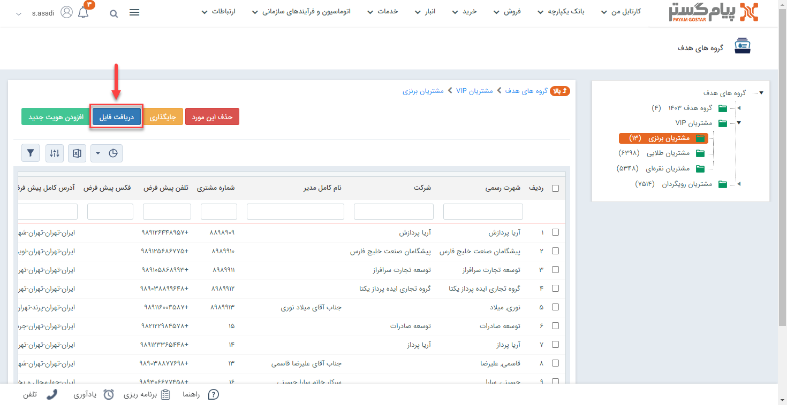
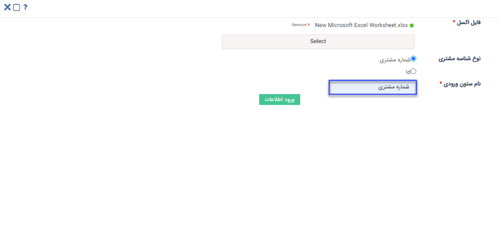

# ثبت هویت در گروه‌های هدف از طریق اکسل

در صورت نیاز به ورود تعدادی هویت به صورت یکجا در بانک اطلاعاتی می‌توانید از روش ورود اکسلی استفاده نمایید. بدین ترتیب می‌توانید شماره‌ مشتری هویت‌های مورد نظر را در اکسل درج نمایید (یا از سایر نرم‌افزارهای خود خروجی بگیرید) و سپس بارگذاری کنید. در این حالت  هویت‌های‌ مورد نظر ایجاد شده و اطلاعات آن در فیلدهای مربوطه وارد می‌شود.  
برای اینکه ورود اطلاعات بدون مواجهه با خطا و با موفقیت به اتمام برسد،‌ در این مقاله تمامی موارد لازم به همراه شیوه بارگذاری مطرح شده است. بر این اساس مقاله شامل عناوین زیر می‌باشد: 
اضافه کردن هویت‌های موجود در بانک اطلاعاتی به گروه هدف می‌تواند از طریق اکسل نیز انجام شود. لذا با توجه به اینکه می‌توان هویت‌ها را از طریق مرجع شناسایی به گروه هدف وارد نمود، می بایست در ستونی در فایل اکسل، یکی از این مقادیر ثبت شده باشد.

## مرجع شناسایی مشتری
برای شناسایی مشتری دو روش اصلی وجود دارد. می‌توانید مشتی را از طریق ‌ شماره مشتری و  Id  به لیست گروه‌های هدف اضافه کنید.

1. **شماره مشتری:**  فیلد شماره مشتری موجود در هویت موردنظر می‌باشد، این شماره برای هر هویت منحصر بفرد است. این شماره می‌تواند به دو صورت دستی و خودکار به مشتری تخصیص داده شود.

2. **ID:** ID همان شناسه‌ی هویت می‌باشد که از طریق دریافت خروجی اکسل از هویت می‌توان آن را مشاهده کرد.

>**نکته** 
برای دسترسی به Id هویت‌ها ابتدا می‌بایست از بانک اطلاعاتی هویت‌هایی که قصد اضافه کردن آنها به گروه هدف را دارید انتخاب کنید و بعد از گرفتن خروجی اکسل، در فایل اکسل ستونی تحت عنوان **شناسه** نمایش داده می‌شود که می‌توانید از آن برای ورود هویت‌ها در گروه هدف استفاده کنید.

نمونه‌ای از فایل اکسل جهت ورود به گروه هدف که دارای اطلاعات شماره مشتری هویت ها می‌باشد، در تصویر زیر قابل مشاهده می‌باشد.

به منظور ورود اطلاعات، ابتدا باید در بخش گروه هدف، در گروه مورد نظر بر روی دریافت فایل کلیک کنید. 

در این صفحه باید اکسل دارای اطلاعات هویت پیوست گردد، سپس نوع مرجع شناسایی(نوع شناسه مشتری) را که قراراست هویت‌ها براساس آن وارد شوند، انتخاب کنید. 

در فیلد "نام ستون ورودی" باید، "نام" ستونی که در اکسل، شناسه مشتری در آن تعریف شده است، نوشته شود و سپس ورود اطلاعات انجام شود. 

طبق این مثال باید فیلد "نام ستون ورودی" با عبارت  "شماره مشتری" مقداردهی شود.

