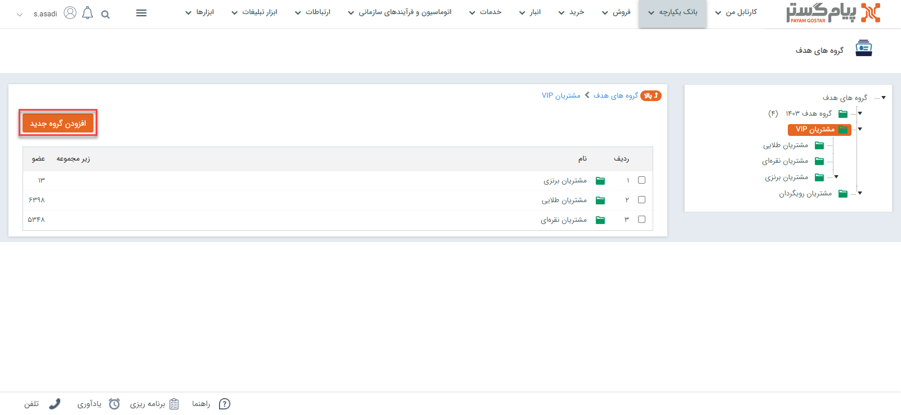
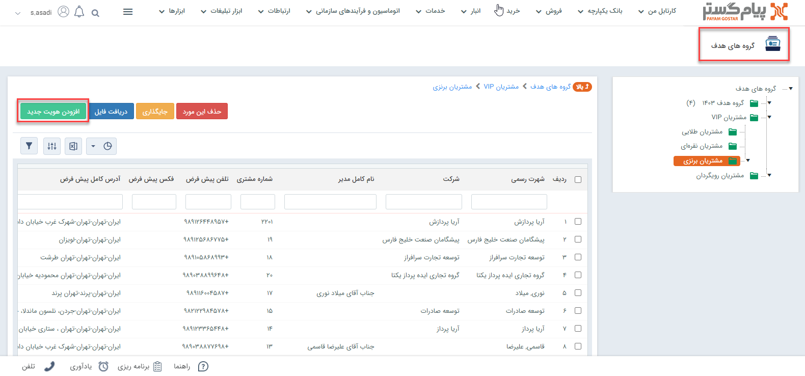
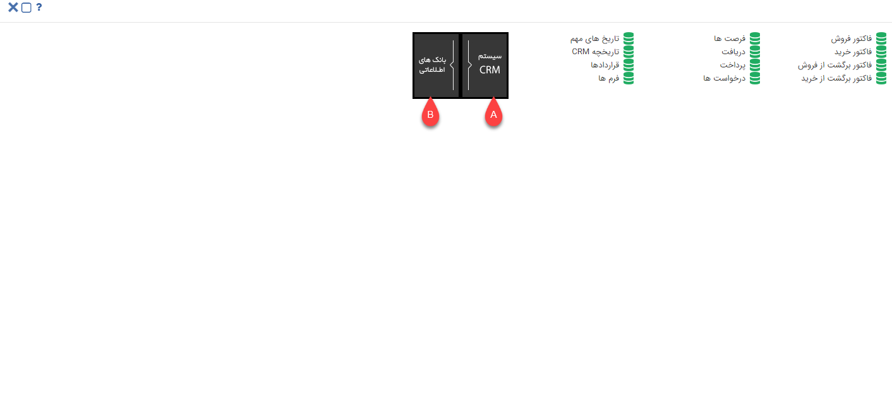
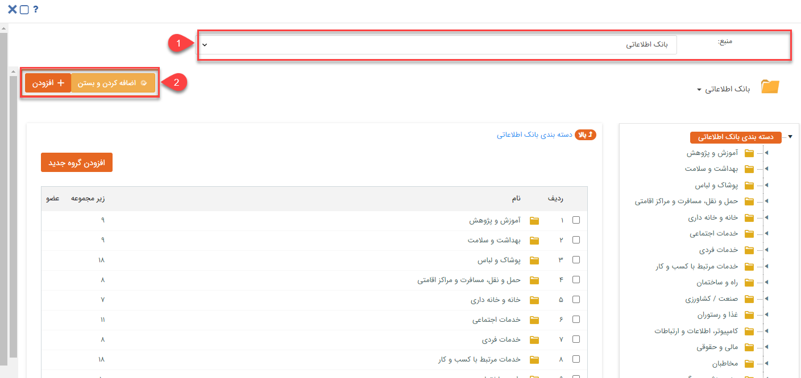

# ایجاد گروه هدف
گروه هدف به منظور اهداف متفاوت برای یک گروه خاص ایجاد می‌شود.از گروه‌های هدف می‌توانید در جستجو، گزارشات و فرآیندهای کاری نیز استفاده کنید.
 برای ایجاد گروه هدف جدید از طریق مسیر زیر اقدام  نمایید:
 **بانک یکپارچه** > **گروه‌های هدف** > **افزودن گروه جدید**
 می‌توانید با کلیلک روی دکمه افزودن گروه جدید  براساس اهداف خود گروه هدف جدید ایجاد کنید.

 با کلیک راست بر روی هر گروه می توانید نام آن را تغییر دهید، آن را حذف کنید و یا آن گروه را برای کاربری خود اختصاصی کنید و یا گروه اختصاصی کرده خود را  با انتخاب گزینه تبدیل  به عمومی از حالت اختصاصی خارج کنید .توجه داشته باشید که برای اختصاصی کردن یک گروه هدف باید خودتان آن را ایجاد کرده باشید و یا مجوز مدیر سیستم یا مدیر بانک اطلاعاتی داشته باشید

> **نکته** 
 کاربری که یک گروه هدف را تبدیل به اختصاصی می کند فقط خود قادر است، اطلاعات داخل آن را مشاهده نماید. (البته مدیر سیستم و یا مدیر بانک اطلاعاتی از این امر مستثنی هستند و کلیه گروه‌ها را می‌توانند مشاهده کنند.)

 

با کلیک بر روی هر گروه می‌توانید برای گروه موردنظر خود زیرگروه ایجاد کنید.

## افزودن هویت به گروه هدف 

 پس از ایجاد گروه یا زیر گروه مورد نظر با استفاده از دکمه "افزودن هویت جدید" می‌توانید هویت‌های دلخواه خود را انتخاب نمایید.

با کلیک بر روی دکمه افزودن هویت جدید، پنجره‌ای به شکل زیر باز خواهد شد. این پنجره این امکان را به شما می‌دهد که بتوانید هویت های مورد نظر خود را بر اساس سوابق سیستم CRM و یا از بانک‌های اطلاعاتی انتخاب کنید.

**A**: برای انتخاب از میان مخاطبان بانک اطلاعاتی از این قسمت می‌توانید استفاده کنید .

**B**: در این قسمت می‌توانید از بین هویت‌هایی که دارای سابقه در CRM هستند هویت(های)جستجو و انتخاب کنید .

> **نکته:** با انتخاب گزینه بانک‌های اطلاعاتی برای انتخاب مخاطبان مورد نظر ، پنجره ای مطابق شکل زیر باز خواهد شد که به شما امکان انتخاب منبع و مخاطبین را می‌دهد.

**1. انتخاب منبع**: به کمک لیست بالای صفحه می‌توانید هویت‌ها را از منابع مختلف مانند بانک اطلاعاتی،  مشتریان و یا گروه‌های هدف قبلی ساخته شده انتخاب کنید. همچنین امکان جستجوی پیشرفته در این قسمت نیز قرارداده شده است که می‌توانید برای پیدا کردن هویت های مورد نظرتان از آن بهره‌مند شوید .

**2. افزودن به بانک اطلاعاتی**: برای اضافه کردن هرکدام از مخاطبان، در هرلایه و هر سطحی که باشند، از دکمه "اضافه کردن و بستن" و یا "اضافه کردن" استفاده می‌شود.