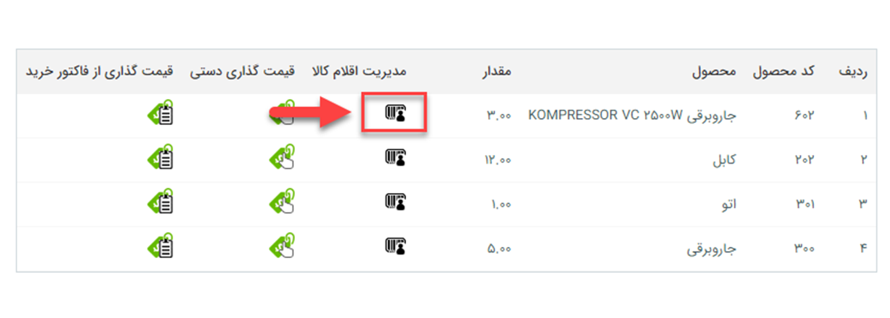

# ورود سریال کالا هنگام ثبت رسید
پس از اضافه کردن محصولات به تراکنش‌های انبار می‌توانید سریال اقلام کالا را نیز وارد کنید. وارد کردن سریال‌ها به شما کمک می‌کند تا با جستجوی سریال‌ها در قسمت[ جستجو قلم کالا  ،](https://github.com/1stco/PayamGostarDocs/blob/master/Help/InventoryManagement/WarehouseProducts'%20list.md) وضعیت کالا (موجود بودن آن در انبار، وضعیت گارانتی و ...) را به سادگی مشاهده نمایید. پس از اضافه نمودن محصولات به تراکنش‌های انبار، به ازای هر ردیف محصول، می‌توانید با کلیک بر روی مدیریت اقلام کالا نسبت به افزودن سریال‌ها اقدام نمایید.

با کلیک بر روی این دکمه صفحه زیر را مشاهده خواهید کرد:

## A. مشخصات کالا
  مشخصات محصول که از مرحله قبلی ثبت شده است در این قسمت نمایش داده می‌شود.
این اطلاعات شامل نام محصول و نام انباری که کالا به آن وارد شده‌است می‌باشد.
## B. وضعیت کالا و ثبت گارانتی
  در این قسمت اطلاعات مرتبط با ساخت و گارانتی قابل مشاهده است.
-  **وضعیت**: می‌بایست وضعیت کالا را از لیست تعریف شده که شامل:**سالم**، **خراب**، **تعمیری** و **مرجوعی** می‌باشد انتخاب نمایید.
- **تاریخ ساخت**: در این قسمت می‌توانید از فیلدهای تاریخی، تاریخ ساخت محصول را ثبت نمایید.
- **تاریخ انقضا**: تاریخ انقضا کالای موردنظر در این قسمت ثبت می‌شود.
- **گارانتی محصول**: اطلاعات مرتبط با گارانتی محصول در این قسمت قابل ثبت می‌باشد. برای اطلاعات بیشتر می‌توانید به [تعیین گارانتی کالا]() مراجعه نمایید.
## C. روش‌های ایجاد سریال برای محصولات
 برای کالای موجود در هر رسید انبار می‌توان از 3 راه سریال تعریف کرد که توضیحات مرتبط با هر یک در قسمت ذیل ذکر شده‌است.
### بارکد خوان/ثبت دستی
 با استفاده از دستگاه بارکد خوان یا بصورت دستی،  می‌توانید سریال‌ها را در فیلد متنی اضافه کنید.

> **نکته** 
 برای استفاده از بارکد خوان، نشانگر(موس) را روی فیلد متن نگه دارید و سپس دستگاه بارکد خوان را متصل کنید و شروع به اسکن بارکدها نمایید. 

### بازه
 می‌توانید یک بازه عدد را همراه با پیشوند به‌خصوصی برای  سریال‌ها انتخاب نمایید.
- **مقدار:** تعداد سریال‌هایی که مورد نیاز است را مشخص کنید. (در این مثال 5 کالا مورد نظر بوده است.)
- **پیشوند سریال:** در صورت نیاز، پیشوند دلخواهی برای سریال‌های تولید شده در نظر بگیرید.
- **از:** حد پایین بازه شروع سریال‌ها را مشخص کنید.
- **تا:** حد بالای بازه پایان سریال‌ها را مشخص کنید.
- **انتخاب اقلام به صورت تصادفی:** در صورت فعال کردن این گزینه از بین بازه انتخاب شده (در این مثال 1000 تا 1005) نرم افزار به صورت تصادفی به اندازه مقدار تعیین شده شماره تصادفی ایجاد می کند.
### فایل اکسل
اگر فایل اکسل سریال کالاها را در اختیار دارید، می‌توانید فایل آن را از این طریق وارد نرم افزار کنید.

> **نکته**  در فایل اکسل فقط باید یک ستون بدون عنوان داشته باشید که حاوی سریال اقلام کالاست. 

 پس از وارد کردن سریال‌ها با استفاده از یکی از سه روش ذکر شده با کلیک بر روی دکمه **افزودن سریال‌ها**، آن‌ها را به ستون سمت چپ اضافه نمایید.
## D. سریال‌های اقلام انتخاب شده
 سریال کالاهایی که وارد کرده‌اید به همراه مشخصات تعیین شده برای هرکدام در این قسمت نمایش داده می‌شود. در صورت اشتباه بودن اطلاعات می‌توانید آن‌ها را ویرایش کنید.
 در انتها پس از وارد کردن سریال و مشخصات مربوط به تمامی اقلام کالا با کلیک بر روی دکمه **"ذخیره کردن"** سریال‌ها را به تراکنش انبار مربوطه اضافه کنید.
