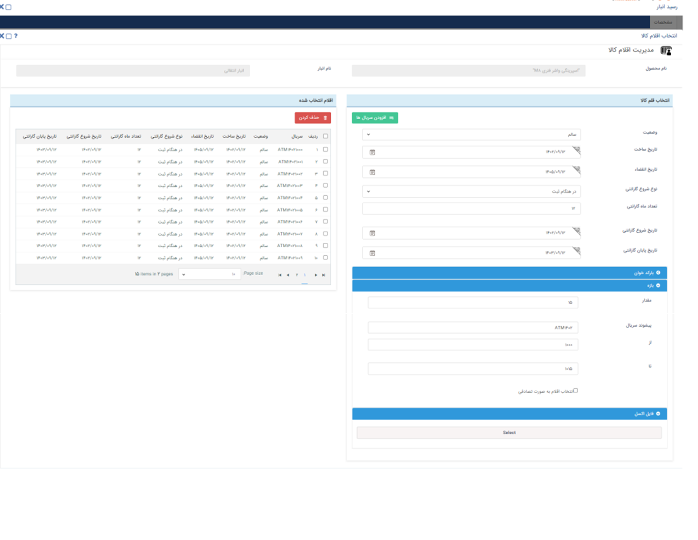
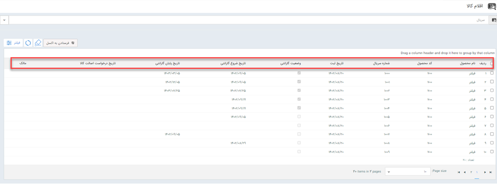
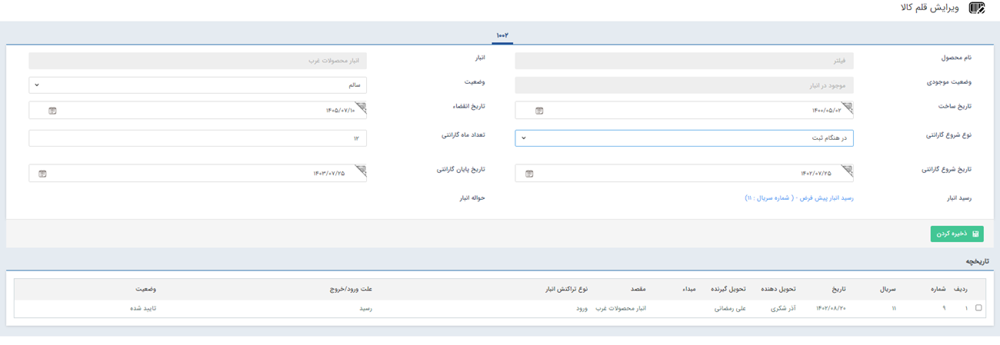

# تعیین گارانتی کالا 
چنانچه ماژول انبارداری سریالی را تهیه کرده باشید می‌توانید به منظور بهبود خدمات مشتری برای محصولات گارانتی  ثبت نمایید. 

>**نکته** 
چنانچه کالای مورد نظر در انبارداری سریالی نیاز به ثبت و بررسی گارانتی داشته باشد قبل از تعیین گارانتی روی محصولات در قسمت تنظیمات می‌بایست چک باکس **اعمال گارانتی** فعال شده باشد.

از طریق دو روش زیر می‌توانید برای محصولات در انبارداری سریالی گارنتی تعریف نمایید:
- **انبار**> **انتخاب انبار مورد نظر**> **تراکنش‌های انبار**> به عنوان مثال **ثبت حواله**> **مدیرت اقلام کالا** > **ثبت گارانتی** 

ثبت گارانتی در پیام‌گستر شامل مشخصات زیر می‌باشد:
1. **نوع شروع گارانتی**: برای ثبت نوع شروع گارانتی محصول می‌بایست مشخص نمایید گارانتی کالا چه زمانی آغاز شود. برای انتخاب نوع شروع گارانتی می‌توانید یکی از گزینه‌های هنگام ثبت، صدور حواله، تایید اصالت کالا  و یا در تاریخ مشخص را از لیست کشویی تنظیم شده انتخاب نمایید.
2. **تعداد ماه گارانتی**: تعداد ماه‌هایی که محصول مورد نظر شامل گارانتی می‌شود را مشخص نمایید.
3. **شروع گارانتی  از**: از فیلد تاریخی پیش‌فرض می‌بایست تاریخ دقیق شروع گارانتی را مشخص کنید.
4. **شروع گارانتی تا**: می‌توانید بازه تاریخی را برای زمان شروع گارانتی در نظر بگیرید. به عنوان مثال گارانتی محصول A می تواند از تاریخ 1403.09.12 تا تاریخ 1402.09.12 آغاز شود.
5. **پایان گارانتی از**: برای درنظر گرفتن تاریخ پایان قرارداد می‌توانید بازه زمانی را در نظر بگیرید که تاریخ پایان گارانتی از یک زمان مشخص شروع شود.
6. **پایان گارانتی تا**: برای ثبت پایان قرارداد می‌توانید در نظر بگیرید که محصول در نظر گرفته شده تا چه تاریخی شامل گارانتی می‌شود.

- **تب انبار** > **اقلام کالا** > **ثبت گارانتی** 

 روشی دیگری که می‌توانید برای ثبت گارانتی برای هر محصول به صورت جداگانه اقدام نمایید بدین صورت است که ابتدا وارد تب اقلام می‌شوید و با انتخاب گزینه اقلام کالا و کلیک روی هر محصول وارد صفحه زیر خواهید شد و از این طریق اطلاعات مرتبط با گارانتی محصولات را ثبت می‌کنید.

