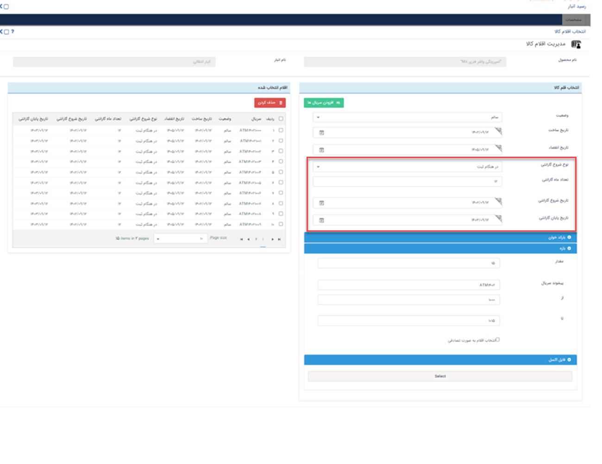
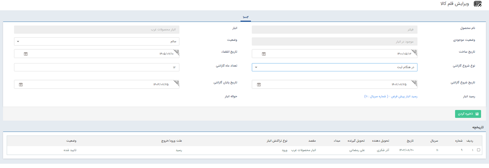

# تعیین گارانتی کالا 
چنانچه ماژول انبارداری سریالی را تهیه کرده باشید می‌توانید به منظور بهبود خدمات مشتری، برای محصولات گارانتی ثبت نمایید. 

>**نکته** 
چنانچه کالای مورد نظر در انبارداری سریالی نیاز به ثبت و بررسی گارانتی داشته باشد قبل از تعیین گارانتی روی محصولات، می‌بایست چک باکس **اعمال گارانتی** را در قسمت [مدیریت محصولات]() فعال شده باشد. 

از طریق دو روش زیر می‌توانید برای محصولات در انبارداری سریالی،  گارانتی تعریف نمایید: 

## ثبت گارانتی محصولات به هنگام ثبت سریال در رسید
به هنگام ثبت رسید،‌ هم زمان با [تعیین سریال محصولات]() در «انتخاب اقلام کالا»، گارانتی محصول را نیز تعیین نمایید.

برای درج گارانتی ابتدا نوع شروع گارانتی را مشخص کرده و سپس اطلاعات مورد نیاز آن را تعیین نمایید. در پیام‌گستر تاریخ شروع گارانتی را می‌توانید در چهار حالت تنظیم کنید: 
- **تاریخ مشخص** 
در صورت انتخاب این گزینه، باید «تاریخ شروع گارانتی» و «تاریخ پایان گارانتی» را مشخص کنید. در این حالت، گارانتی محصول در بازه زمانی مندرج، تعیین می‌شود.
- **در هنگام حواله** 
 در صورت انتخاب این گزینه، باید «تعداد ماه گارانتی» را انتخاب را مشخص نمایید. در این حالت،‌ تاریخ ثبت حواله‌ای که این سریال در آن درج شده،‌ به عنوان تاریخ شروع گارانتی در نظر گرفته شده و تاریخ پایان آن بر اساس تعداد ماه تعیین شده توسط شما محاسبه می‌شود.
- **در هنگام ثبت** 
در صورت انتخاب این گزینه، باید «تعداد ماه گارانتی» را مشخص کنید. در این حالت،‌ تاریخ ثبت گارانتی،‌ به عنوان تاریخ شروع گارانتی در نظر گرفته شده و تاریخ پایان آن بر اساس تعداد ماه تعیین شده توسط شما محاسبه می‌شود.
- **تایید اصالت کالا** 
در صورت انتخاب این گزینه، باید «تعداد ماه گارانتی» را مشخص کنید. در این حالت،‌ تاریخ ثبت گارانتی،‌ به عنوان تاریخ شروع گارانتی در نظر گرفته شده و تاریخ پایان آن بر اساس تعداد ماه تعیین شده توسط شما محاسبه می‌شود.

> **نکته** 
> توجه داشته باشید پیش از افزودن سریال‌های انتخابی، اطلاعات گارانتی را تعیین کرده و سپس بر روی «افزودن سریال‌ها» کلیک کنید. 

چنانچه برای رسیدهایی که پیش‌تر ثبت کرده‌اید قصد تعریف سریال و گارانتی را دارید‌از مسیر  تب **انبار**> **انبارها** > انتخاب **انبار** مورد نظر> انتخاب **رسید** مورد نظر می‌توانید اقدام نمایید.

## ثبت و ویرایش گارانتی برای یک قلم کالا
چنانچه به هنگام تعریف سریال برای محصولات برای آن‌ها گارانتی مشخص نکرده‌اید،‌ از قسمت مدیریت اقلام کالا می‌توانید برای هر محصول شرایط گارانتی را تعیین کنید. بدین منظور از مسیر  **تب انبار** > **اقلام کالا** محصول مورد نظر را یافته و روی ردیف آن کلیک کنید. از این طریق می‌توانید وارد صفحه «ویرایش قلم کالا» شوید.

از این بخش می‌توانید به روش مشابه بخش قبل، اطلاعات گارانتی را درج و ذخیره نمایید. در صورت نیاز به ویرایش گارانتی کالا نیز می‌توانید از این روش استفاده کنید.