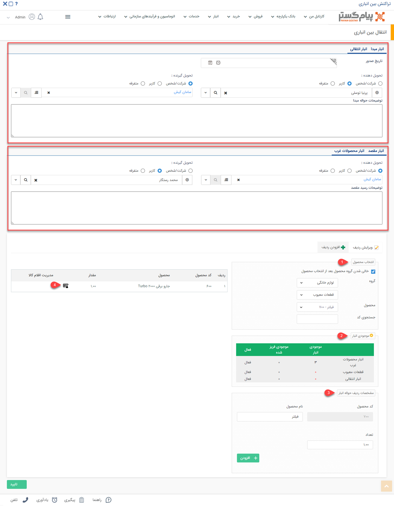

# انتقال کالا بین انبارها
برای انجام انتقال بین انبارهای خود از این گزینه استفاده نمایید برای مثال زمانی نیاز می‌شود محصولات از انبار مرکزی به انبار غرب تهران منتقل شوند در اینصورت سیستم به صورت همزمان برای کالایی که از انبار مرکزی خارج شده یک حواله ثبت می‌کند و برای کالای ورودی به انبار غرب تهران رسید ثبت خواهد شد. پس از ثبت انتقال بین انباری، سیستم به صورت همزمان یک حواله در انبار مبداء و یک رسید در انبار مقصد ثبت خواهد کرد.

تراکنش‌های بین انباری شامل رسید و حواله است که با  نحوه ثبت و جزئیات آن بیشتر آشنا خواهید شد.  
جزئیات مهم برای ثبت تراکنش‌های بین انباری عبارتند از:

1. **نوع حواله مبدا:** نوع حواله‌ای که باید در انبار مبدا ایجاد شود را تعیین کنید.
2. **انبار مبدا:** انباری که قرار است کالاها از آن خارج شود را تعیین کنید.
3. **نوع رسید مقصد:** نوع رسیدی که باید در انبار مقصد ایجاد شود را انتخاب کنید.
4. **انبار مقصد:** انباری که قرار است کالاها به آن منتقل شوند را انتخاب کنید.

> **نکته** 
 توجه داشته باشید برای انجام عملیات انتقال، ابتدا باید در قسمت[ مدیریت تراکنش های انبار](https://github.com/1stco/PayamGostarDocs/blob/master/Help/Settings/Personalization-crm/Management-warehouse-transactions/Management-warehouse-transactions.md) ، حداقل یک رسید انبار از نوع انتقالی و حداقل یک حواله انبار از نوع انتقالی ایجاد کرده باشید.

پس از تعیین انبارهای مبداء و مقصد و نوع تراکنش‌های انباری که باید ثبت شوند، با کلیک بر روی دکمه "تایید"، صفحه زیر را مشاهده خواهید نمود. در این قسمت می‌بایست اطلاعات مرتبط با تحویل دهنده و تحویل گیرنده را مشخص نمایید و در انتها اقلام کالا مورد نظر جهت انتقال بین‌انباری را ثبت کنید.

> **نکته** 
 برای انتقال محصول در انبار ها باید در قسمت مدیریت انبارها حداقل دو انبار در سیستم تعریف کرد و محصول مورد نظر در هر دو انبار تعریف شده باشد.
 >>**نکته**  برای ثبت تراکنش‌های انبار باید دقت شود حتما انبار مورد نظر فعال شده باشد.

برای ثبت  تراکنش انتقال بین انباری می‌بایست اطلاعات مرتبط با حواله  تکمیل شود که این اطلاعات شامل موارد زیر است: تاریخ صدور، مشخصات تحویل دهنده، تحویل گیرنده و توضیحات مرتبط با حواله ثبت شده از انبار مبدا . 
پس از ثبت حواله از انبار مبدا برای انبار مقصد باید رسید ورود کالا به انبار ثبت شود که شامل مشخصات تحویل دهنده، تحویل گیرنده و توضیحات مرتبط با رسید ثبت شده می‌باشد. 
 پس از ثبت حواله و رسید موردنظر  باید اطلاعات محصولاتی که قصد انتقال آنها را دارید مشخص نمایید: 
1. **انتخاب محصول:** نام محصول را از دسته بندی‌های محصولات یا با استفاده از کد آن انتخاب کنید.

> **نکته** 
> توجه داشته باشید در این قسمت تنها محصولاتی را می‌توانید انتخاب کنید که در قسمت مدیریت انبارها به عنوان محصول مجاز این انبار تعیین شده باشند. 

2. **موجودی انبار:** پس از انتخاب محصول، می‌توانید در این قسمت موجودی این محصول را در انبارهای مختلف (انبارهایی که این محصول برای آنها به عنوان محصول مجاز تعریف شده باشند) مشاهده کنید.
3. **مشخصات ردیف حوله انبار:** از پروفایل مشتری، نام محصول انتخاب شده نمایش داده می‌شود و باید مقدار آن را تعیین کنید. سپس  با کلیک روی دکمه **افزودن** می‌توانید محصولات را اضافه کنید.
4. **مدیریت اقلام کالا:** با استفاده از این علامت می‌توانید سریال اقلامی‌ که در حواله درج کرده‌اید را وارد کنید. برای اطلاع از نحوه وارد کردن سریال‌ها،[ مدیریت اقلام کالا ](https://github.com/1stco/PayamGostarDocs/blob/master/Help/Buy-warehouse-sales/Store/sabthavale-resid/aghlam-kala.md)را مطالعه کنید.
