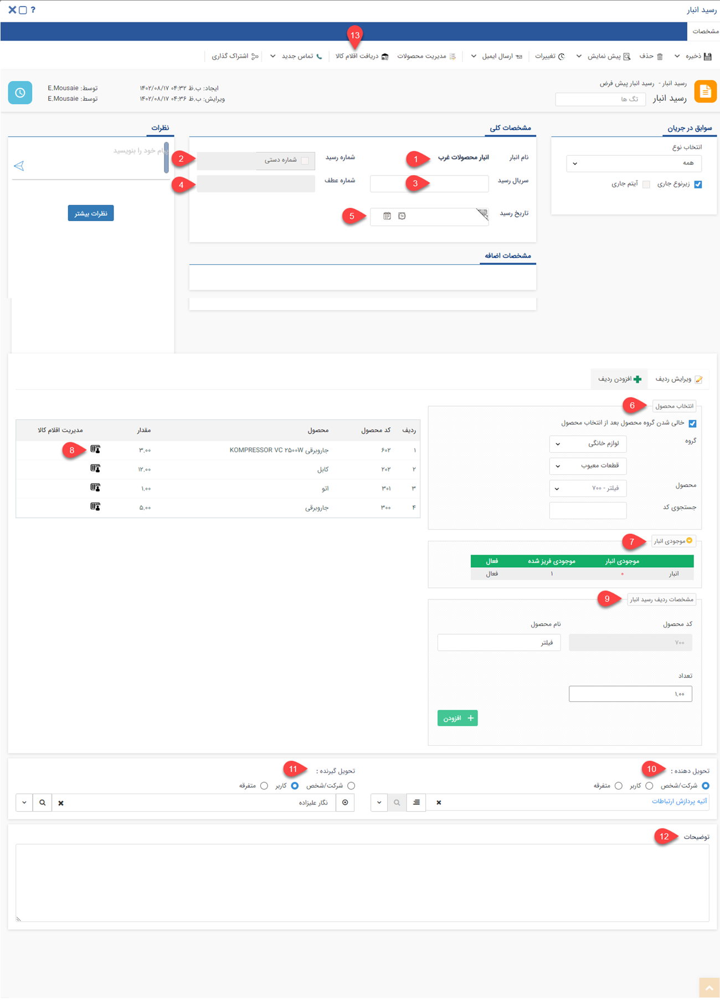

# ورود کالا به انبار و ثبت رسید
در این مقاله با انواع روش‌های ورود کالا به انبار و روش‌های ثبت رسید آشنا خواهید شد:

- [انواع رسید ورود کالا به انبار](#TypesOfReceipt)
- [روش ثبت انواع رسید انبار](#NewWarehouseReceiptMethods)

## انواع رسید ورود کالا{#TypesOfReceipt}
در پیام‌گستر کالاها به سه روش اصلی می‌توانند وارد انبار شوند
 که عبارتند از:
1. **رسید موجودی اولیه:** رسید موجودی اولیه هنگامی ثبت می‌شود که قبل از آن رسیدی ثبت نشده باشد و تنها یکبار  می‌توانید رسید موجودی اولیه ثبت کنید. در حقیقت رسید موجودی اولیه به عنوان سرشماری واقعی در انبار عمل می‌کند.
2. **رسید انبار:** زمانی که کالا وارد انبار می‌شود، برای اضافه شدن آن به انبار از رسید انبار استفاده می‌شود.
3. **رسید مرجوعی(رسید برگشت از فروش):** زمانی که کالا از انبار حواله شده (خارج شده است) و اکنون می‌خواهیم آن را دوباره به انبار بازگردانیم از رسید مرجوعی استفاده می‌شود.

##  ثبت انواع رسید انبار {#NewWarehouseReceiptMethods}
برای ثبت ورود کالا به انبار در پیام‌گستر باید برای اقلام ورودی رسید انبار ثبت کنید. روش‌ ثبت رسید برای کالاها به شرح زیر است: 
 **تب انبار** > **انبارها** > **انتخاب نوع تراکش در انبار** > **رسید  انبار**

> **نکته** 
در صورتیکه در شخصی ‌سازی crm > **فاکتور خرید** چک باکس **"صدور رسید انبار خودکار"** 
را فعال کرده باشید به صورت خودکار رسید انبار شماره‌گذاری خواهد شد. 

### مشخصات انواع رسید انبار
در این مقاله فیلدهای ثبت یک رسید توضیح داده شده است، به عنوان مثال این قسمت رسید انبار (که هنوز تایید نشده است) انتخاب گردیده است.

> **نکته** 
> هر رسید در انبار ابتدا ذخیره می‌شود، سپس باید به تایید رسیده و بعد از آن باید قیمت‌گذاری روی آن انجام شود. در صورت داشتن ماژول **انبارداری سریالی** می‌توانید در رسیدهای ثبت شده، سریال اقلام کالا را نیز وارد کنید.

1. **نام انبار:** نام انباری که این تراکنش در آن ثبت شده است، نمایش داده می‌شود.
2. **شماره رسید:** شماره رسید را مشخص می‌کند (این شماره مختص این نوع تراکنش در تمامی‌انبار‌هاست، به عنوان مثال شماره این نوع رسید بین رسیدهای هم نوع خود در تمامی‌انبارها). 

>**نکته** 
شماره رسید پس از تایید تراکنش به صورت خودکار درج خواهد شد، اما در صورت داشتن مجوز مربوطه می‌توانید به صورت دستی آن را وارد کنید. 

3. **سریال رسید:** سریال این رسید را مشخص می‌کند. شماره سریال پس از ثبت تراکنش به صورت خودکار توسط سیستم درج خواهد شد، اما ممکن است پس از تایید، در صورت متفاوت بودن ترتیب صدور و ترتیب تایید تراکنش‌های انبار تغییر کند.  
مثال: تصور کنید دو نوع رسید به نام‌های رسید نوع1 و رسید نوع2 در شخصی‌سازی تراکنش‌های انبار ایجاد کرده‌اید. اگر یک رسید از نوع1 ثبت کنید شماره 1 و سریال 1 برای آن درج خواهد شد. سپس اگر یک رسید نوع2 ثبت کنید، شماره 1 و سریال 2 برای آن درج خواهد شد.

>**نکته** 
 توجه داشته باشید که سریال تراکنش‌های انبار ممکن است پس از تایید تغییر کند، این اتفاق در صورتی می‌افتد که ترتیب صدور تراکنش با ترتیب تایید آن متفاوت باشد یا شماره سریال را به صورت دستی وارد کرده باشید. 
>> **نکته** 
>  تراکنش‌های انبار بر اساس نوع رسید، منبع  سریال جداگانه دارند (یعنی نمی‌توان دو تراکنش از یک نوع رسید با شماره سریال مشابه ثبت کرد، اما در صورت متفاوت بودن زیرنوع آن‌ها، می‌توانند شماره مشابه داشته باشند). علاوه‌براین، نحوه ثبت سریال یا شماره ارتباطی با صدور تراکنش در انبارهای مختلف ندارد. 

4. **شماره عطف:** شماره رسید را نمایش می‌دهد. در صورتی که شماره سریال به صورت دستی تغییر کند یا ترتیب صدور تراکنش‌ها با تایید آن‌ها متفاوت باشند، شماره سریال پیشین در شماره رسید درج خواهد شد. به طور مثال فرض کنید یک رسید انبار صادر می‌کنید و پس از ذخیره، سریال 5 برای آن درج گردد، سپس رسید دیگری صادر کنید و شماره 6 برای آن درج گردد. در صورتی که ابتدا رسید با سریال 6 را تایید کنید، شماره سریال آن به 5 تغییر کرده و شماره 6 در فیلد شماره رسید درج خواهد شد. همچنین اگر سریال را به صورت دستی در هنگام ثبت وارد کنید، هنگام تایید، شماره سریال بر اساس ترتیب سریال‌دهی سیستم تغییر کرده و شماره وارد شده توسط شما در فیلد شماره رسید درج خواهد شد. توجه داشته باشید که امکان درج یا تغییر شماره رسید به صورت دستی وجود ندارد و صرفاً جهت اطلاع رسانی سریال پیشین تراکنش می‌باشد. خالی بودن این فیلد به معنی تغییر نکردن سریال می‌باشد.
5. **تاریخ رسید:** تاریخ ثبت رسید در این قسمت به صورت خودکار درج می‌گردد اما می‌توانید براساس تاریخ صدور واقعی تراکنش، آن را به صورت دستی تغییر دهید. 

>**نکته** 
  توصیه می‌شود که برای ثبت رسید فیلدهای **شماره رسید** و **تاریخ رسید** خالی گذاشته شوند تا بصورت خودکار تکمیل گردند. 

6. **انتخاب محصول:** نام محصول را از دسته‌بندی‌های محصولات یا با استفاده از کد آن انتخاب کنید.

> **نکته** 
> توجه داشته باشید در این قسمت تنها محصولاتی را می‌توانید انتخاب کنید که در قسمت مدیریت انبارها به عنوان محصول مجاز این انبار تعیین شده باشند.

7. **موجودی انبار:** پس از انتخاب محصول، می‌توانید در این قسمت موجودی این محصول را در انبارهای مختلف (انبارهایی که این محصول برای آنها به عنوان محصول مجاز تعریف شده باشند) مشاهده کنید.
8. **مدیریت اقلام کالا:** با استفاده از این دکمه می‌توانید برای اقلامی که در تراکنش‌های انبار تعریف کرده‌اید سریال وارد نمایید.
9. **دریافت اقلام کالا:** دریافت اقلام کالا به شما کمک می‌کند لیست اقلامی که در رسید ثبت شده‌اند را تحت عنوان فایل اکسل دریافت نمایید.

> **نکته:** 
> اگر به اندازه مقدار انتخاب شده از کالا سریال وارد نکنید به این معنی است که تعدادی از محصولاتی که در رسید هستند، بدون سریال می‌باشند.(برای مثال کالا فله ای است یا هنوز سریال گذاری نشده‌است.)

10. **تحویل دهنده:** فرد یا شرکتی که کالاهای موجود در این رسید را تحویل می‌دهد انتخاب کنید. 
انتخاب این فیلد از سه راه امکان پذیر است:
- **شرکت/شخص**: از بین مخاطبان ثبت شده در نرم افزار یک مخاطب انتخاب می‌شود.
- **کاربر:** از بین کاربران فعال در نرم‌افزار یک فرد انتخاب می‌شود.
- **متفرقه:** نام شخص یا شرکت نوشته می‌شود.

> **نکته** 
> در صورتی که در یک رسید انبار، نام یک هویت را به عنوان تحویل دهنده وارد کنید، آن رسید در سوابق هویت مرتبط نمایش داده خواهد شد.

11. **تحویل گیرنده:** فرد یا شرکتی که کالاهای موجود در این رسید را تحویل می‌گیرد را انتخاب کنید.

> **نکته** 
> در صورتی که در یک رسید انبار، نام یک هویت را به عنوان تحویل گیرنده وارد کنید، آن رسید در سوابق هویت مرتبط نمایش داده خواهد شد. 

12. **توضیحات:** در صورت نیاز می‌توان توضیحات اضافی مرتبط با رسید را در این قسمت وارد کرد.

{#sign}
> **نکته**  
> در صورت وارد کردن تحویل‌دهنده/تحویل گیرنده، اطلاعات آن در سوابق هویت مرتبط ثبت می‌شود. از آنجا که اطلاعات مربوط به هویت مانند آدرس و شماره تلفن می‌تواند هنگام تنظیم قالب چاپ مورد نیاز باشد، پارامترهای هوشمند هویت به این آیتم‌ها اضافه شده‌است.

13. **دریافت اقلام کالا:** با استفاده از این دکمه می‌توانید سریال اقلام کالای وارد شده در این تراکنش را در قالب یک فایل اکسل دریافت کنید.

>**نکته** 
چنانچه رسید ثبت شده برای ورود کالا به انبار تایید گردید می‌توانید رسید را به دو صورت **دستی** و یا  از طریق **فاکتور خرید** شماره‌گذاری  نمایید. برای اطلاعات بیشتر به قسمت 
[قیمت گذاری رسید]() مراجعه نمایید. همچنین از طریق [انتخاب سریال کالا]() می‌توانید از روش‌های مختلف به اقلام کالا مورد‌نظر شماره دهید.
