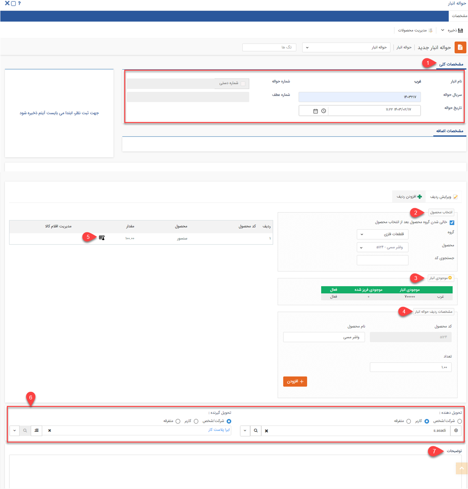
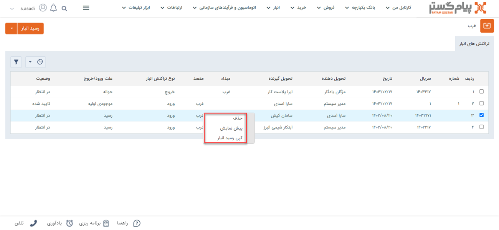
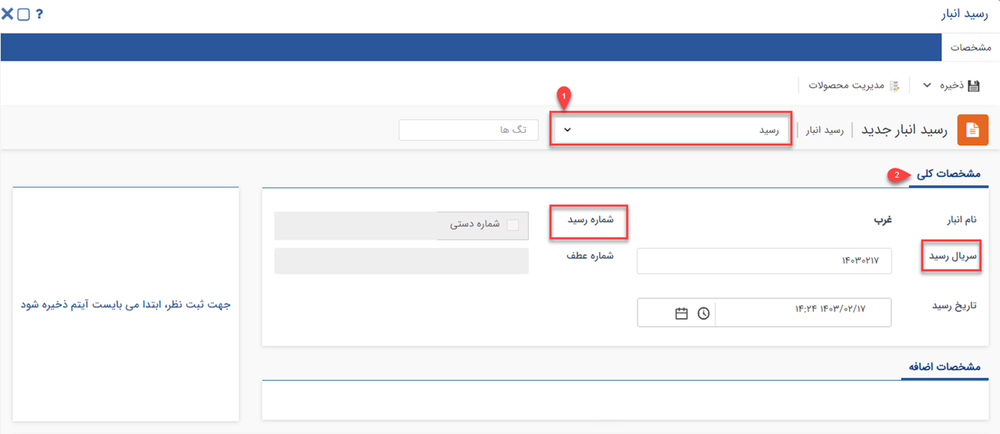

# خروج کالا از انبار و ثبت حواله
در این مقاله با انواع روش‌های خروج کالا از انبار و روش‌های ثبت حواله آشنا خواهید شد:
- [انواع حواله خروح کالا از انبار](#TypesOfRemittances)
- [روش ثبت انواع حواله انبار](#NewWarehouseEmittancesMethods)
- [صدور حواله از رسید یا حواله دیگر](#IssuanceOfRemittanceFromReceiptOrRemittance)

## انواع حواله خروج کالا{#TypesOfRemittances}
 در پیام‌گستر کالاها به سه روش اصلی می‌توانند از انبار خارج شوند 
 که عبارتند از:

1. **حواله انبار(حواله خروج):** زمانی که کالا به دلیلی غیر از فروش (مثلا به دلیل اسقاط شدن کالا و یا اینکه کالا قرار است هدیه شود) از انبار خارج می‌شود از حواله  انبار استفاده می‌شود.
2. **حواله فروش:** زمانی که برای کالا فاکتور فروش صادر شده است، برای تحویل آن به مشتری و کم شدن از موجودی انبار، از حواله فروش استفاده می‌شود.
3. **حواله مرجوعی(حواله برگشت از فروش):** زمانی که کالا به انبار وارد شده (رسید شده است) و اکنون می‌خواهیم آن را از انبار خارج کنیم از حواله مرجوعی استفاده می‌کنیم.
4. **حواله انتقالی:** زمانی که بخواهیم محصولاتی را از یک انبار به  انبار دیگری انتقال دهیم از این نوع حواله استفاده می‌کنیم.

##  ثبت انواع حواله انبار{#NewWarehouseEmittancesMethods}
برای ثبت خروج کالا از انبار در پیام‌گستر باید برای اقلام خروجی حواله انبار ثبت کنید. روش‌ ثبت حواله برای کالاها به شرح زیر است: 
 **تب انبار** > **انبارها** > **انتخاب نوع تراکش در انبار** > **حواله  انبار**

> **نکته** 
در صورتیکه در شخصی ‌سازی crm > **فاکتور فروش** چک باکس **"صدور حواله انبار خودکار"** 
را فعال کرده باشید به صورت خودکار حواله انبار شماره‌گذاری خواهد شد. 

### مشخصات انواع حواله انبار
در این قسمت فیلدهای ثبت یک حواله توضیح داده شده است، برای مثال این قسمت حواله انبار (که هنوز تایید نشده است) انتخاب گردیده است.

 هر حواله در انبار ابتدا ذخیره می‌شود، سپس باید به تایید رسیده و بعد از آن باید قیمت گذاری روی آن انجام شود. در صورت داشتن ماژول **انبارداری سریالی** می‌توانید در حواله‌های ثبت شده، سریال اقلام کالا را نیز وارد کنید.
1. **مشخصات کلی**
- **نام انبار:** نام انباری که این تراکنش در آن ثبت شده است، نمایش داده می‌شود.
- **شماره حواله:** شماره حواله را مشخص می‌کند (این شماره مختص این نوع تراکنش در تمامی‌انبار‌هاست، به عنوان مثال شماره این نوع حواله بین حواله‌های هم نوع خود در تمامی‌انبارها). 

>**نکته** 
شماره حواله پس از تایید تراکنش به صورت خودکار درج خواهد شد، اما در صورت داشتن مجوز مربوطه می‌توانید به صورت دستی آن را وارد کنید.

- **سریال حواله:** سریال این حواله را مشخص می‌کند. شماره سریال پس از ثبت تراکنش به صورت خودکار توسط سیستم درج خواهد شد، اما ممکن است پس از تایید، در صورت متفاوت بودن ترتیب صدور و ترتیب تایید تراکنش‌های انبار تغییر کند.  
مثال: تصور کنید دو نوع حواله به نام‌های حواله نوع1 و حواله نوع2 در شخصی سازی تراکنش‌های انبار ایجاد کرده اید. اگر یک حواله از نوع1 ثبت کنید شماره 1 و سریال 1 برای آن درج خواهد شد. سپس اگر یک حواله نوع2 ثبت کنید، شماره 1 و سریال 2 برای آن درج خواهد شد.

>**نکته** 
 توجه داشته باشید که سریال تراکنش‌های انبار ممکن است پس از تایید تغییر کند، این اتفاق در صورتی می‌افتد که ترتیب صدور تراکنش با ترتیب تایید آن متفاوت باشد یا شماره سریال را به صورت دستی وارد کرده باشید.
>> **نکته** 
>  تراکنش‌های انبار بر اساس نوع حواله منبع سریال جداگانه دارند (یعنی نمی‌توان دو تراکنش از یک نوع حواله با شماره سریال مشابه ثبت کرد، اما در صورت متفاوت بودن زیرنوع آن‌ها، می‌توانند شماره مشابه داشته باشند). علاوه بر این، نحوه ثبت سریال یا شماره ارتباطی با صدور تراکنش در انبارهای مختلف ندارد، یعنی ترتیب شماره‌دهی براساس انبار تغییر نخواهد کرد.

- **شماره عطف:** شماره حواله را نمایش می‌دهد. در صورتی که شماره سریال به صورت دستی تغییر کند یا ترتیب صدور تراکنش‌ها با تایید آن‌ها متفاوت باشند، شماره سریال پیشین در شماره حواله درج خواهد شد. به طور مثال فرض کنید یک حواله انبار صادر می‌کنید و پس از ذخیره، سریال 5 برای آن درج گردد، سپس حواله دیگری صادر کنید و شماره 6 برای آن درج گردد. در صورتی که ابتدا حواله با سریال 6 را تایید کنید، شماره سریال آن به 5 تغییر کرده و شماره 6 در فیلد شماره حواله درج خواهد شد. همچنین اگر سریال را به صورت دستی در هنگام ثبت وارد کنید، در هنگام تایید، شماره سریال بر اساس ترتیب سریال‌ دهی سیستم تغییر کرده و شماره وارد شده توسط شما در فیلد شماره حواله درج خواهد شد. توجه داشته باشید که امکان درج یا تغییر شماره رسید به صورت دستی وجود ندارد و صرفاً جهت اطلاع رسانی سریال پیشین تراکنش می‌باشد. خالی بودن این فیلد به معنی تغییر نکردن سریال می‌باشد.
- **تاریخ حواله:** تاریخ ثبت حواله در این قسمت به صورت خودکار درج می‌گردد اما می‌توانید بر اساس تاریخ صدور واقعی تراکنش، آن را به صورت دستی تغییر دهید. 

>**نکته** 
توصیه می‌شود برای ثبت رسید، فیلدهای **شماره حواله** و **تاریخ حواله** خالی گذاشته شوند تا بصورت خودکار تکمیل گردند. 

2. **انتخاب محصول:** نام محصول را از دسته‌بندی‌های محصولات یا با استفاده از کد آن انتخاب کنید.

> **نکته** 
> توجه داشته‌باشید در این قسمت تنها محصولاتی را می‌توانید انتخاب کنید که در قسمت مدیریت انبارها به عنوان محصول مجاز این انبار تعیین شده باشند.

3. **موجودی انبار:** پس از انتخاب محصول، می‌توانید در این قسمت موجودی این محصول را در انبارهای مختلف (انبارهایی که این محصول برای آنها به عنوان محصول مجاز تعریف شده باشند) مشاهده کنید.
4. **مشخصات ردیف حواله انبار**:
در این بخش می‌بایست مشخصات محصول اعم از نام، کد و تعداد آن ثبت شود.
5. **مدیریت اقلام کالا:** با استفاده از این دکمه می‌توانید برای اقلامی که در تراکنش‌های انبار تعریف کرده‌اید سریال وارد نمایید.

> **نکته:** 
> اگر به اندازه مقدار انتخاب شده از کالا سریال وارد نکنید به این معنی است که تعدادی از محصولاتی که در حواله هستند، بدون سریال می‌باشند. (برای مثال کالا فله ای است یا هنوز سریال گذاری نشده است.)

6. **مشخصات تحویل**
-  **تحویل دهنده:** فرد یا شرکتی که کالاهای موجود در این حواله را تحویل می‌دهد انتخاب کنید.
انتخاب این فیلد از سه راه امکان پذیر است:

   - **شرکت/شخص**: از بین مخاطبان ثبت شده در نرم افزار یک مخاطب انتخاب می‌شود.
   - **کاربر:** از بین کاربران فعال در نرم افزار یک فرد انتخاب می‌شود.
   - **متفرقه:** نام شخص یا شرکت نوشته می‌شود.

> **نکته** 
> در صورتی که در یک حواله‌ انبار، نام یک هویت را به عنوان تحویل‌دهنده وارد کنید، آن رسید در سوابق هویت مرتبط نمایش داده خواهدشد. 

-  **تحویل گیرنده:** فرد یا شرکتی که کالاهای موجود در این حواله را تحویل می‌گیرد را انتخاب کنید.

> **نکته**  
> در صورت وارد کردن تحویل‌دهنده/تحویل گیرنده، اطلاعات آن در سوابق هویت مرتبط ثبت می‌شود. از آنجا که اطلاعات مربوط به هویت مانند آدرس و شماره تلفن می‌تواند هنگام تنظیم قالب چاپ موردنیاز باشد، پارامترهای هوشمند هویت به این آیتم‌ها اضافه شده است. 

7. **توضیحات:** در صورت نیاز می‌توان توضیحات اضافی مرتبط با حواله را در این قسمت وارد کرد.

>**نکته** 
لازم به ذکر است، برای ثبت حواله ها شما مجاز هستند سریال‌هایی که قبلا از طریق رسید وارد انبار شده‌اند را انتخاب کنید. در واقع زمان وارد کردن سریال ها در حواله، علاوه بر سه روش ذکر شده، لیست سریال هایی که از قبل وارد انبار شده اند نمایش داده خواهد شد و می توانید از بین آن ها، سریال های مورد نظر خود را برای خروج از انبار انتخاب کنید. علاوه بر این، می توانید از فیلترهای مختلف برای جستجوی سریال های مورد نظر استفاده کنید.

## صدور حواله از روی رسید یا حواله دیگر {#IssuanceOf RemittanceFromReceiptOrRemittance}
برای جلوگیری از ثبت حواله تکراری، امکان صدور حواله جدیدی از روی حواله یا رسیدی که قبلا ثبت شده وجود دارد. در این حالت تمامی محصولات از سند مبدا به سند مقصد (کپی می‌شود) انتقال می‌یابند. 
عملکرد به این صورت است که روی حواله یا رسید مورد نظر راست کلیک کرده و سند انبار را کپی می کنیم، صدور حواله از روی اسناد دیگر ربطی به تایید و یا عدم تایید سند مبدا ندارد.

 با راست کلیک روی سند انبار و کپی گرفتن از آن، حواله  جدیدی  برای کاربر باز می‌شود که فقط شامل ردیف محصولات تراکنش مبدا است.(نوع تراکنش بسته به سند انتخاب شده دارد، برای مثال اگر رسید به‌عنوان تراکنش مبدا انتخاب شده باشد، رسید جدید باز خواهد شد )
 
 
 
 1. **زیر نوع سند انبار:** نوع رسید و حواله مقصد طبق سند مبدا مشخص می شود اما امکان انتخاب زیر نوع سند انبار وجود دارد .
 2. **شماره سند انبار:**  شماره و سریال رسید و یا حواله باید توسط کاربر مشخص شود.
 برای ثبت سند انبار به نکات زیر دقت فرمایید:
  - ردیف های سند ، همان ردیف ها و  تحویل دهنده و تحویل گیرنده همان تحویل دهنده و گیرنده سند مبدا بوده و امکان ویرایش توسط کاربر را دارد .
 - تاریخ سند الزامی ندارد که با تاریخ روز جاری تنظیم شود.
 - در صورت کپی اسناد مقدار سوپر فیلدها هم در سند جدید کپی می‌شود.
 
> **نکته** 
رسید یا حواله مقصد هیچ وابستگی‌ای به رسید و یا حواله مبدا ندارد .  کاربر فقط رسید و حواله‌هایی را می‌تواند از این روش ایجاد کند که مجوز صدور آن‌ها را دارد، همچنین از روی رسید موجود اولیه و حواله/رسید انتقالی امکان ایجاد سند دیگر وجود ندارد.
