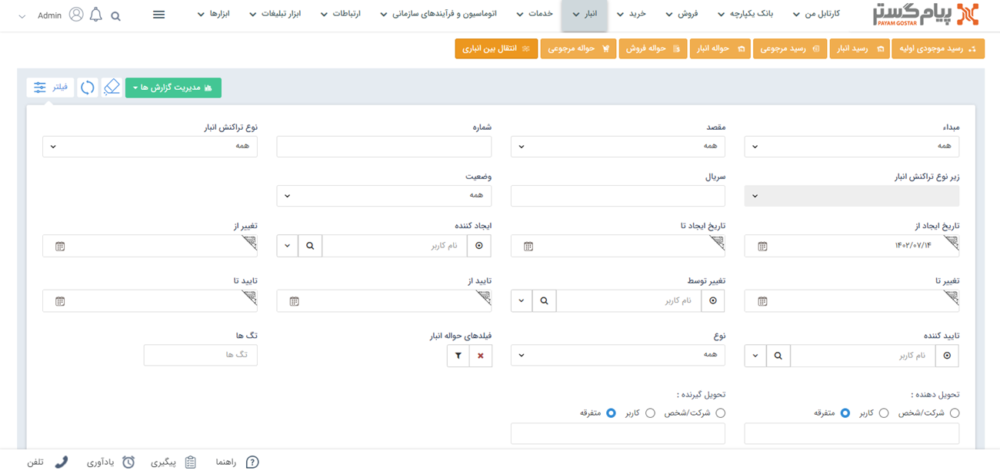

# مبانی انبارداری
در صورت داشتن ماژول انبار‌داری پیام‌گستر،می‌توانید حواله‌ها و رسید‌های ثبت شده در هر انبار را مدیریت نمایید. 
برای استفاده از انبارداری باید ابتدا محصولات در[ قسمت مدیریت محصولات ](https://github.com/1stco/PayamGostarDocs/blob/master/Help/Basic-Information/Product%20management/Product-management.md)تعریف شده باشند و محصولات هر انبار در قسمت[ مدیریت انبارها ](https://github.com/1stco/PayamGostarDocs/blob/master/Help/Settings/Warehouse-management/Warehouse-management.md)به عنوان محصول مجاز تعیین گردند. 
 برای تنظیم حواله‌ها و رسید‌های مرتبط با انبار می‌توانید از قسمت[ مدیریت تراکنش‌های انبار](https://github.com/1stco/PayamGostarDocs/blob/master/Help/Settings/Personalization-crm/Management-warehouse-transactions/Management-warehouse-transactions.md)  اقدام کنید.
برای ثبت محصولات در انبار و مدیریت انبار‌داری باید با مفاهیم  **حواله** و **رسید** در پیام‌گستر آشنا شوید.
- **حواله:** به معنی خروج کالا از انبار است.
- **رسید:** به معنی ورود کالا به انبار است.

انواع تراکنش‌های انبار به شرح زیر می‌باشند:

1. **رسید موجودی اولیه:** در هر انبار فقط یکبار رسید موجودی اولیه صادر می‌شود. این رسید موجودی سر‌شماری شده واقعی در انبار را به نرم افزار وارد می‌کند.

> **نکته** 
 در انبار قبل از صدور رسید موجودی اولیه اگر رسید و یا حواله ثبت شود، دیگر امکان ثبت رسید موجودی اولیه نیست. 

2. **رسید انبار:** زمانی که کالا وارد انبار می‌شود، برای اضافه شدن آن به انبار از رسید انبار استفاده می‌شود.
3. **رسید مرجوعی(رسید برگشت از فروش):** زمانی که کالا از انبار حواله شده (خارج شده است) و اکنون می‌خواهیم آن را دوباره به انبار بازگردانیم از رسید مرجوعی استفاده می‌شود.
4. **حواله انبار(حواله خروج):** زمانی که کالا به دلیلی غیر از فروش (مثلا به دلیل اسقاط شدن کالا، یا اینکه کالا قرار است هدیه داده شود) از انبار خارج می‌شود از حواله انبار استفاده می‌شود.
5. **حواله فروش:** زمانی که برای کالا فاکتور فروش صادر شده است، برای تحویل آن به مشتری و کم شدن از موجودی انبار، از حواله فروش استفاده می‌شود.
6. **حواله مرجوعی(حواله برگشت از فروش):** زمانی که کالا به انبار وارد شده (رسید شده است) و اکنون می‌خواهیم آن را از انبار خارج کنیم از حواله مرجوعی استفاده می‌کنیم.
7. **انتقال بین انباری:** زمانی که بخواهیم محصولاتی را از یک انبار به  انبار دیگری انتقال دهیم از این عملکرد استفاده می‌شود.

در پیام‌گستر از طریق فیلتر می‌توانید روی یک یا چند فیلد از تراکنش‌های انبار فیلتر اعمال کنید. در نظر داشته باشید پس از تکمیل باید دکمه اعمال را بزنید تا به نتیجه مورد نظر دسترسی پیدا کنید و در آخر برای فیلتر کردن تراکنش جدید باید فیلدهایی که  از قبل پرشده بودند خالی شوند. 

>**نکته**  
ابتدا قسمت [فیلترهای پیشرفته ](https://github.com/1stco/PayamGostarDocs/blob/master/Help/Customer-relationship-management/Advanced-filter/Advanced-filter.md)را مطالعه کنید.

- **مبداء:** این فیلتر برای تراکنش‌های از نوع انتقال بین انباری (تراکنش‌هایی که در آن انبار فعلی به عنوان انبار مقصد انتخاب شده است) کاربرد دارد. می‌توان انبار مبدا مورد نظر را انتخاب کرد و تراکنش‌های بین انباری بین انبار مبدا و انبار فعلی را مشاهده کرد.
- **مقصد:** این فیلتر برای تراکنش‌های از نوع انتقال بین انباری (تراکنش‌هایی که در آن انبار فعلی به عنوان انبار مبداء انتخاب شده است) کاربرد دارد. می‌توان انبار مقصد مورد نظر را انتخاب کرد و تراکنش‌های بین انباری، انبار مقصد و انبار فعلی را مشاهده کرد .
- **شماره:** شماره یا بخشی از شماره تراکنش(های) انبار مورد نظر را می‌توان فیلتر نمود .
- **نوع تراکنش انبار:** تراکنش‌های انبار به سه نوع رسید موجودی اولیه، رسید انبار و حواله انبار تقسیم می‌شوند. نوع تراکنش مورد نظر خود را مشخص کنید.
- **زیرنوع تراکنش انبار:** پس از انتخاب نوع تراکنش انبار در مرحله قبل، می‌توانید زیرنوع تراکنش مورد نظر خود را نیز انتخاب کنید.(رسید انبار سه زیر نوع و حواله انبار چهار زیرنوع دارد)
- **سریال:** سریال یا بخشی از سریال تراکنش(های) انبار مورد نظر را می‌توان فیلتر نمود.
- **وضعیت:** وضعیت تایید، رد و قیمت‌گذاری تراکنش(های)انبار مورد نظر خود را می‌توانید مشخص کنید.
- **بازه تایید:** می‌توانید یک حد پایین و بالا برای تاریخ تایید تراکنش‌های انبار مورد نظر خود تعیین کنید.
- **تاییدکننده:** می‌توانید کاربر تایید کننده تراکنش‌های انبار مورد نظر را فیلتر کنید .
- **فیلدهای تراکنش انبار:** در این قسمت می‌توانید یکی از زیرنوع‌های تراکنش انبار تعریف شده در شخصی سازی را فیلتر کنید. همچنین می‌توانید با استفاده از دکمه فیلتر موجود در این فیلد، پس از انتخاب یکی از زیرنوع‌های تراکنش انبار، روی فیلدهای اضافه شده به آن نیز فیلتر مورد نظر خود را اعمال کنید.
- **تگ‌ها:** می‌توانید آیتم‌ها را بر اساس تگ‌های درج شده روی آن‌ها جستجو کنید.
- **تحویل دهنده:** تحویل دهنده تراکنش انبار مورد نظر خود که می‌تواند یک کاربر، یک هویت از بانک اطلاعاتی یا یک شخص/شرکت متفرقه باشد را مشخص کنید.
- **تحویل گیرنده:** تحویل گیرنده تراکنش انبار مورد نظر خود که می‌تواند یک کاربر، یک هویت از بانک اطلاعاتی یا یک شخص/شرکت متفرقه باشد را مشخص کنید.
- **مدیریت گزارش‌ها:**  با استفاده از این بخش می‌توان از لیست تراکنش‌های انبار با توجه به فیلتر‌های اعمال شده، گزارش گیری کرد. برای توضیحات بیشتر می‌توانید به بخش[ گزارش ساز جدید ](https://github.com/1stco/PayamGostarDocs/blob/master/Help/Management-and-reports/Report-Builder/Report-Builder.md)مراجعه کنید.

> **نکته** 
در صورتی که حداقل یک انبار در سیستم تعریف کرده باشید و انبارداری را بر روی سریالی تنظیم کرده باشید، قادر به مشاهده انبارها در منو صفحه اصلی نرم‌افزار خواهید بود.

