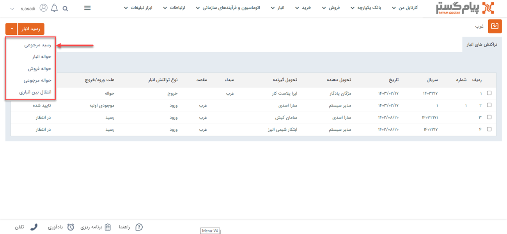

# مبانی انبارداری
در صورت داشتن ماژول انبار‌داری پیام‌گستر،می‌توانید حواله‌ها و رسید‌های ثبت شده در هر انبار را مدیریت نمایید. 
برای استفاده از انبارداری باید ابتدا محصولات در[ قسمت مدیریت محصولات ](https://github.com/1stco/PayamGostarDocs/blob/master/Help/Basic-Information/Product%20management/Product-management.md)تعریف شده باشند و محصولات هر انبار در قسمت[ مدیریت انبارها ](https://github.com/1stco/PayamGostarDocs/blob/master/Help/Settings/Warehouse-management/Warehouse-management.md)به عنوان محصول مجاز تعیین گردند. 
 برای تنظیم حواله‌ها و رسید‌های مرتبط با انبار می‌توانید از قسمت[ مدیریت تراکنش‌های انبار](https://github.com/1stco/PayamGostarDocs/blob/master/Help/Settings/Personalization-crm/Management-warehouse-transactions/Management-warehouse-transactions.md)  اقدام کنید.
برای ثبت محصولات در انبار و مدیریت انبار‌داری باید با مفاهیم  **حواله** و **رسید** در پیام‌گستر آشنا شوید.
- **حواله:** به معنی خروج کالا از انبار است.
- **رسید:** به معنی ورود کالا به انبار است.

انواع تراکنش‌های انبار به شرح زیر می‌باشند:

- **رسید موجودی اولیه:** در هر انبار فقط یکبار رسید موجودی اولیه صادر می‌شود. این رسید موجودی سر‌شماری شده واقعی در انبار را به نرم افزار وارد می‌کند.

> **نکته** 
 در انبار قبل از صدور رسید موجودی اولیه اگر رسید و یا حواله ثبت شود، دیگر امکان ثبت رسید موجودی اولیه نیست. 

- **رسید انبار:** زمانی که کالا وارد انبار می‌شود، برای اضافه شدن آن به انبار از رسید انبار استفاده می‌شود.
-  **رسید مرجوعی(رسید برگشت از فروش):** زمانی که کالا از انبار حواله شده (خارج شده است) و اکنون می‌خواهیم آن را دوباره به انبار بازگردانیم از رسید مرجوعی استفاده می‌شود.
- **حواله انبار(حواله خروج):** زمانی که کالا به دلیلی غیر از فروش (مثلا به دلیل اسقاط شدن کالا، یا اینکه کالا قرار است هدیه داده شود) از انبار خارج می‌شود از حواله انبار استفاده می‌شود.
- **حواله فروش:** زمانی که برای کالا فاکتور فروش صادر شده است، برای تحویل آن به مشتری و کم شدن از موجودی انبار، از حواله فروش استفاده می‌شود.
- **حواله مرجوعی(حواله برگشت از فروش):** زمانی که کالا به انبار وارد شده (رسید شده است) و اکنون می‌خواهیم آن را از انبار خارج کنیم از حواله مرجوعی استفاده می‌کنیم.
- **انتقال بین انباری:** زمانی که بخواهیم محصولاتی را از یک انبار به  انبار دیگری انتقال دهیم از این عملکرد استفاده می‌شود.

> **نکته** 
در صورتی که حداقل یک انبار در سیستم تعریف کرده باشید و انبارداری را بر روی سریالی تنظیم کرده باشید، قادر به مشاهده انبارها در منو صفحه اصلی نرم‌افزار خواهید بود.

