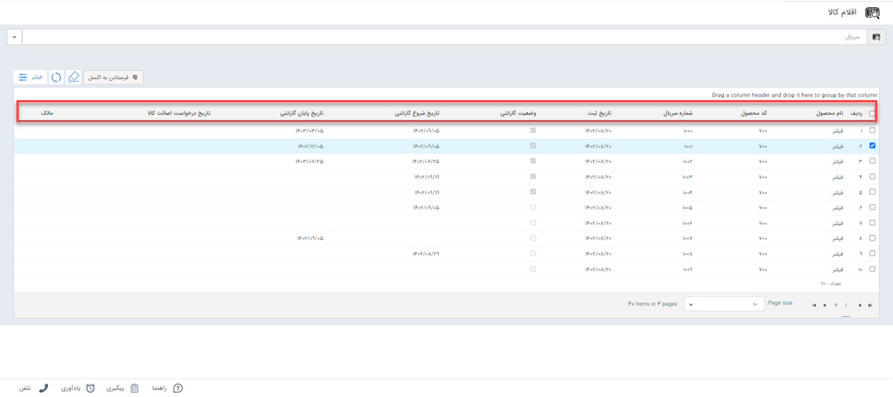
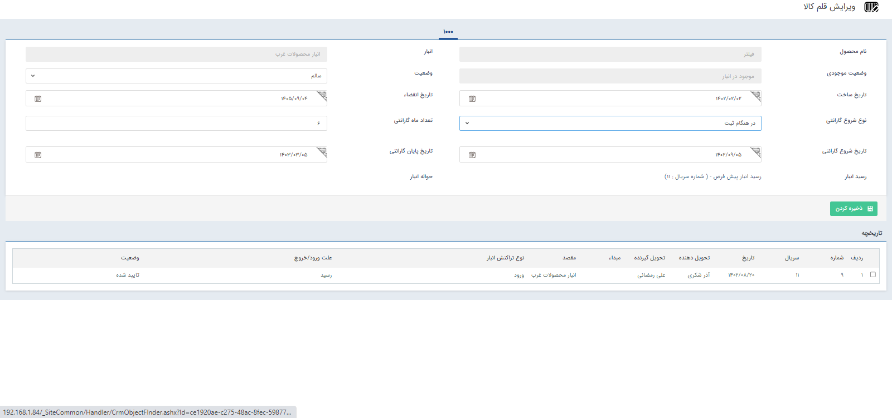
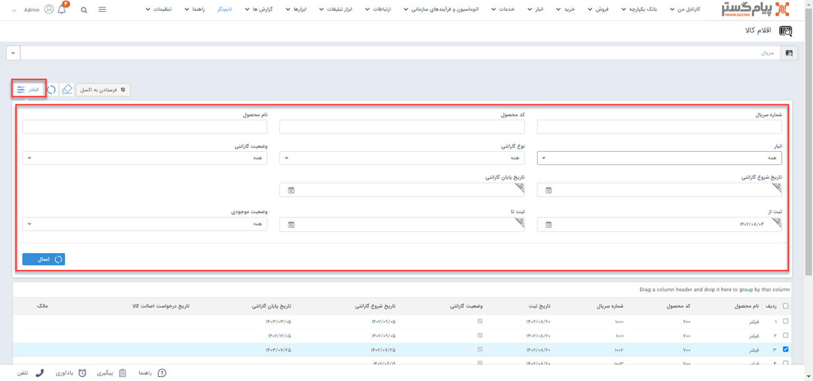

# بررسی گارانتی محصول
در در صورت تعریف سریال و گارانتی برای محصولات،‌ در صورت نیاز به بررسی گارانتی یک قلم کالا و یا تمامی کالاهایی با معیار مورد نظر، می‌توانید به راحتی به آن دسترسی داشته باشید.
در این مقاله، شیوه‌‌ی بررسی گارانتی محصولات در انبارداری سریالی از دو روش معرفی می‌شود:
## روش بررسی گارانتی محصول
در شرایط نیاز به مشاهده و بررسی گارانتی کالا می‌توانید از مسیر **تب انبار** > **اقلام کالا**، با جستجوی سریال کالای مورد نظر در کادر بالا، کالای مذکور را یافته و اطلاعات مندرج را در ردیف آن مشاهده نمایید.

اطلاعات مندرج در جدول به شرح زیر می‌باشد: 
- **نام محصول:** نام محصول (محصولی که با سریال مذکور در انبار وارد شده است) در این قسمت نمایش داده می‌شود.
- **کد محصول:** محصولات در پیام‌گستر براساس شماره کد ثبت می‌شوند که در این قسمت نمایش داده خواهد شد. از این کد برای جستجوی محصول هم می‌توانید استفاده کنید. 
- **شماره سریال:** سریال تخصیص داده شده به کالا در این قسمت نمایش داده می‌شود. سریال محصولات (برای هر قلم کالا) به هنگام ثبت رسید تعریف می‌شود.
- **تاریخ ثبت:** تاریخ ثبت رسید کالای انتخابی را نمایش می‌دهد.
- **وضعیت گارانتی:** در این قسمت وضعیت مشمولیت گارانتی نمایش داده می‌شود. چنانچه در بازه تاریخی مشمولیت گارانتی قرار داشته باشید (بر اساس زمان گارانتی مشخص شده برای محصول)، وضعیت گارانتی در این قسمت با یک تیک فعال اعلام می‌شود.
- **تاریخ شروع گارانتی:** زمان شروع گارانتی را در این قسمت مشاهده می‌کنید.
- **تاریخ پایان گارانتی:**  زمان پایان گارانتی را در این قسمت مشاهده می‌کنید.
- **تاریخ درخواست اصالت کالا:** تاریخ دریافت پیامک بررسی اصالت کالا (ارسال شده از سمت مصرف‌کننده)،‌ در این قسمت نمایش داده می‌شود.
- **مالک:** مالک شخصی است که سریال را برای درخواست بررسی اصالت کالا ارسال کرده است. چنانچه شماره موبایلی که پیامک از آن ارسال شده است در سیستم دارای هویت باشد،‌ نام هویت در این بخش نمایش داده می‌شود. در غیر این صورت شماره ارسال‌کننده پیام به جای آن درج می‌شود. 
برای مشاهده اطلاعات بیشتر از کالا،‌ با کلیک بر روی هر سطر، وارد صفحه مربوط به آن خواهید شد.

در این صفحه اطلاعات مرتبط با گارانتی محصول را قابل مشاهده و ویرایش است. در صورت نیاز به کسب اطلاعات بیشتر در زمینه گارانتی به راهنمای [تعیین گارانتی]() مراجعه نمایید.  
## جستجوی گارانتی کالا با اعمال فیلتر
در صورت نیاز به جستجوی کالاها بر اساس سایر اطلاعات و یا جستجوی تعدادی از اقلام کالا با ویژگی‌های مشترک (مثلا تمام کالاهای یک انبار) می‌توانید از **فیلتر** استفاده کنید.
در قسمت فیلتر می‌توانید کالا/کالاهایی که می‌خواهید گارانتی آن را چک کنید براساس شماره سریال، کد محصول، نام محصول، نام انبار، نوع گارانتی، وضعیت گارانتی، تاریخ شروع و پایان گارانتی، تاریخ ثبت و وضعیت موجودی فیلتر نمایید.

