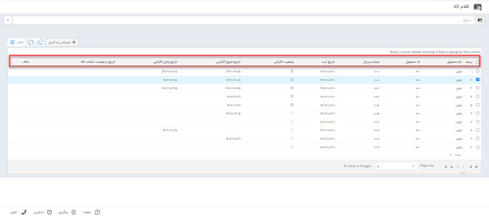
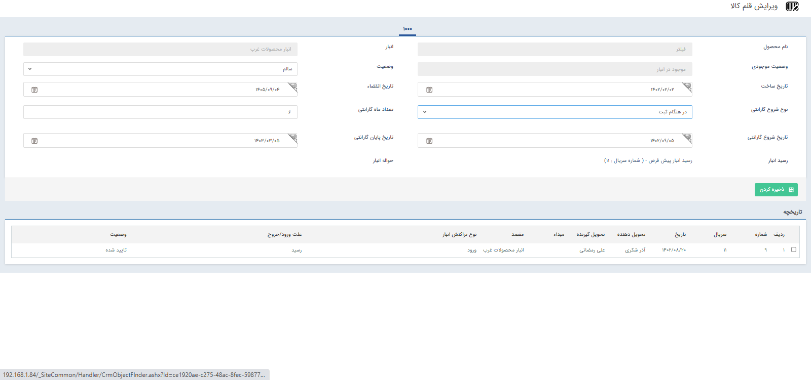
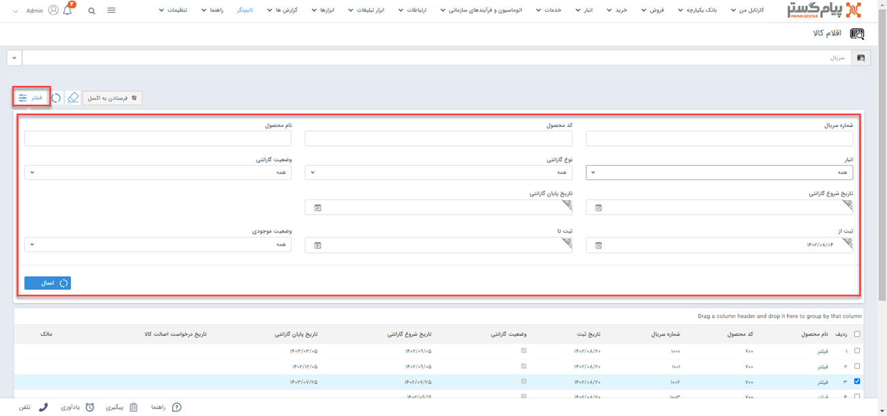

# بررسی گارانتی محصول
در این مقاله روش‌ بررسی  گارانتی محصولات در انبارداری سریالی در دو حالت بررسی می‌شود:
در انبارداری سریالی هنگام ثبت رسید در انیار برای کالاها سریال تعریف می‌شود و براساس سریال کالا می‌توان برای کالا ها گارانتی تعریف کرد.
## روش بررسی گارانتی محصول
پس از ثبت گارانتی برای محصول هنگامی که مشتری نیاز به استفاده از خدمات گارانتی داشته باشد می‌توانید از طریق مسیر  گارانتی محصول را بررسی نمایید. 
- **تب انبار** > **اقلام کالا** >  **بخش جستجوی سریال** 

- **ردیف**:ردیف شماره کالا در این قسمت درج می‌شود.
- **نام محصول**: نام محصولی که با سریال در انبار وارد شده است در این قشمت نمایش داده می‌شود.
- **کد محصول**:محصولات در پیام‌گستر براساس شماره کد ثبت می‌شوند که در این قسمت نمایش داده خواهد شد.
- **شماره سریال**: در تراکنش‌های انبار سریالی محصولات براساس ویژگی‌هایشان یا صلاحدید سازمان تعدادی سریال منحصر به فرد دریافت می‌کنند
- **تاریخ ثبت**: زمان  ثبت این محصول در پیام‌گستر در این قسمت نمایش داده‌خواهد شد.
- **وضعیت گارانتی**:در این قسمت وضعیت کالا را مشخص می‌کند که می‌تواند **سالم** ،**خراب** ،**تعمیری** و **مرجوعی** باشد.
- **تاریخ شروع گارانتی**: زمان شروع گارانتی در این قسمت درج خواهد شد.
- **تاریخ پایان گارانتی**:  زمان پایان گارانتی در این قسمت درج خواهد شد.
- **تاریخ درخواست اصالت کالا**: زمانی که برای احراز هویت این کالا درخواست داده‌اید در این قسمت ثبت می‌شود.
- **مالک**: مالک شخصی است که سریال را برای درخواست بررسی اصالت کالا ارسال می‌کند. 
با کلیک روی هر سط وارد صفحه ویرایش اقلام کالا خواهید شد. 

در این صفحه اطلاعات مرتبط با گارانتی محصول را وارد نمایید. 
## جستجوی گارانتی کالا با اعمال فیلتر
برای  بررسی  سریع‌تر گارانتی محصول می‌توان با اعمال **فیلتر** در قسمت اقلام کالا، گارانتی کالا را بررسی کرد.
در قسمت فیلتر می‌توانید کالایی که می‌خواهید گارانتی آن را چک کنید براساس شماره سریال، کد محصول، نام محصول، نام انبار، نوع گارانتی، وضعیت گارانتی، تاریخ شروع و پایان گارانتی، تاریخ ثبت و وضعیت موجودی فیلتر نمایید.

