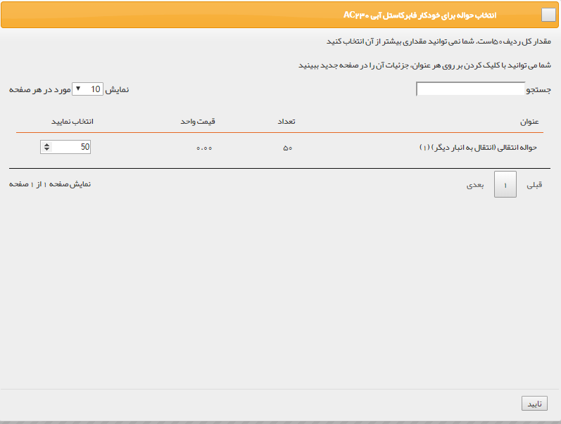

# قیمت گذاری تراکنش‌های انتقالی انبار
تمامی حواله‌ها و رسیدها پس از تایید، به کارتابل کاربر یا کاربرانی که مجوز قیمت گذاری رسید/حواله در انبار مربوطه به آنها داده شده منتقل می‌شوند تا عملیات قیمت‌گذاری بر روی آنها انجام شود. برای ویرایش مجوز قیمت‌گذاری کاربران در انبارها به قسمت مدیریت مجوزهای انبار در [مدیریت انبارها ](https://github.com/1stco/PayamGostarDocs/blob/master/Help/Settings/Warehouse-management/Warehouse-management.md)مراجعه کنید.

با دوبار کلیک روی هر سطر می‌توان قیمت‌گذاری را انجام داد.

> **نکته** 
کاربری که مجوز قیمت‌گذاری تراکنش‌ها را داشته باشد، علاوه بر کارتابل در انتظار قیمت‌گذاری از قسمت خرید و فروش انبار در لیست تراکنش‌های انبار مورد نظر هم می‌تواند تراکنش مورد نظر را قیمت‌گذاری کند .

 توجه داشته باشید که قیمت‌گذاری اقلام کالا ارتباطی با قیمت فروش به مشتری ندارد و صرفاً برای در اختیار داشتن موجودی ریالی کالاها در انبار و انجام عملیات انبارگردانی این کار انجام می‌شود. زمان ورود کالا به انبار(صدور رسید) قیمت‌گذاری باید توسط شما به صورت دستی یا از روی فاکتور خرید یا اگر رسید مرجوعی بود از حواله فروش انجام شود، اما هنگام خروج کالا از انبار (صدور حواله) قیمت‌گذاری بر اساس فی میانگین هر کالا انجام می‌شود و نمی‌توانید آن را به صورت دستی انجام دهید.

قیمت‌گذاری‌ انواع تراکنش‌های انبار به صورت زیر است:

- [**قیمت‌گذاری حواله انتقالی:**](#TransferRemittance)  قیمت‌گذاری از روی میانگین قیمت‌های وارد شده در رسیدهای انبار انجام می‌شود.
- [**قیمت‌گذاری رسید انتقالی:**](#TransferReciept) قیمت‌گذاری به صورت دستی یا از روی حواله انتقالی انجام می‌شود.

## قیمت گذاری حواله انتقالی (#TransferRemittance)
برای تراکنش‌های بین انباری ابتدا می‌بایست یک حواله انتقالی برای خروج کالا از انبار ثبت شود.
 قیمت‌گذاری حواله انتقالی از روی میانگین قیمت رسیدهایی که تا کنون ثبت شده است (رسیدهای شامل محصولات این حواله) محاسبه می‌شود. 
به طور مثال اگر خودکار فابرکاستل آبی از طریق 2 رسید انبار وارد شده باشد و در یک رسید 5 خودکار با قیمت 10000 ریال وارد شده باشد و در رسید دوم 15 خودکار با قیمت 20000 ریال وارد شده باشد، فی میانگین به صورت زیر محاسبه خواهد شد:

	فی میانگین = (5*10000+ 15*20000)/20= 17500 

**دکمه قیمت گذاری:** پس از قیمت‌گذاری برای تمام ردیف‌های کالا، با کلیک بر روی این علامت قیمت‌گذاری روی حواله انتقالی انجام می‌شود.

پس از انجام قیمت‌گذاری، می‌توانید با استفاده از دکمه لغو قیمت گذاری، تراکنش را به حالت قیمت‌گذاری نشده برگردانید.

## قیمت‌گذاری رسید انتقالی (#TransferReciept)
پس از ثبت انتقال بین انباری، سیستم یک حواله در انبار مبداء و یک رسید در انبار مقصد ثبت خواهد کرد .
قیمت گذاری رسید انتقالی به صورت دستی یا از روی حواله انتقالی انجام می‌شود.

1. **قیمت‌گذاری دستی:** در هر ردیف تعداد کالا و قیمت آن را تعیین کنید

2. **قیمت‌گذاری از حواله:** می‌توانید از لیست حواله‌های انتقالی قیمت‌گذاری شده که شامل این محصول هستند، مشخص کنید که چه تعداد کالا از روی کدام حواله‌ها قیمت‌گذاری شوند.

3. **دکمه قیمت‌گذاری:** پس از قیمت‌گذاری برای تمام ردیف‌های کالا، با کلیک بر روی این علامت قیمت‌گذاری روی رسید انجام می‌شود.
 پس از انجام قیمت‌گذاری، می‌توانید با استفاده از دکمه لغو قیمت گذاری، تراکنش را به حالت قیمت‌گذاری نشده برگردانید.

