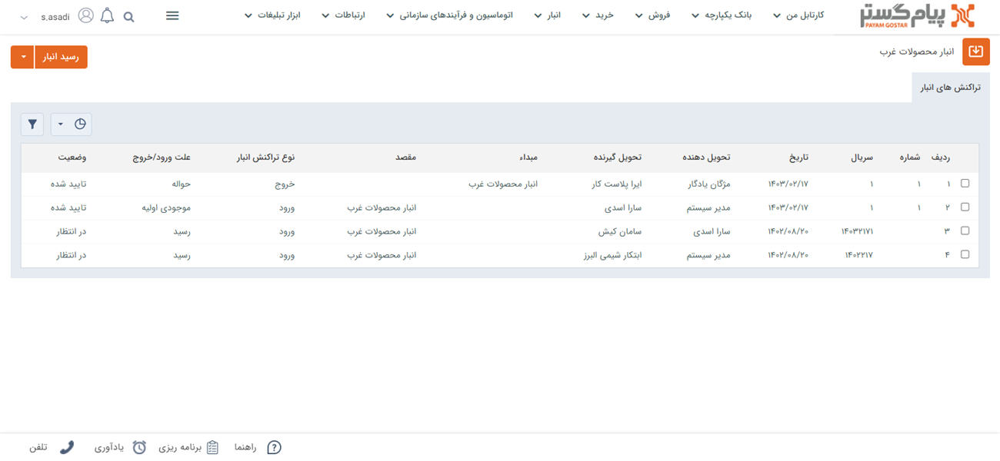

# مشاهده لیست تراکنش‌های انبار
برای مشاهده تراکنش‌های انبار اعم از رسید و حواله از طریق مسیر زیر می‌توانید اقدام نمایید:
- **انبار** > **انبارها** > **انتخاب انبار مورد نظر** > **مشاهده لیست تراکنش‌های انبار**

با کلیک روی دکمه تراکنش‌های انبار می‌توانید تراکنش‌های ثبت شده در انبار را به روزرسانی نمایید. همچنین می‌توانید تراکنش‌های انبار را براساس آیتم‌های مختلف **فیلتر** کنید.

## مشاهده لیست محصولات انبار
در مسیر ذکر شده برای مشاهده لیست تراکنش‌های انبار قابلیت مشاهده رسید و حواله ثبت شده را خواهید داشت اما نمی‌توانید موجودی کالای مورد نظر در انبار را مشاهده نمایید. یکی از راه‌هایی که به شما در بررسی موجودی کالا کمک خواهد کرد استفاده از **گزارش کاردکس کالا** و **گزارش موجودی انبار** است. 

- [گزارش کاردکس کالا](#Products'cardexReport)
- [گزارش موجودی انبار](#warehouseInventoryReport)

### گزارش کاردکس کالا {#Products'cardexReport}
گزارش کاردکس کالا از گزارشات موجود در سیستم است که از مسیر **گزارش‌ها** > **لیست گزارشات** قابل مشاهده می‌باشد. 
گزارش کاردکس یکی از گزارشات کاربردی برای برای بررسی تراکنش‌ها و موجودی انبار است. این گزارش شامل مواردی مانند: شماره، شماره سریال، نام انبار، تاریخ، مقدار وارد شده به انبار، مقدار صادر شده از انبار و مانده محصول است. 
با کلیک روی دکمه **دریافت گزارش** می‌توانید گزارش را در قالب pdf دریافت نمایید. 
گزارش کاردکس کالا شامل اطلاعات زیر می‌باشد:
- **ردیف**: شماره ردیف محصولاتی که تراکنش‌های مرتبط با آن‌ در انبارداری ثبت شده است
- **شماره سریال**: سریال ثبت شده برای کالا هنگام ثبت رسید یا حواله می‌باشد.
- **کد محصول**:کد محصولی که کالا در انبار تعریف شده است.
- **شماره**: شماره محصولات براساس الگوی شماره‌گذاری تعریف شده در رسید و حواله مشاهده می‌شود.
- **انبار**:نام انبارهایی که تراکنش‌های انبار در آن‌ها انجام شده‌است.
- **نوع تراکنش**: نوع تراکنش‌های انبار که شامل رسید موجودی اولیه، رسید انبار، رسید مرجوعی، حواله انبار، حواله فروش، حواله فروش و انتقال بین انباری است دراین قسمت نمایش داده می‌شود.
- **تاریخ**: فیلد تاریخی مرتبط با زمان ثبت این تراکنش انبار است.
- **مقدار وارده**: تعداد کالایی که با رسید وارد انبار شده‌اند.
- **مقدار صادره**: تعداد کالایی که با حواله از انبار خارج شده‌اند
- **مانده**: مانده همان اختلاف تعداد کالاهای ورودی به انبار و تعداد کالاهای خروجی از انبار است.

>**نکته** 
قبل از دریافت گزارش کاردکس کالا می‌بایست بر روی دکمه به روزرسانی کلیک نمایید تا تراکنش‌های ثبت شده در انبار به روزرسانی شوند. 

محصولات در گزارش کاردکس کالا براساس کد محصول مرتب شده‌اند و موجودی 
انبار، مانده محصول و فی میانگین قابل مشاهده می‌باشد.
برای دریافت گزارش کاردکس کالا می‌توانید گزارشات را براساس آیتم‌های مختلف فیلتر کنید. 

### گزارش موجودی انبار {#warehouseInventoryReport}
گزارش موجودی از انبار هم مانند گزارش کاردکس کالا شامل اطلاعاتی نظیر کد محصول، نام محصول، مقدار وارد شده با رسیدهای انبار، مقدار صادر شده با حواله‌های انبار و میزان موجودی کالا در انبار می‌باشد.
در این گزارش هم می‌توانید براساس نیاز موجودی کالاها را در انبار **فیلتر** نمایید. 
گزارش موجودی انبار را می‌توانید در قالب pdf دریافت کنید.