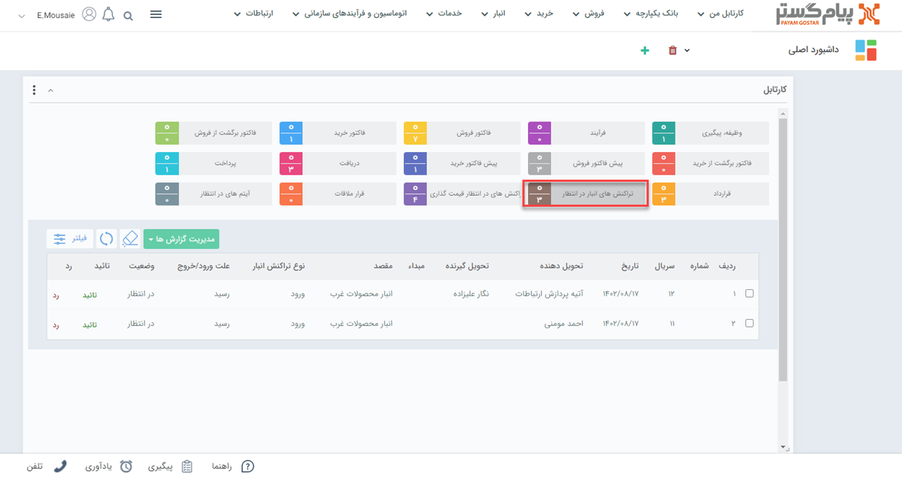

## کارتابل رسیدهای انبار در انتظار تایید
در صورتی که از سیستم انبارداری پیشرفته پیام‌گستر استفاده می‌کنید، رسید‌های ثبت شده در تراکنش‌های انبار نیاز به تایید دارند. در صورتی که مجوز تایید هر کدام از زیرنوع‌های تراکنش انبار را داشته باشید و در تنظیمات رسید‌ در قسمت شخصی سازی، گزینه‌ی "نیاز به تایید دارد" را فعال کرده باشید، پس از صدور رسید‌ می‌توانید آن را در قسمت تراکنش‌های انبار در انتظار مشاهده کرده و آن را تایید یا رد کنید.

> **نکته**  
برای اینکه بتوانید یک رسید‌ انبار صادر شده را تایید کنید، باید مجوز تایید رسید‌های انبار را داشته باشید. همچنین می‌بایست از زیر نوع رسیدها برای مثال رسید انبار پیش فرض  در قسمت مدیریت مجوزها و همچنین مجوز تایید رسید‌ها در قسمت مدیریت انبار ، مدیریت  مجوزهای انبار  مربوطه را داشته باشید. 

همچنین با دو بارکلیک بر روی هر کدام از رسیدهای موجود در کارتابل می‌توانید آن را مشاهده کنید.
به خاطر داشته باشید در حالت پیش‌فرض لیست رسیدهای یک‌ماه اخیر را مشاهده می‌کنید، برای مشاهده رسید‌های بیشتر باید همانند تصویر زیر از منوی فیلتر بازه‌‌ی زمان مورد نظر خود را اعمال کنید.

به کمک فیلتر پیشرفته می‌توانید  رسید‌های در انتظار تایید را با استفاده از تاریخ ایجاد، تایید، شماره سریال و ... فیلتر نمایید.