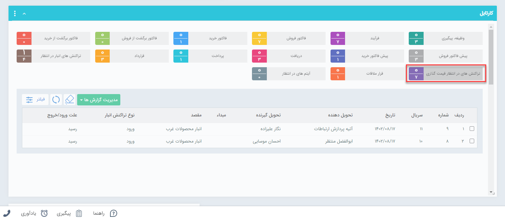

## قیمت گذاری رسیدهای انبار
تمامی رسیدها پس از تایید به کارتابل کاربر یا کاربرانی که مجوز قیمت گذاری رسید در انبار مربوطه به آنها داده شده می‌روند تا عملیات قیمت گذاری بر روی آنها انجام شود. برای ویرایش مجوز قیمت گذاری کاربران در انبارها به قسمت مدیریت مجوزهای انبار در [مدیریت انبارها ](https://github.com/1stco/PayamGostarDocs/blob/master/Help/Settings/Warehouse-management/Warehouse-management.md)مراجعه کنید.
برای ثبت قیمت‌ گذاری می‌توانید با دوبار کلیک روی هر سطر قیمت گذاری را انجام دهید.

> **نکته** 
 کاربری که مجوز قیمت‌گذاری تراکنش‌ها را داشته باشد علاوه بر کارتابل در انتظار قیمت‌گذاری از قسمت خرید فروش انبار در لیست تراکنش‌های انبار مورد نظر هم می‌تواند تراکنش مورد نظر را قیمت گذاری کند. 

 توجه داشته باشید که قیمت گذاری اقلام کالا ارتباطی با قیمت فروش به مشتری ندارد و صرفاً برای در اختیار داشتن موجودی ریالی کالاها در انبار و انجام عملیات انبارگردانی این کار انجام می‌شود. زمان ورود کالا به انبار(صدور رسید) قیمت گذاری باید توسط شما به صورت دستی یااز روی فاکتور خرید یا اگر رسید مرجوعی بود از حواله فروش انجام شود، اما هنگام خروج کالا از انبار (صدور حواله) قیمت گذاری براساس فی میانگین هر کالا انجام می‌شود و نمی‌توانید آن را به صورت دستی انجام دهید. 

قیمت‌ گذاری‌ انواع رسیدهای انبار به صورت زیر است:
- **رسید موجودی اولیه:** باید  بصورت دستی قیمت گذاری  شود. 
- **رسید انبار:** قیمت گذاری بصورت دستی و یا از روی فاکتور خرید انجام می‌شود. 
- **رسید مرجوعی:** قیمت گذاری  بصورت دستی یا از روی حواله انجام می‌شود.  

