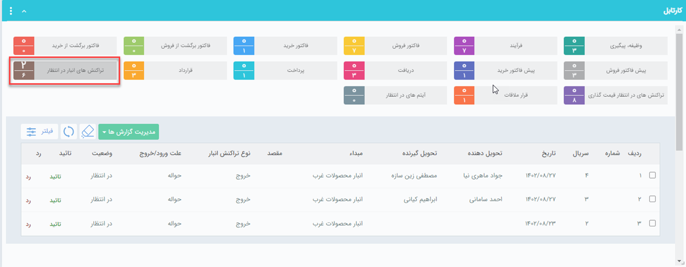
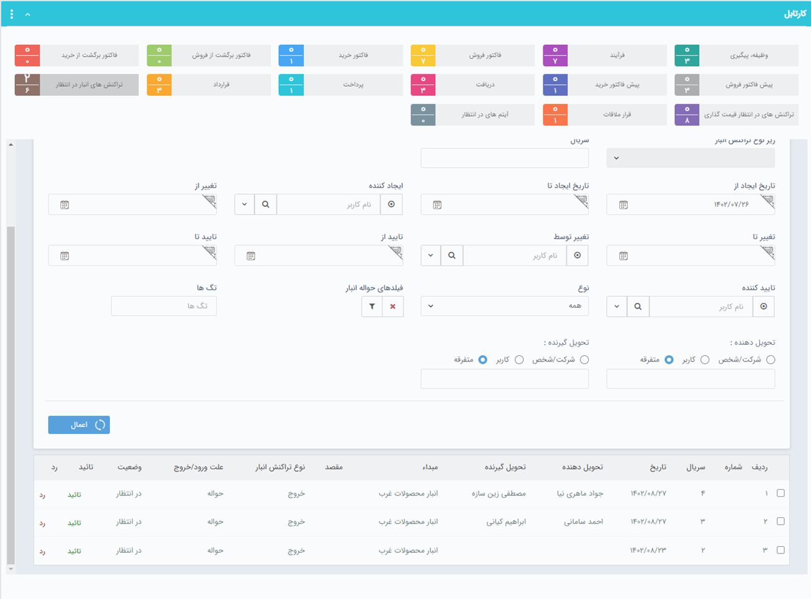

## کارتابل حواله‌های انبار در انتظار تایید
در صورتی که از سیستم انبارداری پیشرفته پیام‌گستر استفاده می‌کنید، حواله‌های ثبت شده در تراکنش‌های انبار نیاز به تایید دارند. در صورتی که مجوز تایید هر کدام از زیرنوع‌های تراکنش انبار را داشته باشید و در تنظیمات حواله در قسمت شخصی‌سازی، گزینه‌ی "نیاز به تایید دارد" را فعال کرده باشید، پس از صدور حواله می‌توانید آن را در قسمت تراکنش‌های انبار در انتظار مشاهده کرده و آن را تایید یا رد کنید.

> **نکته**  
برای اینکه بتوانید یک حواله انبار صادر شده را تایید کنید، باید مجوز تایید حواله‌های انبار را داشته باشید. همچنین می‌بایست از زیر نوع حواله‌‌ها برای مثال حواله انبار پیش فرض  در قسمت مدیریت مجوزها و همچنین مجوز تایید حواله‌ها در قسمت مدیریت انبار، مدیریت  مجوزهای انبار  مربوطه را داشته باشید. 

همچنین با دو بارکلیک بر روی هر کدام از حواله‌های موجود در کارتابل می‌توانید آن را مشاهده کنید.
به خاطر داشته باشید در حالت پیش‌فرض لیست حواله‌های یک‌ماه اخیر را مشاهده می‌کنید، برای مشاهده حواله‌های بیشتر باید همانند تصویر زیر از منوی فیلتر بازه‌‌ی زمان مورد نظر خود را اعمال کنید.

به کمک فیلتر پیشرفته می‌توانید حواله‌های در انتظار تایید را با استفاده از تاریخ ایجاد، تایید، شماره سریال و ... فیلتر نمایید.