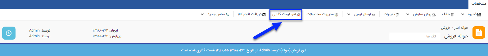
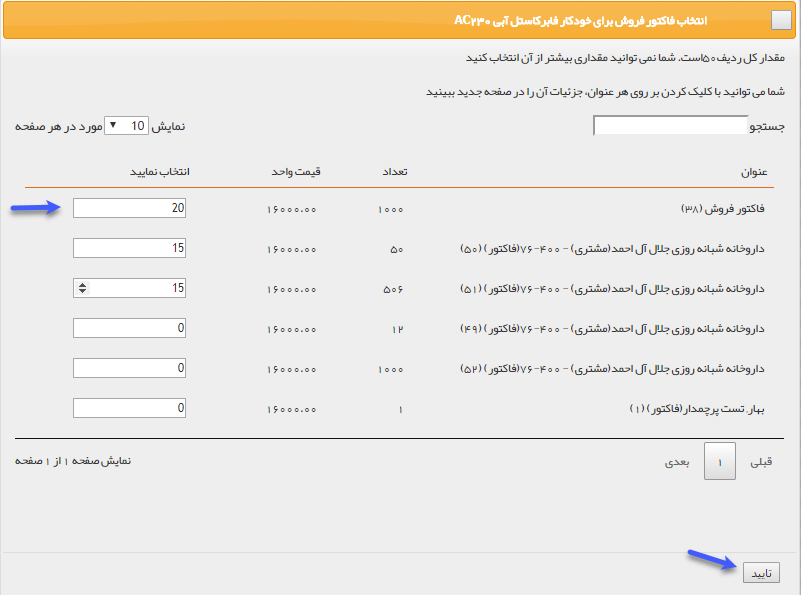
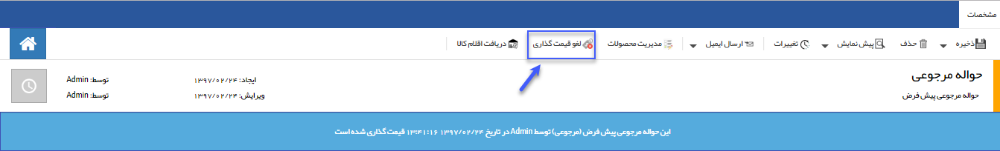

# قیمت گذاری حواله‌های انبار
 توجه داشته باشید که قیمت‌گذاری اقلام کالا ارتباطی با قیمت فروش به مشتری ندارد و برای عملیات انبارگردانی این کار انجام می‌شود. هنگام خروج کالا از انبار (صدور حواله) قیمت‌گذاری بر اساس فی میانگین هر کالا انجام می‌شود و نمی‌توانید آن را به صورت دستی انجام دهید.
تمامی حواله‌ها از تایید به کارتابل کاربر یا کاربرانی که مجوز قیمت‌گذاری حواله در انبار مربوطه به آنها داده شده می‌روند تا عملیات قیمت‌گذاری بر روی آنها انجام شود. برای ویرایش مجوز قیمت گذاری کاربران در انبارها به قسمت مدیریت مجوزهای انبار در [مدیریت انبارها ](https://github.com/1stco/PayamGostarDocs/blob/master/Help/Settings/Warehouse-management/Warehouse-management.md)مراجعه کنید. شماره‌گذاری حواله‌های انبار به چند طریق صورت می‌گیرد. 
پس از تایید حواله ها در **کارتابل** > **تراکنش‌های انبار در انتظار** تمامی حواله‌ها از این کارتابل خارج می‌شوند و به کارتابل **تراکنش‌های در انتظار قیمت‌گذاری** منتقل می‌شوند. در این کارتابل تمامی تراکنش‌های تایید شده قابل مشاهده هستند.

- [**حواله انبار:**](#WarehouseRemittance)  قیمت‌گذاری از روی میانگین قیمت‌های وارد شده در رسیدهای انبار انجام می‌شود. 
- [**حواله فروش:**](#PurchaseRemittance)
 قیمت‌‌گذاری از روی میانگین قیمت‌های وارد شده در رسیدهای انبار انجام می‌شود.
- [**حواله مرجوعی:**](#ReturnRemittanceFromPurchase)
  قیمت‌گذاری از روی میانگین قیمت‌های وارد شده در رسیدهای انبار انجام می‌شود. 

## قیمت گذاری حواله‌های انبار {#WarehouseRemittance}
برای خارج کردن کالا از انبار از این حواله استفاده می‌شود. 
**قیمت گذاری:** از روی میانگین قیمت رسیدهایی که تا کنون ثبت شده است (رسیدهای شامل محصولات این حواله) محاسبه می‌شود. 
به طور مثال اگر خودکار فابرکاستل آبی از طریق 2 رسید انبار وارد شده باشد و در یک رسید 5 خودکار با قیمت 10000 ریال وارد شده باشد و در رسید دوم 15 خودکار با قیمت 20000 ریال وارد شده باشد، فی میانگین به صورت زیر محاسبه خواهد شد:

	فی میانگین = (5*10000+ 15*20000)/20= 17500

- **دکمه قیمت گذاری:** پس از قیمت‌گذاری برای تمام ردیف‌های کالا، با کلیک بر روی این علامت قیمت‌گذاری روی حواله انجام می‌شود.

- **دکمه لغو قیمت گذاری:** پس از انجام قیمت‌گذاری، می توانید با استفاده از دکمه لغو قیمت‌گذاری، تراکنش را به حالت قیمت گذاری نشده برگردانید.

- **قیمت‌گذاری از کارتابل تراکنش‌های در حال انتظار** روش دیگری که برای قیمت‌گذاری تراکنش‌های انبار می‌توانید استفاده کنید به شرح زیر  است: 
**کارتابل** > **تراکنش های در انتظار قیمت گذاری** > **کلیک روی سطر** 
با دوبار کلیک روی هر سطر می‌توان قیمت‌گذاری را انجام داد

> **نکته** 
کاربری که مجوز قیمت‌گذاری تراکنش‌ها را داشته باشد علاوه بر کارتابل در انتظار قیمت‌گذاری از قسمت خرید فروش انبار در لیست تراکنش‌های انبار مورد نظر  هم می‌تواند تراکنش مورد نظر را قیمت گذاری کند . 

## قیمت گذاری حواله فروش {#PurchaseRemittance}
برای خارج کردن کالایی که فروش رفته از این نوع حواله استفاده می شود. 
- **قیمت‌گذاری حواله فروش:** از روی میانگین قیمت رسیدهایی که تا کنون برای محصولات این حواله ثبت شده است محاسبه می‌شود. 
به طور مثال اگر خودکار فابرکاستل آبی از طریق 2 رسید انبار وارد شده باشد و در یک رسید 5 خودکار با قیمت 10000 ریال وارد شده باشد و در رسید دوم 15 خودکار با قیمت 20000 ریال وارد شده باشد، فی میانگین به صورت زیر محاسبه خواهد شد: 

	فی میانگین = (5*10000+ 15*20000)/20= 17500 

- **دکمه قیمت‌گذاری**: با استفاده از کلید قیمت گذاری حواله فروش قیمت گذاری می شود.

 - **دکمه لغو قیمت‌گذاری**: پس از انجام قیمت گذاری، می توانید با استفاده از دکمه لغو قیمت گذاری، تراکنش را به حالت قیمت گذاری نشده برگردانید.

**اتصال حواله به فاکتور فروش:** می توانید تعیین کنید که کالاهای این حواله فروش مرتبط با کدام فاکتورهای فروش می‌شود.
از آنجایی که حواله فروش در صورت خارج کردن محصولات به فروش رفته از انبار استفاده می‌شود، می‌توان مشخص کرد که هرکدام از محصولات حواله مرتبط با کدام فاکتور فروش می‌باشد. این اتصال در [گزارشات افتراق ](https://github.com/1stco/PayamGostarDocs/blob/master/Help/Management-and-reports/Sales-reports/Differentiation-reports/Differentiation-reports.md) نرم افزار تاثیر گذار است. 

ابتدا مشخص کنید که چه تعداد از کالا مرتبط با کدام فاکتور فروش می باشد و در انتها روی دکمه تایید کلیک کنید.

> **نکته** 
یک حواله می‌تواند برای چند فاکتور مختلف باشد.(یعنی محصولات موجود در حواله مربوط به فاکتور فروش‌های مختلف باشد، برای مثال اگر محصول خودکار در حواله مقدار 10 باشد میتواند 5 خودکار مربوط به یک فاکتور فروش و 5 تای دیگر مربوط به فاکتور فروش دیگر باشد)

## قیمت گذاری حواله مرجوعی {#ReturnRemittanceFromPurchase}
برای بازگرداندن کالاهایی که قبلا در انبار وارد شده اند(برای آنها رسید ثبت شده‌است)، از این حواله استفاده می‌شود.

- **قیمت‌گذاری حواله مرجوعی:**  از آنجایی که حواله مرجوعی در صورت مرجوع کردن کالاهای وارد شده (رسید شده) به انبار استفاده می‌شود، می‌توان مشخص کرد که هر کدام از محصولات حواله با کدام رسید انبار مرتبط است. برای قیمت گذاری باید ابتدا تمام محصولات را به یکی از رسیدهای انبار شامل این محصول متصل کنید.

- **اتصال به رسید:** می توانید انتخاب کنید که تعداد موجود در این حواله مرجوعی مرتبط با کدام رسید ها است.

- **دکمه قیمت گذاری:** پس از قیمت گذاری برای تمام ردیف های کالا، با کلیک بر روی این علامت قیمت گذاری روی حواله انجام می‌شود.

- **دکمه لغو قیمت گذاری:** پس از انجام قیمت‌گذاری، می‌توانید با استفاده از دکمه لغو قیمت گذاری، تراکنش را به حالت قیمت گذاری نشده برگردانید.

> **نکته** 
 توجه داشته باشید تا زمانی که تمامی ردیف های کالا به رسیدهای انبار متصل نشوند، امکان قیمت‌گذاری حواله مرجوعی وجود ندارد.